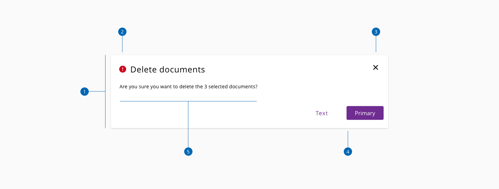
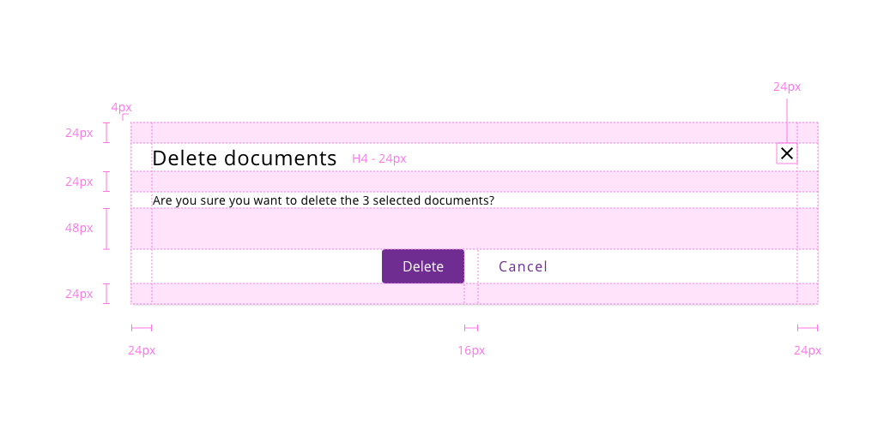
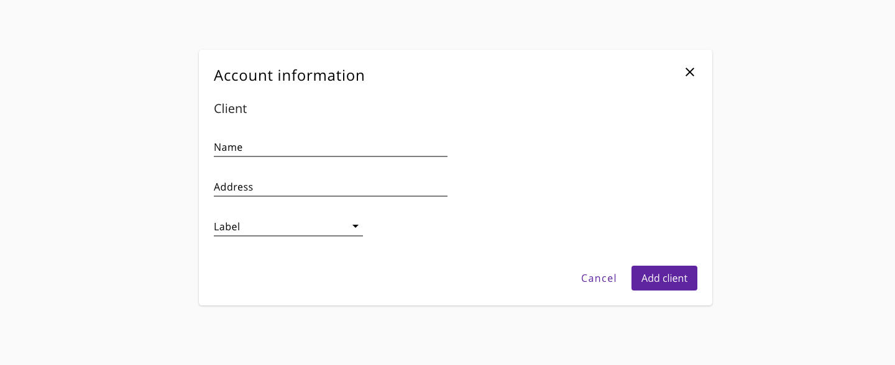
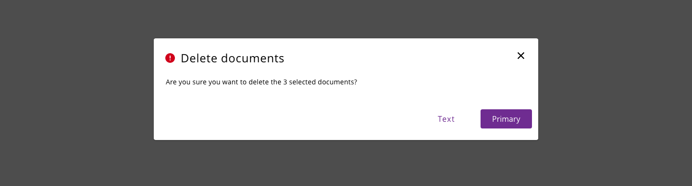

# Dialog

A modal dialog is a message box or child window that requires user interaction before returning to the parent window. These boxes appear on top of the open parent window that is currently displayed on the screen.

## Usage

* The dialog always should have a title to introduce the actions or information that will get displayed on the screen.  
* Can contain a descriptive text or a phrase related to the action that triggered the dialog.
* Can have some combinations of actions, like buttons to accept/cancel the action. There can be one, two or more buttons.
* If the dialog is not including a cancel action, provide a way to close it
* Modal dialog boxes should overlay only a portion of the underlying page to keep the user oriented within the workflow.
* The modal dialog should emerge from the top of the screen and be centered horizontally on the parent page. 
* Modal dialog features should be used sparingly, as they disrupt workflow, but can be advantageous when used properly

## Anatomy

1. Dialog container
2. Title
3. Close action
4. Dialog actions
5. Content

## Design Specifications

_Design specifications for dialog component_

### Color

| Component token                | Element                     | Core token                    | Value                  |
| :----------------------------- | :-------------------------  | :---------------------------  | :--------------------  |
| `overlayColor`                 | Overlay                     | `color-black`                 | #000000                |
| `scrollBarThumbColor`          | Scrollbar: Thumb            | `color-grey-700`              | #666666                |
| `scrollBarTrackColor`          | Scrollbar: track            | `color-grey-200`              | #e6e6e6                |
| `backgroundColor`              | Scrollbar: container        | `color-white`                 | #ffffff                |
| `fontColor`                    | Title                       | `color-black`                 | #000000                |
| `closeIconColor`               | Icon close                  | `color-black`                 | #000000                |
| `boxShadowColor`               | Container shadow            | -                             | rgba(0, 0, 0, 0.2)     |
| `closeIconBackgroundColor`     | Icon close background       | `none`                        | none                   |
| `closeIconBorderColor`         | Icon close border           | `none`                        | none                   |

### Padding

padding | value
-- | --
`xxsmall` | 6px
`xsmall` | 16px
`small` _(default)_ | 24px
`medium` | 36px
`large` | 48px
`xlarge` | 64px
`xxlarge` | 100px

And also apply different values to each side of the component:
`top` `bottom` `left` `right`

### Border

| Property                 | Element          | Core token                 | Value            |
| :----------------------- | :--------------- | :------------------------- | :--------------- |
| `border-width`           | Container        | `border-width-0`           | 0                |
| `border-style`           | Container        | `border-style-none`        | none             |
| `border-radius`          | Container        | `border-radius-medium`     | 0.25rem / 4px    |

### Specifications for desktop and tablet (landscape mode)

| Property               |  value |
| ---------------------  | ----------------- |
| `min-width`            |             800px |
| `max-width`            |               80% |
| Title `font-size`      |              24px |
| Body `font size`       |              16px |
| `font-weight`          |           Regular |
| 'X' icon size          |           24x24px |
| `margin`               |              32px |
| Title icon space       |              12px |

### Specifications for tablet (portrait mode)

| Property         | Value   |
| ---------------  | ------  |
| `min-width`      | 92%     |
| `max-width`      | 92%     |

### Specifications for phone

| Property           |   Value |
| ------------------ | ------  |
| `min-width`        |  92%    |
| `max-width`        |  92%    |
| Title `font-size`  |  20px   |

## Content

_Example of a dialog using Halstack components as content_

Any content (Halstack component or custom) can be placed inside the dialog component, try always to avoid scrolling.

## Overlay

_Example of the overlay usage_

The overlay element makes possible to get the user attention into the dialog creating a layer between the actual application and the modal information showed in the user interface.

### Specifications for overlay

| Property |               Value |
| -------- | ------------------: |
| Width    |             `100vw` |
| Height   |             `100vh` |
| Color    | `#000, 0.7 opacity` |

## Combining with other UI elements

There are some elements that require some guidance to use it on the dialog component, based on the nature of the component or the behavior that it has in the ecosystem. Due to resource loading or prompting messages for the user, special guides are defined to incorporate these scenarios.

For the case that the application has a modal opened and it needs to load data from the server, we can represent this situation to the user in several ways.

- One option can be to stick to the default implementation of the spinner component and use it in the overlay mode, overlapping the loading element to the rest of the interface components and make it clear that the application is getting some resources from the APIs.
- Another approach, to avoid render an overlay on top of another overlay is to integrate the loading indicator into the modal window. This can be done placing the spinner near the title of the dialog, on the right side and the small variations of the component. Using this way we make explicit to the user that the applications are working on something without the need to distract the attention from the dialog.

Both approaches are equally valid, and its use depends on the context of the application and the content of the dialog.

## Links and references

- https://xd.adobe.com/view/23e2cca4-5021-490a-a548-e99a9b4a2006-76b1/screen/878a0090-5cac-4084-8e1c-6c61f61bf552/variables/

____________________________________________________________

[Edit this page on Github](https://github.com/dxc-technology/halstack-style-guide/blob/master/guidelines/components/dialog/README.md)
