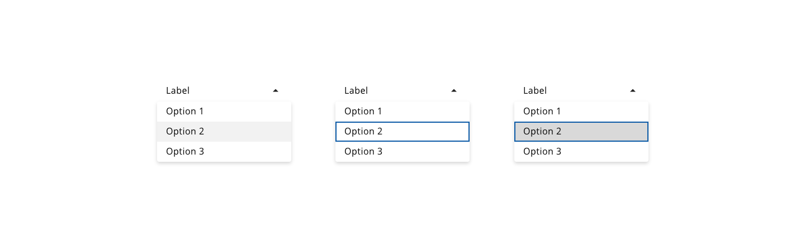
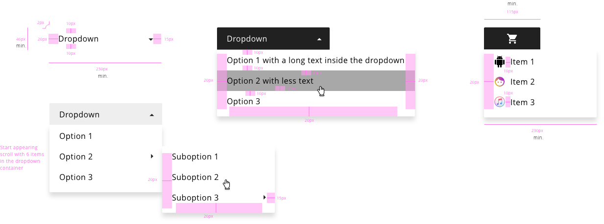
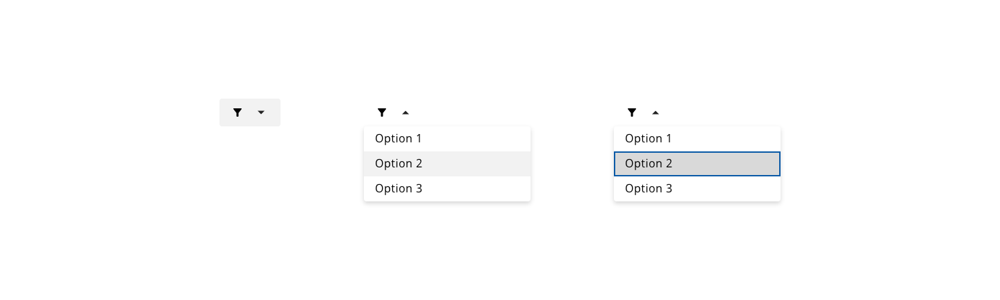

# Dropdown

The use of dropdowns has its advantages but it depends on the screen support. Dropdowns are a standard widget, so the users know how to interact with them. The options available in a dropdown component are static, so this prevents from erroneous data entered by the user since it only shows a range of correct values for that input.

## Appearance

Dropdowns have a similar look and behaviour to select components, the difference is that while select is only to collect user's data into a form, dropdown can be used in a variety of scenarios.

* Dropdowns can be useful as a list of items that will be shown when the user clicks or hovers their main parent that will trigger the pop up with the options.
* An arrow linked with the label of the dropdown should be shown to indicate the user that more options are available but are currently hidden.
* By default, every dropdown will be extending underneath his main container if the space in the screen is enough to contain all the size declared for the pop-up.

If there is a special case when the dropdown couldn't be displayed below the selector because it is hiding important information reducing discoverability and scanability in the website then consider to use other options to display the information or customize the position of the pop up to fitting the necessities of the application.

## States

### Dropdown button

States: **enabled**, **hover**, **focus**, **active** and **disabled**.

_Example of the dropdown component states_

### Option list

States: **enabled**, **hover**, **focus** and **selected**:

_Example of the option list states_

## Design Specifications

_Dropdown component specifications_

### Color

| Tokens                    | Value       |
| -----------------------   | ----------- |
| `backgroundColor`         |     #FFFFFF |
| `fontColor`               |     #000000 |
| `dropdownBackgroundColor` |     #FFFFFF |
| `dropdownFontColor`       |     #000000 |
| `hoverBackgroundOption`   |     #F2F2F2 |
| `hoverBackgroundColor`    |     #F2F2F2 |
| `scrollBarThumbColor`     |     #666666 |
| `scrollBarTrackColor`     |     #D9D9D9 |
| `focusColor`              |     #005FCC |

### Width

width | Value
-- | --
`small` | 60px
`medium` _(default)_ | 240px
`large` | 480px
`fitContent` | -
`fillParent` | -

### Margin

margin | Value
-- | --
`xxsmall` | 6px
`xsmall` | 16px
`small` | 24px
`medium` | 36px
`large` | 48px
`xlarge` | 64px
`xxlarge` | 100px

### Padding

| Property        | Element         | Value     |
| --------------- | ----------      | --------- |
| `padding-left` | Dropdown button  | 16px      |
| `padding-left` | Options list     | 16px      |
| `padding-right`| Dropdown button  | 16px      |
| `padding-right`| Options list     | 16px      |

### Border

| Property                 | Element                | Core token                 | Value            |
| :----------------------- | :--------------------- | :------------------------- | :--------------- |
| `border-width`           | Dropdown button        | `border-width-0`           | 0                |
| `border-style`           | Dropdown button        | `border-style-none`        | none             |
| `border-radius`          | Dropdown button        | `border-radius-medium`     | 0.25rem / 4px    |
| `border-width`           | Options list           | `border-width-0`           | 0                |
| `border-style`           | Options list           | `border-style-none`        | none             |
| `border-radius`          | Options list           | `border-radius-medium`     | 0.25rem / 4px    |
| `border-width`           | Focus outline          | `border-width-2`           | 2px              |
| `border-style`           | Focus outline          | `border-style-solid`       | solid            |
| `border-radius`          | Focus outline          | `border-radius-medium`     | 0.25rem / 4px    |

### Typography

| Property        | Element         | Value     |
| --------------- | ----------      | ----------|
| `font-size`     | Dropdown button | 1rem/16px |
| `font-size`     | List item       | 1rem/16px |
| `font-weight`   | Dropdown button | 400       |
| `font-weight`   | List item       | 400       |

## Iconography

| Property          | Element         | Value     |
| ---------------   | ----------      | ----------|
| `height`/ `width` | Caret           | 24/24px   |
| `height`/ `width` | Custom icon     | 20/20px   |

## Icon Usage

It is allowed the use of icons within the dropdown component. There are several options of configuration, the icon can be placed before or after the label, also the icon can be the unique content of the dropdown placeholder and options, so the final goal of this is to keep consistency with the rest of the components of the design system such as buttons or selects, that have the same behavior.

_Examples of icon usage_

## Accessibility

### WCAG 2.2

* Understanding WCAG 2.2 - [SC 1.4.13: Content on Hover or Focus](https://www.w3.org/WAI/WCAG22/Understanding/content-on-hover-or-focus.html)
* Understanding WCAG 2.2 - [SC 3.2.2: On Input](https://www.w3.org/WAI/WCAG22/Understanding/on-input.html)

### WAI-ARIA 1.2

* WAI-ARIA Authoring Practices 1.2 - [3.16 Menu button](https://www.w3.org/TR/wai-aria-practices-1.2/#menubutton)

## User Interface Design Considerations

- Consider the number of options (binary decisions or a few items) to decide to implement one component that represent in a better way the data, i.e. radio button or switch toggle.
- For a large number of well specified options, consider to use an autocomplete field to filter the amount of options while typing.
- Consider the input, might be that a text input would fit better than a dropdown.

## Links and references

- https://xd.adobe.com/view/23e2cca4-5021-490a-a548-e99a9b4a2006-76b1/screen/7ea088c7-538c-400f-ac77-722eabc1ecf2/variables/

____________________________________________________________

[Edit this page on Github](https://github.com/dxc-technology/halstack-style-guide/blob/master/guidelines/components/dropdown/README.md)
