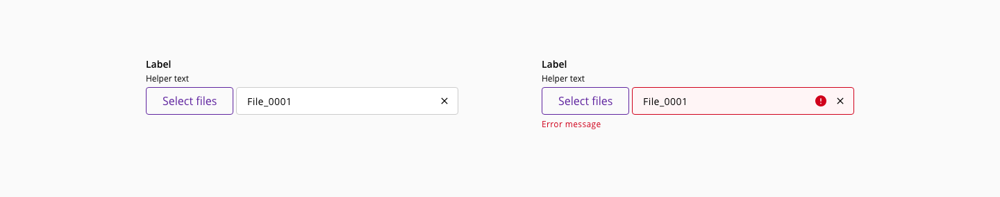

# File input

The file input component is used to choose files from any location in the local machine and update those files to the server where the application is hosted. It is a common procedure in applications where files are required, like documents, images, or other information in digital formats.

## Usage

Considerations for the file input component use:

### Do's

* Provide a meaningful label and helper text to help the user understand the files expected
* When displaying errors, provide feedback about the type of error using the error message
* When the file input process fails, provide useful information instead of showing an error message using technical or undetermined information (e.g. '0x94 ERROR_PATH_BUSY')

### Don'ts

* Use the file input component to upload multiple files inside a modal dialog
* Use a variant with drag and drop functionality when designing for mobile devices

## Variants

_File input component variants_

|  Name        | Use case                                                                                 |
| :----------- | :--------------------------------------------------------------------------------------- |
| **File**     | Use the file variant when designing for multidevice                                      |
| **Filedrop** | Use in large or complex forms when designing only for desktop                            |
| **Dropzone** | Choose the dropzone when the main purpose of the content is to file input files/images   |

## States

The component file input is made-up of an input (type: file) and a file-item(s).

### File

The element has the following states: **Enabled**, **hover**, **focus**, **active** and **disabled**.

_File variant states_

### Filedrop

The element has the following states: **Enabled**, **hover**, **focus**, **active**, **dragover** and **disabled**.

_Filedrop variant states_

### Dropzone

The element has the following states: **Enabled**, **hover**, **focus**, **active**, **dragover** and **disabled**.

_Dropzone variant states_
### File items

The element has the following states: **Enabled**, **hover/focus**, **active**, **loading** and **error**.

_File item states_

## Anatomy

1. Label
2. Drag and drop area
3. Error message
4. Error indicator
5. Action - Remove file
6. Helper text
7. file input button
8. File preview
9. File name
10. File item container

## File item with preview

When the files to upload are mainly images, the preview can provide more feedback to the user rather than the name of the file, preventing errors loading content.

_File item with preview example_

## Single file file input

In order to provide a compact version of the file input component to accommodate any layout restriction, the variant file displays the file name in the same row instead of growing vertically.

_Variant file single_

## Design Specifications

_File input design specifications_

### Color

#### Base

| Component token               | Element                     | Core token                  | Value         |
| :---------------------------- | :-------------------------- | :-------------------------- | :------------ |
| `dropBorderColor`             | Drag and drop area          | `color-black`               |   #000000     |
| `fileItemBorderColor`         | File item                   | `color-grey-300`            |   #cccccc     |
| `fileItemIconColor`           | File item                   | `color-black`               |   #000000     |
| `fileNameFontColor`           | File name                   | `color-black`               |   #000000     |
| `filePreviewBackgroundColor`  | File preview                | `color-color-grey-100`      |   #f2f2f2     |
| `filePreviewIconColor`        | File preview icon           | `color-black`               |   #000000     |
| `labelFontColor`              | Label                       | `color-black`               |   #000000     |
| `helperTextFontColor`         | Helper text                 | `color-black`               |   #000000     |
| `dropLabelFontColor`          | Drop label                  | `color-black`               |   #000000     |

#### Interactive

| Component token                         | Element                     | Core token                  | Value         |
| :-------------------------------------- | :-------------------------- | :-------------------------- | :------------ |
| `disabledLabelFontColor`                | Label:disabled              | `color-grey-500`            |   #999999     |
| `disabledHelperTextFontColor`           | Helper text:disabled        | `color-grey-500`            |   #999999     |
| `disabledDropLabelFontColor`            | Drop label:disabled         | `color-grey-500`            |   #999999     |
| `focusDropBorderColor`                  | Dnd border:focus            | `color-blue-600`            |   #0095ff     |
| `disabledDropBorderColor`               | Dnd border:disabled         | `color-grey-500`            |   #999999     |
| `dragoverDropBackgroundColor`           | Dnd fill:dragover           | `color-blue-50`             |   #f5fbff     |
| `hoverFileItemIconBackgroundColor`      | File item icon:hover        | `color-grey-100`            |   #f2f2f2     |
| `activeFileItemIconBackgroundColor`     | File item icon:active       | `color-grey-300`            |   #cccccc     |
| `errorFileItemBorderColor`              | File item container:error   | `color-red-700`             |   #d0011b     |
| `errorFileItemBackgroundColor`          | File item container:error   | `color-red-50`              |   #fff5f6     |
| `errorFilePreviewBackgroundColor`       | File item preview:error     | `color-red-200`             |   #ffccd3     |
| `errorMessageFontColor`                 | File item:error             | `color-red-700`             |   #d0011b     |

### Typography

| Property        | Element        | Token                   | Value           |
| :-------------- | :------------- | :---------------------- | :-------------- |
| `font-family`   | Label          | `font-family-sans`      | Open Sans       |
| `font-size`     | Label          | `font-scale-02`         | 0.875rem / 14px |
| `font-weight`   | Label          | `font-bold`             | 600             |
| `line-height`   | Label          | `font-leading-loose-01` | 1.75em          |
| `font-family`   | File item      | `font-family-sans`      | Open Sans       |
| `font-size`     | File item      | `font-scale-02`         | 0.875rem / 14px |
| `font-weight`   | File item      | `font-regular`          | 400             |
| `line-height`   | File item      | `font-leading-normal`   | 1.5em           |
| `font-family`   | Helper text    | `font-family-sans`      | Open Sans       |
| `font-size`     | Helper text    | `font-scale-01`         | 12px            |
| `font-weight`   | Helper text    | `font-regular`          | 400             |
| `line-height`   | Helper text    | `font-leading-normal`   | 1.5em           |
| `font-family`   | Drop label     | `font-family-sans`      | Open Sans       |
| `font-size`     | Drop label     | `font-scale-03`         | 1rem / 16px     |
| `font-weight`   | Drop label     | `font-regular`          | 400             |
| `font-family`   | Error message  | `font-family-sans`      | Open Sans       |
| `font-size`     | Error message  | `font-scale-01`         | 0.75rem / 12px  |
| `font-weight`   | Error message  | `font-regular`          | 400             |
| `line-height`   | Error message  | `font-leading-normal`   | 1.5em           |

### Border

| Property        | Element               | Token                   | Value              |
| :-------------- | :-------------------- | :---------------------- | :----------------- |
| `border-style`  | Drag and drop area    | `border-style-dashed`   | dashed             |
| `border-width`  | Drag and drop area    | `border-width-1`        | 1px                |
| `border-radius` | Drag and drop area    | `border-radius-large`   | 0.375rem / 6px     |
| `border-style`  | File item             | `border-style-solid`    | solid              |
| `border-width`  | File item             | `border-width-1`        | 1px                |
| `border-radius` | File item             | `border-radius-medium`  | 0.25rem / 4px      |

## Links and references

* [React CDK component](https://developer.dxc.com/tools/react/next/#/components/fileInput)
* [Angular CDK component](https://developer.dxc.com/tools/angular/next/#/components/fileInput)
* [Adobe XD component](https://xd.adobe.com/view/e2c71e4d-54a9-461a-b269-fcb1b3ffe407-b794/)

____________________________________________________________

[Edit this page on Github](https://github.com/dxc-technology/halstack-style-guide/blob/master/guidelines/components/file input/README.md)
