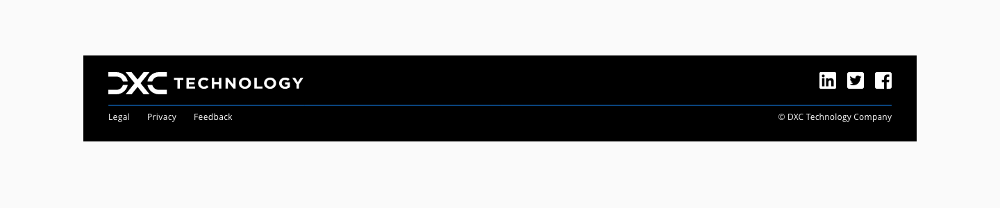
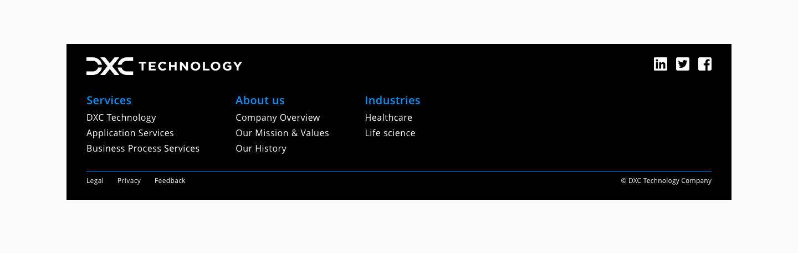
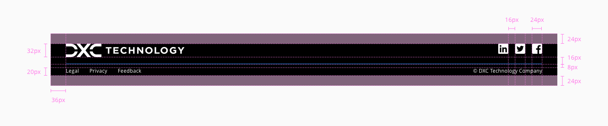

# Footer

_Footer component example_

Footers are a secondary element in a web page because they usually appear at the bottom and it is the last thing that the user interacts with. But the presence of the footer must be designed in every application and be part of it (consumer or back-office) as it is a key layout element to the overall experience. Is a choice of the designer to either leave the footer visible by default or push it down, depending on the use case.

## Usage

- The footer frame should be docked at the bottom of the page and should not scroll with any of the data within working section of the screen.
- The footer frame should span the entire screen width.
- The footer frame should display the copyright information at the right margin.
- We recommend uploading either an alternate version or a smaller brand image than the used in the header. If the company has an alternate version of the logo, isotype, imagotype or isologo available, we encourage to use it. In the opposite case a smaller version of the main brand image can be used.

## Anatomy

1. Container
2. Logo
3. Social icons
4. Copyright
5. Company links

## Content

_Footer custom content examples_

The footer component has a custom area where many kinds of content can be placed, some of them are contemplated in the following list:

* Plain text or content
   * Informational purpose text

* Menu links
   * Global navigation
   * Sitemap
   * Useful links or resources

* Forms
  * Select language
  * Login / Sing up
  * Provide email adress / Subscribe

* Actions
  * Ask for help / Support
  * Business related actions / Call to action
  * Search

## Design specifications

_Footer component design specs_

### Color

| Component token                   | Element               | Core token                   | Value        |
| :-------------------------------- | :-------------------- | :--------------------------- | :----------- |
| `backgroundColor`                 | Footer container      | `color-black`                | #000000      |
| `bottomLinksDividerColor`         | Divider               | `color-blue-600`             | #0095ff      |
| `bottomLinksFontColor`            | Bottom links          | `color-white`                | #ffffff      |
| `copyrightFontColor`              | Copyright             | `color-white`                | #ffffff      |
| `socialLinksColor`                | Social icons          | `color-white`                | #ffffff      |

### Height

|  Property         |   Value   |
| ----------------- | --------- |
|  `min-height`     |   124px   |

### Margin-top

| Margin      |   Value   |
| ----------- | --------- |
| `xxsmall`   |   6px     |
| `xsmall`    |   16px    |
| `small`     |   24px    |
| `medium`    |   36px    |
| `large`     |   48px    |
| `xlarge`    |   64px    |
| `xxlarge`   |   100px   |

### Padding

| Property          |   Value   |
| ----------------- | --------- |
| `padding-top`	    |   24px    |
| `padding-right`	  |   36px    |
| `padding-bottom`  |   24px    |
| `padding-left`	  |   36px    |

### Typography

| Property      |   Element                 |  Value          |
| ------------- | ------------------------- | --------------- |
| `font-size`	  |   Titles      	          |  1rem/16px      |
| `font-size`   |   Links   	              |  0.875rem/14px  |
| `font-size`   |   Copy-write              |  0.75rem/12px   |
| `line-height` |   Copy-write              |  1.25rem        |
| `font-size`   |   Terms & company links   |  0.75rem/12px   |
| `line-height` |   Terms & company links   |  1.25rem        |
| `font-weight`	|   Titles      	          |  600            |
| `font-weight`	|   Links	                  |  400            |

### Iconography

| Property          |   Element             |  Value      |
| ----------------- | --------------------- | ----------- |
| `height`/ `width`	|   Social media icons  |   24/24px   |

### DXC Logo

| Property      |   Element     |  Value    |
| ------------- | ------------- | --------- |
| `max-height`  |   DXC logo    |   32px    |

### Terms & Company Links

| Property                 | Element                | Core token                 | Value            |
| :----------------------- | :--------------------- | :------------------------- | :--------------- |
| `min height`             | Links container        | `-`                        | 20px             |
| `padding-top`            | Links container        | `spacing-03`               | 0.5rem / 8px     |
| `border-width`           | Links separator        | `border-width-1`           | 1px              |
| `border-style`           | Links separator        | `border-style-solid`       | solid            |

### Custom content

| Property        |   Element     	    |   Value   		        |
| --------------- | ------------------- | --------------------- |
| `min-height`   	|   Custom container	|   16px    		        |

The content of the footer should be adapt to the space available depending on the screen device.

## Responsive version for mobile and tablet

The same content in the footer will be displayed for the responsive versions and the only modification will be the width of it. With less space available to display the content, some of the items will be relocated to fit well in the screen.

Regarding his behavior, the footer must be pushed down always so it is not visible by default after page load, even when the content is smaller than the device screen size. This includes the splash screen, which must push the footer down. Of course, if the content is larger than the device screen size, the footer will be pushed down anyway 

On the mobile version, first we have the logo. Below it the links to privacy and terms to let a space for custom component and at the bottom the copyright terms, centered.
At this stage, the custom content and the disposition is responsability of the user, the same way as it is in the desktop and tablet version.

## Links and references

* [React CDK component](https://developer.dxc.com/tools/react/next/#/components/footer)
* [Angular CDK component](https://developer.dxc.com/tools/angular/next/#/components/footer)
* [Adobe XD component](https://xd.adobe.com/view/5a5265da-3257-40c4-b086-f3d90de179e0-0f01/)

____________________________________________________________

[Edit this page on Github](https://github.com/dxc-technology/halstack-style-guide/blob/master/guidelines/components/footer/README.md)
