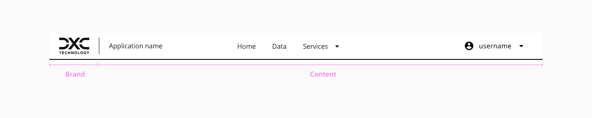
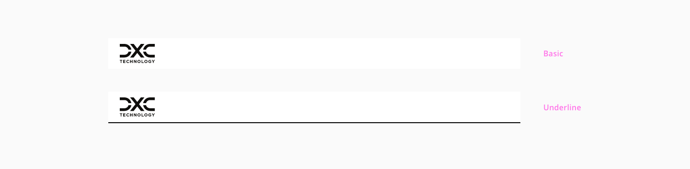
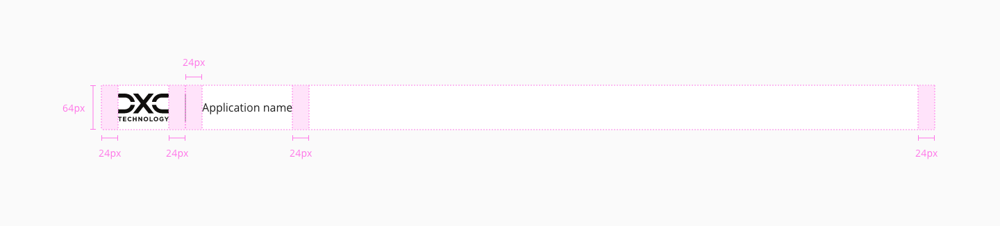
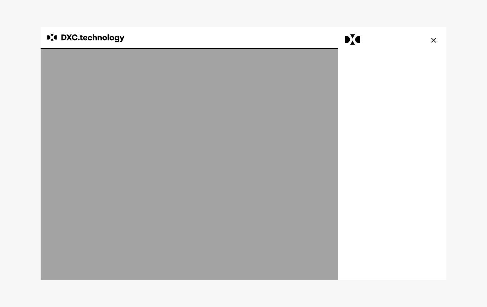

# Header

The header is an important component in the interface, it is the area dedicated for the navigation across the application and helps users understand what the content of the page is about. They appear at the top of a page, above the main content.
## Anatomy


* **Brand**: In this area should be placed the company logo, it will go on the left side of the header.

* **Content**:

   * **Application name**: If the application has a specific name, can be placed here.
   * **Primary navigation**: The links and dropdowns with a navigational purpose should be placed here.
   * **Site options**: Language selector, settings, or other any option that applies globally should be placed here. 
   * **Account**: In the case that the application manages accounts, the element for the login and register options should be positioned on the far right except in the tablet and mobile version that will be covered in the following sections.




_Header distribution example_

## Variants

Following the convention of the variants that can be found in a component, two main variants are defined for the header.
Variants: **basic** and **underlined**.



_Header component variants_


## Design Specifications



_Header design specifications_

### Color

| Tokens                 |  Value         |
| --------------------   | -------------- |
| `backgroundColor`      |    #FFFFFF     |
| `underlinedColor`      |    #000000     |
| `fontColor`            |    #000000     |
| `backgroundColorMenu`  |    #FFFFFF     |
| `fontColorMenu`        |    #000000     |
| `hamburguerColor`      |    #000000     |
| `overlayColor`         |    #565656     |
| `focusColor`           |    #005FCC     |


### Size

| Property                                 | Value    |
| ---------------------------------------- | -------- |
| `height`                                 |   64px   |
| `width`                                  |   100%   |

### Border

| Property                 | Element                | Core token                 | Value            |
| :----------------------- | :--------------------- | :------------------------- | :--------------- |
| `border-width`           | Underline              | `border-width-2`           | 2px              |
| `border-style`           | Underline              | `border-style-solid`       | solid            |

### Margin

The margin only applies to the `margin-bottom` of the header component.

margin | value
-- | --
```xxsmall``` | 6px
```xsmall``` | 16px
```small``` | 24px
```medium``` | 36px
```large``` | 48px
```xlarge``` | 64px
```xxlarge``` | 100px

### Padding

The variable padding only applies to the content area, the `padding-left` applied to the brand area is fixed (20px)

padding | value
-- | --
`xxsmall` | 6px
`xsmall` | 16px
`small` | 24px
`medium` | 36px
`large` | 48px
`xlarge` | 64px
`xxlarge` | 100px

Different values can be applied to each side of the component:
`top` `bottom` `left` `right`


## Content

* Any component or custom content can be placed in the content area of the header (e.g. dropdown, button, link).
* Halstack components placed as a children should follow their respective guidelines.
* There is a special adaptation of the dropdown with a trasparent background design to be a children of the aheader component.


## Responsive version for mobile and tablet

Due to the applications are accessible from a laptop, tablet and mobile it is necessary to think and design a header version for the corresponding device. The design for smaller devices tries to keep the consistency respect to the other versions, allowing the user experiences a similar interaction although the space available is less.



_Header menu responsive version_


## User Interface Design Considerations

- Try to avoid to place a large number of items inside the content area.
- Avoid increasing the header height.


## Links and references

- https://xd.adobe.com/view/23e2cca4-5021-490a-a548-e99a9b4a2006-76b1/screen/448bb58a-bcfc-4aac-b265-42376a27a591/variables/

____________________________________________________________

[Edit this page on Github](https://github.com/dxc-technology/halstack-style-guide/blob/master/guidelines/components/header/README.md)
