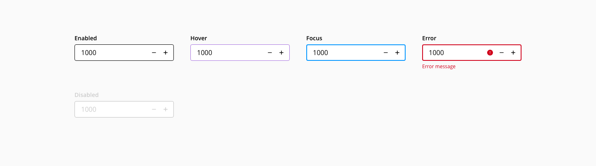
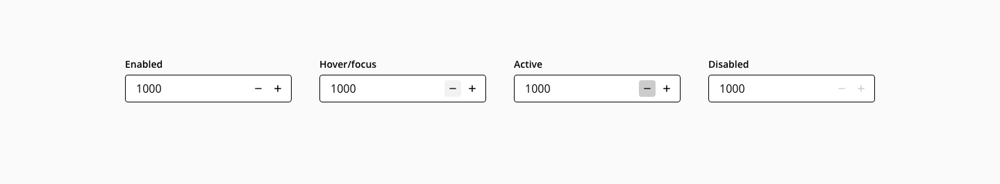
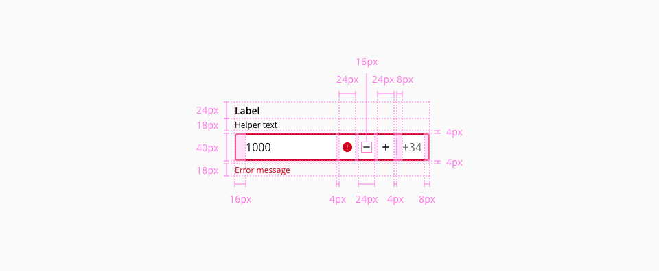

# Input-number

The Input-number component is an Input-text component that only allows numerical values and it has controls for incrementing or decrementing them.

## Usage

* Don't use the number-input component for amounts. Use a input-text instead
* Always enable typing in the input field
* Avoid using the component when large values are expected

## States

### Input

States: **Enabled**, **hover**, **focus**, **error** and  **disabled**

_Input states example_

### Spin button

States: **Enabled**, **hover/focus**, **active** and  **disabled**

_Spin button states example_

## Anatomy

1. Label
2. Helper text
3. Suffix
4. Container
5. Spin button increase
6. Spin button decrease
7. Error indicator
8. Error message
9. Value

## Design specifications

_Design specifications of the input-number component_

### Color

| Component token          | Element            | Token             | Value             |
| ------------------------ | ------------------ | ----------------- | ----------------- |
| `labelFontColor`         | Label              | `black`           | #000000           |
| `valueFontColor`         | Value              | `black`           | #000000           |
| `helperTextFontColor`    | Helper-text        | `black`           | #000000           |
| `enabledOutlineColor`    | Outline:enabled    | `black`           | #000000           |
| `ActionIconColor`        | Spin button icon   | `black`           | #000000           |
| `ActionBackgroundColor`  | Spin button        | `transparent`     | #transparent      |

#### Interactive

| Component token                 | Element                     | Token             | Value           |
| ------------------------------- | --------------------------- | ----------------- | --------------- |
| `hoverOutlineColor`             | Outline:hover               | `purple-500`      | #a46ede         |
| `focusOutlineColor`             | Outline:focus               | `blue-600`        | #0095ff         |
| `errorOutlineColor`             | Outline:error               | `red-700`         | #d0011b         |
| `disabledOutlineColor`          | Outline:disabled            | `grey-500`        | #999999         |
| `errorMessageColor`             | Error message               | `red-700`         | #d0011b         |
| `errorIconColor`                | Error icon                  | `red-700`         | #d0011b         |
| `disabledContainerFillColor`    | Input container:disabled    | `grey-100`        | #f2f2f2         |
| `disabledLabelFontColor`        | Label:disabled              | `grey-500`        | #999999         |
| `disabledValueFontColor`        | Value:disabled              | `grey-500`        | #999999         |
| `disabledHelperTextFontColor`   | Helper text:disabled        | `grey-500`        | #999999         |
| `disabledPlaceholderFontColor`  | Placeholder:disabled        | `grey-500`        | #999999         |
| `hoverActionBackgroundColor`    | Spin button:hover           | `grey-100`        | #f2f2f2         |
| `focusActionBackgroundColor`    | Spin button:focus           | `grey-100`        | #f2f2f2         |
| `activeActionBackgroundColor`   | Spin button:active          | `grey-300`        | #cccccc         |
| `disabledActionBackgroundColor` | Spin button:disabled        | `transparent`     | transparent     |
| `hoverActionIconColor`          | Spin button icon:hover      | `grey-500`        | #999999         |
| `focusActionIconColor`          | Spin button icon:focus      | `grey-500`        | #999999         |
| `disabledActionIconColor`       | Spin button icon:disabled   | `grey-500`        | #999999         |

### Typography

| Property        | Element        | Token                   | Value           |
| --------------- | -------------- | ----------------------- | --------------- |
| `font-family`   | Label          | `type-sans`             | Open Sans       |
| `font-size`     | Label          | `type-scale-02`         | 0.875rem / 14px |
| `font-weight`   | Label          | `type-bold`             | 600             |
| `line-height`   | Label          | `type-leading-loose-01` | 1.75em          |
| `font-family`   | Value          | `type-sans`             | Open Sans       |
| `font-size`     | Value          | `type-scale-03`         | 1rem / 16px     |
| `font-weight`   | Value          | `type-regular`          | 400             |
| `font-family`   | Error message  | `type-sans`             | Open Sans       |
| `font-size`     | Error message  | `type-scale-01`         | 0.75rem / 12px  |
| `font-weight`   | Error message  | `type-regular`          | 400             |
| `line-height`   | Error message  | `type-leading-normal`   | 1.5em           |

### Spacing

| Property        | Element         | Token             | Value           |
| --------------- | --------------- | ----------------- | --------------- |
| `margin-left`   | Error icon      | `spacing-02`      | 0.25rem / 4px   |
| `margin-left`   | Spin button    |  `spacing-02`      | 0.25rem / 4px   |
| `padding-left`  | Input           | `spacing-03`      | 0.5rem / 8px    |
| `padding-left`  | Input container | `spacing-03`      | 0.5rem / 8px    |
| `padding-right` | Input container | `spacing-03`      | 0.5rem / 8px    |
| `margin-top`    | Input container | `spacing-02`      | 0.25rem / 4px   |
| `margin-bottom` | Input container | `spacing-02`      | 0.25rem / 4px   |

### Border

| Property        | Element               | Token             | Value           |
| --------------- | --------------------- | ----------------- | --------------- |
| `border`        | Input container       | `-`               | 1px solid       |
| `box-shadow`    | Input container:focus | `-`               | 1px solid       |

## Accesibility

<!--
Add WCAG success criterion and WAI-ARIA design pattern and example when available

### WCAG 

* Understanding WCAG 2.2 - [SC x.x name of the succes criterion](url)
-->

### WAI-ARIA

* WAI-ARIA Authoring practices 1.2 - [3.21 Spinbutton](https://www.w3.org/TR/wai-aria-practices-1.2/#spinbutton)
* WAI-ARIA Authoring practices 1.2 - ["Date Picker Spin Button" design pattern](https://www.w3.org/TR/wai-aria-practices-1.1/examples/spinbutton/datepicker-spinbuttons.html)

## Links and references

* [Angular CDK component](url)
* [React CDK component](url)

____________________________________________________________

* [Edit this page on GitHub](url)

