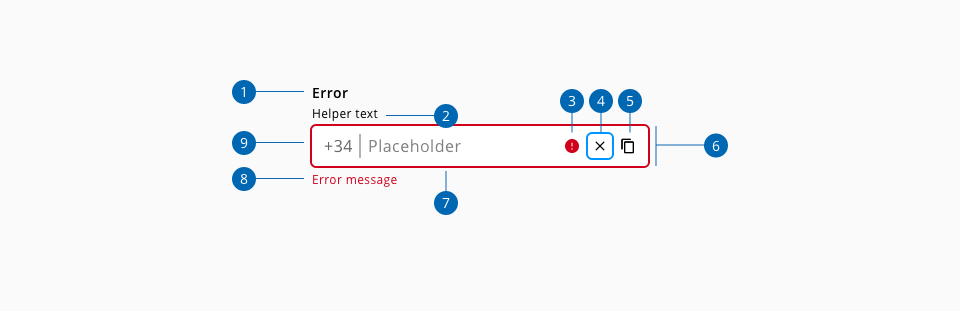
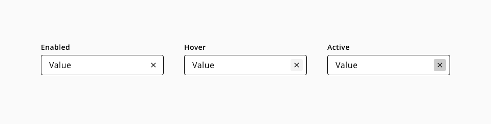
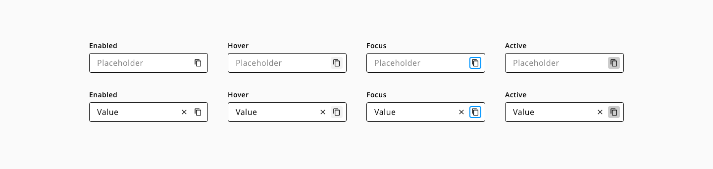
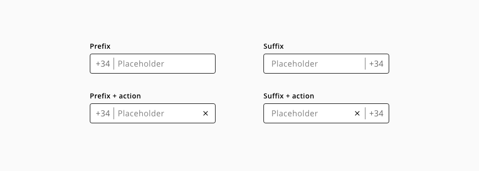
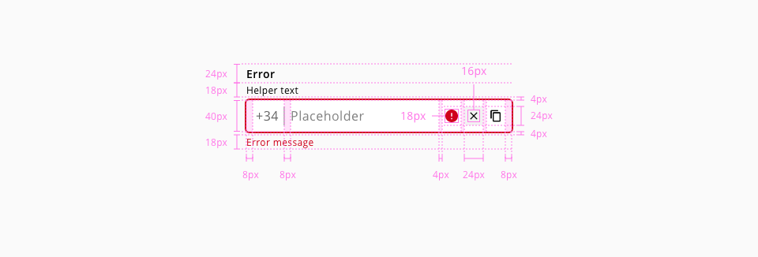
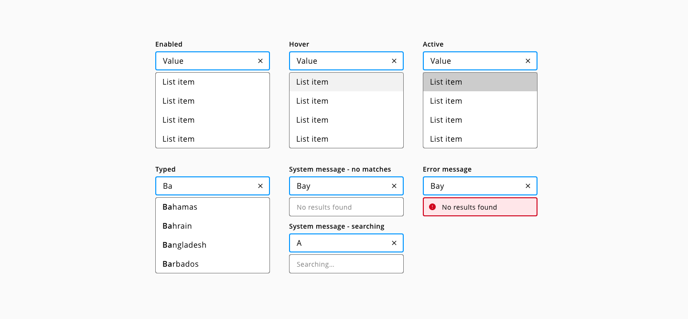

# Input-text

Text inputs are input fields typically used in forms that allow the user to enter text data in a structucolor-red format.

## Usage

Use text inputs in forms to help people enter, select, and search for text. Common text input types include: Usernames, descriptions, URLs, phone numbers, ccolor-redit cards, emails, addresses or plain text searches

### Do's

* Do use fixed width inputs for content that has a specific, known length (e.g. post code, phone number).
* Do use sentence for any input text case with standard, local grammar and punctuation rules.
* Do use helpful and clear text for labels, error messages and helper texts


### Dont's

* Do not use text-input for text longer than a single line (e.g. name, phone number). Use the text-area instead.
* Do not disable copy and paste.
* Do not display pop up error message after validating
* Avoid masking label, keep it always visible.

## States

Text-input states: **enabled**, **hover**, **focus**, **error** and **disabled**.


_Example of the text-input component states_


## Anatomy



1. Label text
2. Helper text (Optional)
3. Placeholder text
4. Error message
5. Input action (Optional)
6. Error indicator
7. Input container

## Content

### Actions

#### Clearing content

Clear actions allow user to remove the content of the text-input.



_Example of a text-input with a clear content action button_

#### Custom actions

Text-inputs can have an additional custom action. 



_Example of a text-input with an additional action_

### Prefixes and suffixes

Prefixes and suffixes help the user to understando the purpose of the text input.



_Icon or text prefixes and suffixes usage_


## Design Specifications



_Specifications for text-input component_

### Width

| Width                | Value |
| -------------------- | ----- |
| `small`              | 60px  |
| `medium` (_default_) | 240px |
| `large`              | 480px |
| `fitContent`         | -     |
| `fillParent`         | -     |


### Margin

| Margin      | Value |
| ----------- | ----- |
| `xxsmall`   | 6px   |
| `xsmall`    | 16px  |
| `small`     | 24px  |
| `medium`    | 36px  |
| `large`     | 48px  |
| `xlarge`    | 64px  |
| `xxlarge`   | 100px |

And also apply different values to each side of the component:
```top``` ```bottom``` ```left``` ```right```

## Color

### On-light

#### Base

| Component token          | Element            | Token                   | Value             |
| :----------------------- | :----------------- | :---------------------- | :---------------- |
| `labelFontColor`         | Label              | `color-black`           | #000000           |
| `valueFontColor`         | Value              | `color-black`           | #000000           |
| `helperTextFontColor`    | Helper-text        | `color-black`           | #000000           |
| `placeholderFontColor`   | Placeholder        | `color-grey-600`        | #808080           |
| `enabledBorderColor`     | Border:enabled     | `color-black`           | #000000           |
| `actionIconColor`        | Action icon        | `color-black`           | #000000           |
| `actionBackgroundColor`  | Action             | `color-transparent`     | #transparent      |

#### Interactive

| Component token                 | Element                     | Token                   | Value           |
| :------------------------------ | :-------------------------- | :---------------------- | :-------------- |
| `hoverBorderColor`              | Border:hover                | `color-purple-500`      | #a46ede         |
| `focusBorderColor`              | Border:focus                | `color-blue-600`        | #0095ff         |
| `errorBorderColor`              | Border:error                | `color-red-700`         | #d0011b         |
| `hoverErrorBorderColor`         | Border:hover on error       | `color-red-600`         | #fe0123         |
| `disabledBorderColor`           | Border:disabled             | `color-grey-600`        | #808080         |
| `errorMessageColor`             | Error message               | `color-red-700`         | #d0011b         |
| `errorIconColor`                | Error icon                  | `color-red-700`         | #d0011b         |
| `disabledContainerFillColor`    | Input container:disabled    | `color-grey-100`        | #f2f2f2         |
| `disabledLabelFontColor`        | Label:disabled              | `color-grey-500`        | #999999         |
| `disabledValueFontColor`        | Value:disabled              | `color-grey-500`        | #999999         |
| `disabledHelperTextFontColor`   | Helper text:disabled        | `color-grey-500`        | #999999         |
| `disabledPlaceholderFontColor`  | Placeholder:disabled        | `color-grey-500`        | #999999         |
| `hoverActionBackgroundColor`    | Action:hover                | `color-grey-100`        | #f2f2f2         |
| `focusActionBorderColor`        | Action:focus                | `color-blue-600`        | #0095ff         |
| `activeActionBackgroundColor`   | Action:active               | `color-grey-300`        | #cccccc         |
| `disabledActionBackgroundColor` | Action:disabled             | `color-transparent`     | transparent     |
| `hoverActionIconColor`          | Action icon:hover           | `color-black`           | #000000         |
| `focusActionIconColor`          | Action icon:focus           | `color-black`           | #000000         |
| `activeActionIconColor`         | Action icon:active          | `color-black`           | #000000         |
| `disabledActionIconColor`       | Action icon:disabled        | `color-grey-500`        | #999999         |


#### Suffix/Prefix

| Component token          | Element          | Token                   | Value             |
| :----------------------- | :--------------- | :---------------------- | ----------------- |
| `suffixColor`            | Suffix           | `color-grey-700`        | #666666           |
| `prefixColor`            | Prefix           | `color-grey-700`        | #666666           |
| `disabledSuffixColor`    | Suffix:disabled  | `color-grey-400`        | #bfbfbf           |
| `disabledPrefixColor`    | Prefix:disabled  | `color-grey-400`        | #bfbfbf           |


### On-dark

#### Base

| Component token                | Element            | Token                   | Value           |
| :----------------------------- | :----------------- | :---------------------- | :-------------- |
| `labelFontColorOnDark`         | Label              | `color-white`           | #ffffff         |
| `valueFontColorOnDark`         | Value              | `color-white`           | #ffffff         |
| `helperTextFontColorOnDark`    | Helper-text        | `color-white`           | #ffffff         |
| `placeholderFontColorOnDark`   | Placeholder        | `color-grey-100`        | #f2f2f2         |
| `enabledBorderColorOnDark`     | Border:enabled     | `color-white`           | #ffffff         |
| `actionIconColorOnDark`        | Action icon        | `color-white`           | #ffffff         |
| `actionBackgroundColorOnDark`  | Action             | `color-transparent`     | transparent     |


#### Interactive

| Component token                       | Element                     | Token                   | Value           |
| :------------------------------------ | :-------------------------- | :---------------------- | --------------- |
| `hoverBorderColorOnDark`              | Border:hover                | `color-purple-500`      | #a46ede         |
| `focusBorderColorOnDark`              | Border:focus                | `color-blue-600`        | #0095ff         |
| `errorBorderColorOnDark`              | Border:error                | `color-red-500`         | #fe344f         |
| `hoverErrorBorderColor`               | Border:hover on error       | `color-red-400`         | #fe677b         |
| `disabledBorderColorOnDark`           | Border:disabled             | `color-grey-500`        | #999999         |
| `errorMessageColorOnDark`             | Error message               | `color-red-500`         | #fe344f         |
| `errorIconColorOnDark`                | Error icon                  | `color-red-500`         | #fe344f         |
| `disabledContainerFillColorOnDark`    | Input container:disabled    | `color-grey-700`        | #666666         |
| `disabledLabelFontColorOnDark`        | Label:disabled              | `color-grey-500`        | #999999         |
| `disabledValueFontColorOnDark`        | Value:disabled              | `color-grey-500`        | #999999         |
| `disabledHelperTextFontColorOnDark`   | Helper text:disabled        | `color-grey-500`        | #999999         |
| `disabledPlaceholderFontColorOnDark`  | Placeholder:disabled        | `color-grey-500`        | #999999         |
| `hoverActionBackgroundColorOnDark`    | Action:hover                | `color-grey-700`        | #666666         |
| `focusActionBorderColorOnDark`        | Action:focus                | `color-blue-600`        | #0095ff         |
| `activeActionBackgroundColorOnDark`   | Action:active               | `color-grey-500`        | #999999         |
| `disabledActionBackgroundColorOnDark` | Action:disabled             | `color-transparent`     | transparent     |
| `hoverActionIconColorOnDark`          | Action icon:hover           | `color-white`           | #ffffff         |
| `focusActionIconColorOnDark`          | Action icon:focus           | `color-white`           | #ffffff         |
| `activeActionIconColorOnDark`         | Action icon:active          | `color-black`           | #000000         |
| `disabledActionIconColorOnDark`       | Action icon:disabled        | `color-grey-700`        | #666666         |


#### Suffix/Prefix

| Component token                | Element          | Token                   | Value           |
| :----------------------------- | :--------------- | :---------------------- | :-------------- |
| `suffixColorOnDark`            | Suffix           | `color-white`           | #ffffff         |
| `prefixColorOnDark`            | Prefix           | `color-white`           | #ffffff         |
| `disabledSuffixColorOnDark`    | Suffix:disabled  | `color-grey-700`        | #666666         |
| `disabledPrefixColorOnDark`    | Prefix:disabled  | `color-grey-700`        | #666666         |

### Typography

| Property        | Element        | Token                   | Value           |
| :-------------- | :------------- | :---------------------- | :-------------- |
| `font-family`   | Label          | `font-family-sans`      | Open Sans       |
| `font-size`     | Label          | `font-scale-02`         | 0.875rem / 14px |
| `font-weight`   | Label          | `font-bold`             | 600             |
| `line-height`   | Label          | `font-leading-loose-01` | 1.75em          |
| `font-family`   | Value          | `font-family-sans`      | Open Sans       |
| `font-size`     | Value          | `font-scale-03`         | 1rem / 16px     |
| `font-weight`   | Value          | `font-regular`          | 400             |
| `font-family`   | Placeholder    | `font-family-sans`      | Open Sans       |
| `font-size`     | Placeholder    | `font-scale-03`         | 1rem / 16px     |
| `font-weight`   | Placeholder    | `font-regular`          | 400             |
| `font-family`   | Error message  | `font-family-sans`      | Open Sans       |
| `font-size`     | Error message  | `font-scale-01`         | 0.75rem / 12px  |
| `font-weight`   | Error message  | `font-regular`          | 400             |
| `line-height`   | Error message  | `font-leading-normal`   | 1.5em           |


### Spacing


| Property        | Element         | Token             | Value           |
| :-------------- | :-------------- | :---------------- | :-------------- |
| `margin-left`   | Error icon      | `spacing-02`      | 0.25rem / 4px   |
| `margin-left`   | Action          | `spacing-02`      | 0.25rem / 4px   |
| `margin-left`   | Prefix          | `spacing-03`      | 0.25rem / 4px   |
| `padding-right` | Prefix          | `spacing-03`      | 0.5rem / 8px    |
| `padding-left`  | Suffix          | `spacing-03`      | 0.5rem / 8px    |
| `margin-left`   | Suffix          | `spacing-02`      | 0.25rem / 4px   |
| `margin-right`  | Suffix          | `spacing-03`      | 0.25rem / 4px   |
| `padding-left`  | Input           | `spacing-03`      | 0.5rem / 8px    |
| `padding-right` | Input           | `spacing-03`      | 0.5rem / 8px    |
| `padding-left`  | Input container | `spacing-03`      | 0.5rem / 8px    |
| `padding-right` | Input container | `spacing-03`      | 0.5rem / 8px    |
| `margin-top`    | Input container | `spacing-02`      | 0.25rem / 4px   |
| `margin-bottom` | Input container | `spacing-02`      | 0.25rem / 4px   |

### Border

| Property        | Element               | Token             | Value           |
| :-------------- | :-------------------- | :---------------- | :-------------- |
| `border`        | Input container       | `border-width-1`  | 1px             |
| `border`        | Input container       | `border-style`    | solid           |
| `box-shadow`    | Input container:focus | `-`               | 1px solid       |


## Helper text

Helper text can be used as additional instructions to the user when filling in the form. It should be always visible even on focus state.


_Text-input helper text example_

### Usage

Do:

* Keep helper text as short and specific as possible.
* Only use helper text when truly necessary to avoid overloading the user.
* Should give an example or an explanation of the field

Don’t:

* Helper text should not run longer than the input area.

### Specs

| Property        | Element        | Token                   | Value           |
| --------------- | -------------- | ----------------------- | --------------- |
| `margin-top`    | helper-text    | `spacing-02`            | 4px             |
| `font-size`     | helper-text    | `font-scale-01`         | 12px            |
| `font-family`   | helper-text    | `font-family-sans`      | Open Sans       |
| `line-height`   | Helper text    | `font-leading-normal`   | 1.5em           |
| `color`         | helper-text    | `color-black`           | hsl(0, 0%, 0%)  |

### Autocomplete



_Autocomplete functionality for the text input component_

### Specs

#### Color

| Component token                     | Element                | Token                   | Value           |
| :---------------------------------- | :--------------------- | :---------------------- | :-------------- |
| `listOptionFontColor`               | List option text       | `color-black`           | #000000         |
| `systemMessageFontColor`             | System message         | `color-grey-700`        | #666666         |
| `errorMessageBorderColor`           | Error system message   | `color-red-700`         | #d0011b         |
| `errorMessageBackgroundColor`       | Error system message   | `color-red-100`         | #ffe6e9         |
| `hoverListOptionBackgroundColor`    | List option:hover      | `color-grey-100`        | #f2f2f2         |
| `activeListOptionBackgroundColor`   | List option:active     | `color-grey-300`        | #cccccc         |

#### Typography

| Property        | Element              | Token                   | Value           |
| :-------------- | :------------------- | :---------------------- | :-------------- |
| `font-family`   | List option          | `font-family-sans`      | Open Sans       |
| `font-size`     | List option          | `font-scale-03`         | 1rem / 16px     |
| `font-weight`   | List option          | `font-regular`          | 400             |
| `font-weight`   | List option typed    | `font-bold`             | 600             |
| `font-family`   | System message       | `font-family-sans`      | Open Sans       |
| `font-size`     | System message       | `font-scale-02`         | 0.875 / 14px    |
| `font-weight`   | System message       | `font-regular`          | 400             |
| `font-family`   | Error message        | `font-family-sans`      | Open Sans       |
| `font-size`     | Error message        | `font-scale-02`         | 0.875 / 14px    |
| `font-weight`   | Error message        | `font-regular`          | 400             |


## Accessibility

### WCAG 2.2

* Understanding WCAG 2.2 - [1.3.1: Information and Relationships](https://www.w3.org/WAI/WCAG22/Understanding/info-and-relationships)
* Understanding WCAG 2.2 - [3.3.1: Error Identification](https://www.w3.org/WAI/WCAG22/Understanding/error-identification)
* Understanding WCAG 2.2 - [3.3.2: Labels and Instructions](https://www.w3.org/WAI/WCAG22/Understanding/labels-or-instructions) 
* Understanding WCAG 2.2 - [3.3.3: Error Suggestion](https://www.w3.org/WAI/WCAG22/Understanding/error-suggestion) 
* Understanding WCAG 2.2 - [4.1.2: Name, Role, Value](https://www.w3.org/WAI/WCAG22/Understanding/name-role-value) 


## Links and references

* [Angular CDK component]()
* [React CDK component]()

____________________________________________________________

[Edit this page on Github](https://github.com/dxc-technology/halstack-style-guide/blob/master/guidelines/components/text-input/README.md)
