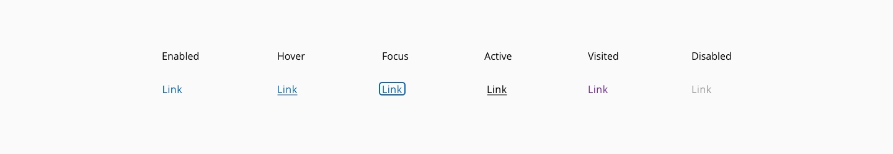
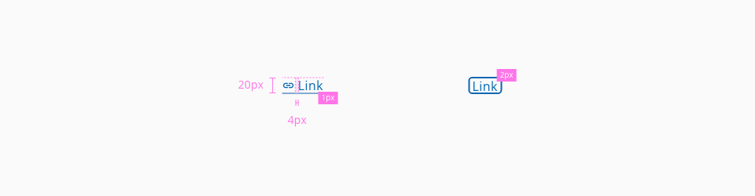
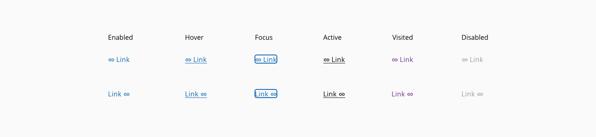

# Link

Links are used as navigational elements. They may appear isolated, inside a sentence or paragraph, or following the content.

* [Usage](#usage)
* [States](#states)
* [Design specifications](#design-specifications)
* [Icon Usage](#icon-usage)
* [Accessibility](#accessibility)
* [Links and references](#links-and-references)

## Usage

- Provide visual cue to suggest clickability for all types of links
- Distinguish the visited and unvisited for navigation links
- Clearly explain where the link will take you to
- Front-load the most relevant keyword

## States

States: **enabled**, **hover**, **focus**, **active**, **visited** and **disabled**

_Example of the link component states_

## Design Specifications

_Design specifications for link component_

### Color

| Tokens                              | Value       |
| ---------------------------------   | ----------- |
| `fontColor`                         |   #005FCC   |
| `visitedFontColor`                  |   #8800F6   |
| `underlinedBackgroundColor`         |   #005FCC   |
| `visitedUnderlinedBackgroundColor`  |   #8800F6   |
| `disabledColor`                     |   #D9D9D9   |
| `disabledUnderlinedBackgroundColor` |   #D9D9D9   |
| `hoverFontColor`                    |   #006BF6   |

### Margin

| Margin    | value  |
| --------- | ------ |
| `xxsmall` | 6px    |
| `xsmall`  | 16px   |
| `small`   | 24px   |
| `medium`  | 36px   |
| `large`   | 48px   |
| `xlarge`  | 64px   |
| `xxlarge` | 100px  |

### Typography

| Property                    | value       |
| --------------------------- | ----------- |
| `font-size`                 | 1rem/16px   |
| `font-weight`               | 400         |

### Border

| Property                      | Element                      |  Value      |
| ----------------------------- | ----------------             | ----------- |
| `border-bottom`               | `link` container (on hover)  |   1px       |

## Icon Usage

An icon can be used either in the normal or underlined mode to represent more graphical the purpose of the link, placing the icon before or after the link that is representing.

_Icon usage for the link component_

### Icon specs

| Property                      | Element                |  Value      |
| ----------------------------- | ----------------       | ----------- |
| `height/width`                |  icon                  |   16/16px   |
| `padding-left`                |  icon                  |   4px       |

## Accessibility

### WCAG 2.2

* Understanding WCAG 2.2 - [2.4.9: Link Purpose (Link Only)](https://www.w3.org/WAI/WCAG22/Understanding/link-purpose-link-only.html)
* Understanding WCAG 2.2 - [2.4.4: Link Purpose (In Context)](https://www.w3.org/WAI/WCAG22/Understanding/link-purpose-in-context.html)

### WAI-ARIA 1.2

* WAI-ARIA authoring practices 1.2 - [3.13 Link](https://www.w3.org/TR/wai-aria-practices-1.2/#link)

## Links and references

- https://xd.adobe.com/view/23e2cca4-5021-490a-a548-e99a9b4a2006-76b1/screen/7d626918-c972-43d1-86f1-a0eb6f4ae0c4/variables/

____________________________________________________________

[Edit this page on Github](https://github.com/dxc-technology/halstack-style-guide/blob/master/guidelines/components/link/README.md)
