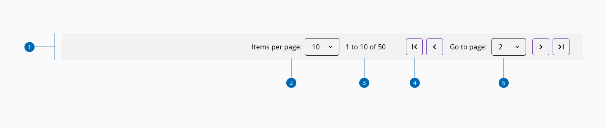
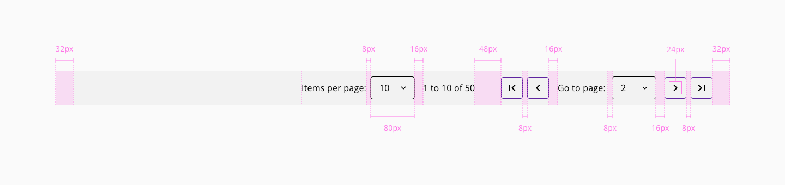

# Paginator

The paginator component allows dividing large amounts of content into multiple pages.

## Usage

Usage considerations about the paginator component:

* Use the paginator when the number of elements is affecting the system load, or when the screen size grows considerably
* Always place the paginator at the bottom of the data that is being divided
* Identify the current page and the number of elements that are being displayed

## Anatomy

1. Container
2. Items per page
3. Items indicator
4. Page actions
5. Page selector

## Design specifications

_Paginator design specifications_

### Color

| Component token           | Element         | Core token         | Value     |
| :------------------------ | :-------------- | :----------------- | :-------- |
| `backgroundColor`         | Container       | `color-grey-100`   | #f2f2f2   |
| `fontColor`               | Type all        | `color-black`      | #000000   |

### Typography

| Component token           | Element         | Core token             | Value                     |
| :------------------------ | :-------------- | :--------------------- | :------------------------ |
| `fontFamily`              | Type all        | `font-family-sans`     | 'Open Sans', sans-serif   |
| `fontSize`                | Type all        | `font-scale-03`        | 1rem / 16px               |
| `fontStyle`               | Type all        | `font-style-normal`    | normal                    |
| `fontWeight`              | Type all        | `font-weight-regular`  | 400                       |
| `fontTextTransform`       | Type all        | -                      | none                      |

### Spacing

| Component token                    | Element                | Core token         | Value          |
| :--------------------------------- | :--------------------- | :----------------- | :------------- |
| `marginRight`                      | Content                | `spacing-32`       | 2rem / 32px    |
| `marginLeft`                       | Content                | `spacing-32`       | 2rem / 32px    |
| `itemsPerPageSelectorMarginLeft`   | Items per page         | `spacing-0`        | 0rem / 0px     |
| `itemsPerPageSelectorMarginRight`  | Items per page         | `spacing-16`       | 1rem / 16px    |
| `pageSelectorMarginRight`          | Page selector          | `spacing-16`       | 1rem / 16px    |
| `pageSelectorMarginLeft`           | Page selector          | `spacing-0`        | 0rem / 0px     |
| `totalItemsContainerMarginRight`   | Items indicator        | `spacing-48`       | 3rem / 48px    |
| `totalItemsContainerMarginLeft`    | Items indicator        | `spacing-0`        | 0rem / 0px     |

### Size

| Component token      | Element          | Core token    | Value     |
| :------------------- | :--------------- | :------------ | :-------- |
| `height`             | Container        | -             | 64px      |
| `width`              | Container        | -             | 100%      |

## Links and references

* [Angular CDK component](https://developer.dxc.com/tools/angular/next/#/components/paginator)
* [React CDK component](https://developer.dxc.com/tools/react/next/#/components/paginator)
* [Adobe XD component](https://xd.adobe.com/view/07d8d8c6-4a1b-4b1f-acc4-00e7df7d66cc-528b/)

____________________________________________________________

* [Edit this page on GitHub](https://github.com/dxc-technology/halstack-style-guide/blob/master/guidelines/components/paginator/README.md)
