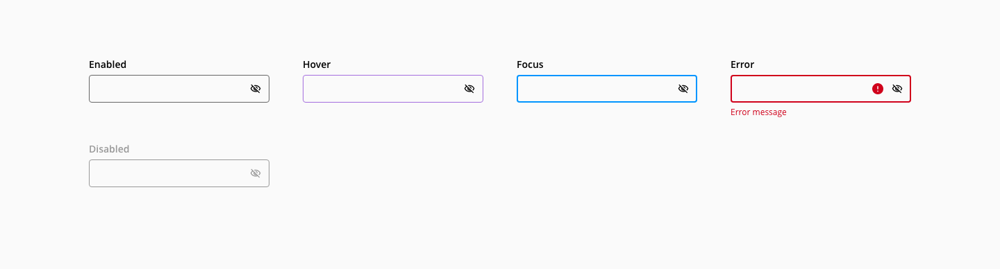
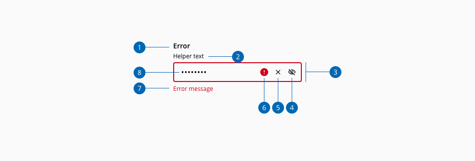
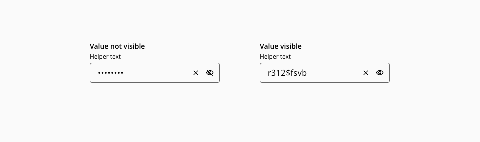
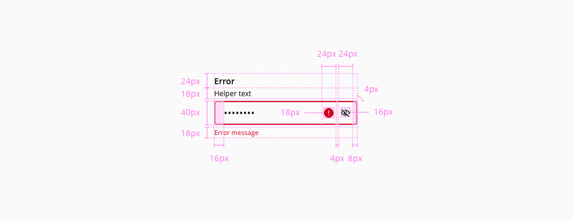

# Password input

The password input component is very much like the text input, with the difference that their value is obscured by default (by replacing its characters with dot symbol ("•"), and the mask can be toggled on/off using the show and hide component action.

## Usage

### Do

* Use the component password input when the value expected is a password and need to be secured
* Provide the requirements in the helper text

### Don't

* Show the validation of the password input until the component loses the focus
* Disable the copy/paste input functionality

## States

The component password has the following states:

States: **Enabled**, **Hover**, **Focus**, **Error** and **Disabled**.

_Password input component states_

## Anatomy

_Component anatomy example_

1. Label
2. Helper text _(Optional)_
3. Input container
4. Show/Hide action
5. Clear action
6. Error icon
7. Error message
8. Input value

## Actions

_Show and hide action to toggle the value visibility_

The value of the input can be toggled on or off using the default action the component provides. The password input can also be clearable.

* The toggle indicates the action that will be performed when clicked, tapped, or pressing keyboard `Enter` key.
* The toggle has a `title` with a textual cue for the resulting action

## Design specifications

_Password input component specifications_

The password input `color`, `typography`, `border`, `spacing`, `width` and `margin` specifications are inherited from the text input, for reference [check the text input component documentation](https://developer.dxc.com/design/guidelines/components/text input). 

The password input doesn't have the following text input elements, therefore their listed styles don't apply:

* Placeholder
* Prefix / Suffix

## Accessibility

### WCAG 

* Understanding WCAG 2.2 - [SC 1.3.5 Identify Input Purpose](https://www.w3.org/WAI/WCAG22/Understanding/identify-input-purpose.html)
* Understanding WCAG 2.2 - [SC 3.3.3 Error Suggestion](https://www.w3.org/WAI/WCAG22/Understanding/error-suggestion)
* Understanding WCAG 2.2 - [SC 3.3.7 Accessible Authentication](https://www.w3.org/WAI/WCAG22/Understanding/accessible-authentication)

### WAI Web Accessibility Tutorials

* Forms - [Full Password Example](https://www.w3.org/WAI/tutorials/forms/examples/password/)

## Links and references

* [React component](https://developer.dxc.com/tools/react/next/#/components/passwordInput)
* [Angular component](https://developer.dxc.com/tools/angular/next/#/components/passwordInput)
* [Adobe XD component](https://xd.adobe.com/view/9e81c000-7d20-4531-a6cd-8da5f4de876e-cbd2/)

____________________________________________________________

* [Edit this page on GitHub](https://github.com/dxc-technology/halstack-style-guide/blob/master/guidelines/components/password input/README.md)

