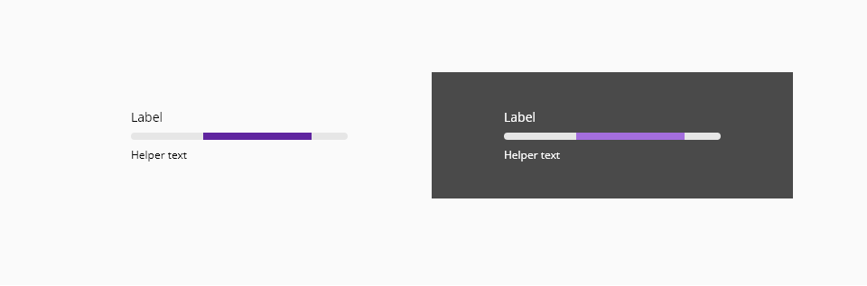

# Progress-bar

Progress indicators offer visibility of system status to the user, giving feedback to indicate that the application is taking some time to processing data. The main aim of these components is to reduce the user's uncertainty about offering something to look at while the user is waiting for the end.

A progress bar should be used in any scenario that will take more than 1 second in performing the action, for anything that takes less than that time, it will be distracting for the user.

## Usage

### Do

* Use a progress bar when it will give people feedback in a long-running process with continuous values.
* Add additional information to clarify to the user the action for which is waiting ("Sending documents...")
* Use the determinate type if it is possible, the user can have an estimation on how long it is gonna take.

### Don't

* For an unknown amount of time/progress, consider using a loading spinner instead.
* Do not use this type of component in actions that will take less than 1 minute to the system.


## Variants

The component progress-bar has two variants: **default** and **overlay**.



_Progress bar variants_

## Anatomy


1. Label _(Optional)_
2. Progress track line
3. Helper text _(Optional)_
4. Progress total line
5. Progress indicator _(Optional)_

## Determinate or indeterminate   
 


_Determinate vs undeterminate progress bar_

* Determinate indicators display how long a process will take. They should be used in longer processes.

* Indeterminate indicators express an unspecified amount of wait time. They should be used when:
        * The processing time is unknown.
        * The wait time is expected to be short enough that it’s not necessary to display.   

## Design Specifications


_Component design specifications_

### Color

| Component token            | Element                   | Token                   | Value      |
| :------------------------- | :------------------------ | :---------------------- | :--------- |
| `trackLineColor`           | Track line                | `color-purple-700`      | #5f249f    |
| `trackLineColorOnDark`     | Track line                | `color-purple-500`      | #a46ede    |
| `totalLineColor`           | Total line                | `color-grey-200`        | #e6e6e6    |
| `labelFontColor`           | Label                     | `color-black`           | #000000    |
| `labelFontColor`           | Label                     | `color-black`           | #000000    |
| `labelFontColorOnDark`     | Label                     | `color-white`           | #ffffff    |
| `indicatorFontColor`       | Indicator                 | `color-black`           | #000000    |
| `indicatorFontColorOnDark` | Indicator                 | `color-white`           | #ffffff    |
| `helperFontColor`          | Helper text               | `color-black`           | #000000    |
| `helperFontColorOnDark`    | Helper text               | `color-white`           | #ffffff    |
| `overlayColor`             | Overlay                   | -                       | #000000 0.80 opacity  |

### Size

| Property        | Element                      | Token            | Value     |
| --------------- | ---------------------------- | ---------------- | --------- |
| `height`        | Track line                   | -                | 8px       |
| `height`        | Total line                   | -                | 8px       |
| `max-width`     | Overlay                      | -                | 100vw     |
| `max-height`    | Overlay                      | -                | 100vh     |

### Internal spacing

| Property        | Element                      | Token            | Value     |
| --------------- | ---------------------------- | ---------------- | --------- |
| `margin-bottom` | Label                        | -                | 8px       |
| `margin-top`    | Helper text                  | -                | 8px       |

### Margin

| Margin | Value |
-- | --
```xxsmall``` | 6px
```xsmall``` | 16px
```small``` | 24px
```medium``` | 36px
```large``` | 48px
```xlarge``` | 64px
```xxlarge``` | 100px

And also apply different values to each side of the component:
```top``` ```bottom``` ```left``` ```right```

### Typography

| Property        | Element          | Token            | Value     |
| --------------- | ---------------- | ---------------- | --------- |
| `font-size`     | Label            | `font-scale-02`  | 14px      |
| `font-weight`   | Label            | `font-regular`   | 400       |
| `font-size`     | Indicator        | `font-scale-02`  | 14px      |
| `font-weight`   | Indicator        | `font-bold`      | 600       |
| `font-size`     | Helper text      | `font-scale-01`  | 12px      |
| `font-weight`   | Helper text      | `font-regular`   | 400       |

### Border

| Property                 | Element          | Core token                 | Value            |
| :----------------------- | :--------------- | :------------------------- | :--------------- |
| `border-width`           | Track line       | `border-width-0`           | 0                |
| `border-style`           | Track line       | `border-style-none`        | none             |
| `border-radius`          | Track line       | `border-radius-full`       | 9999px           |

## Links and references

* [Angular CDK component](https://developer.dxc.com/tools/angular/next/#/components/progressbar)
* [React CDK component](https://developer.dxc.com/tools/react/next/#/components/progressBar)

____________________________________________________________

[Edit this page on Github](https://github.com/dxc-technology/halstack-style-guide/blob/master/guidelines/components/progressbar/README.md)
