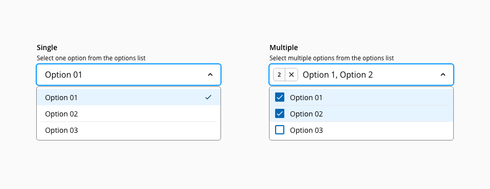
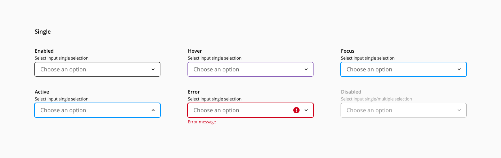
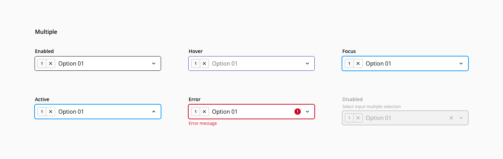
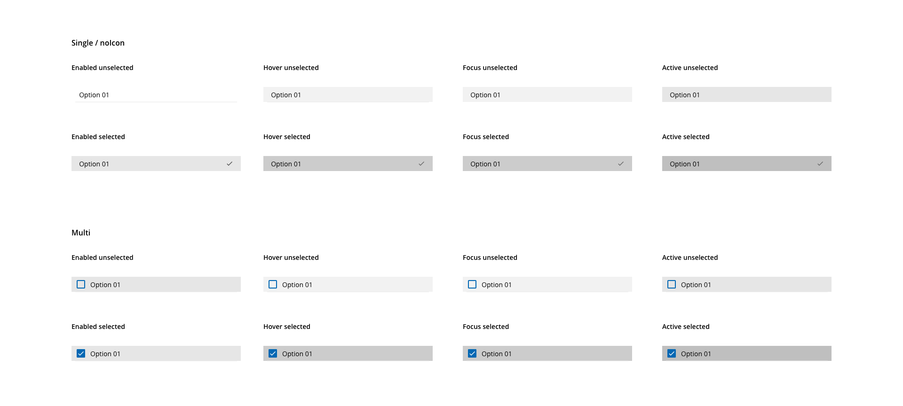
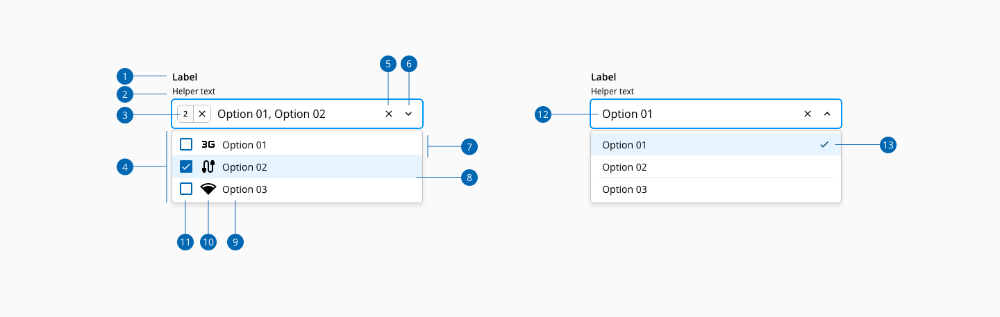
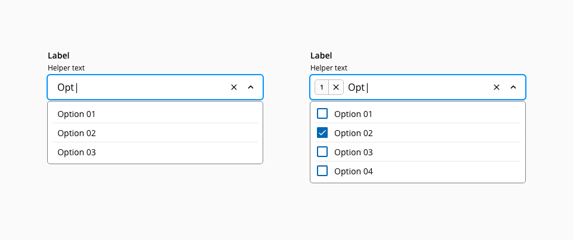
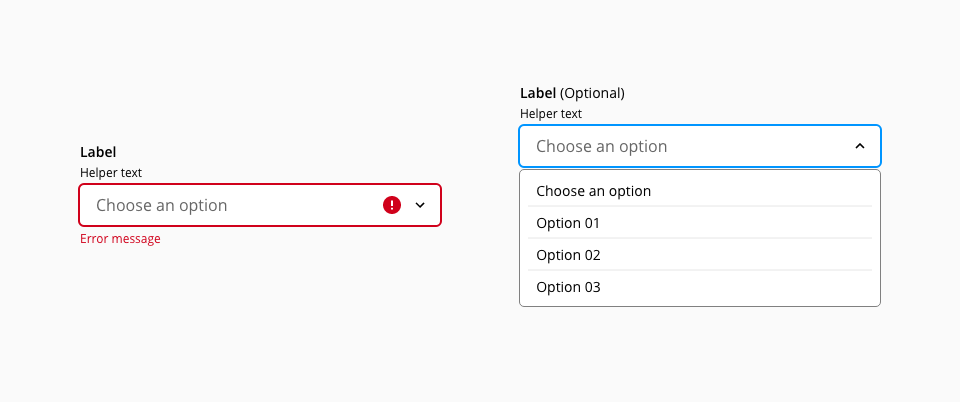
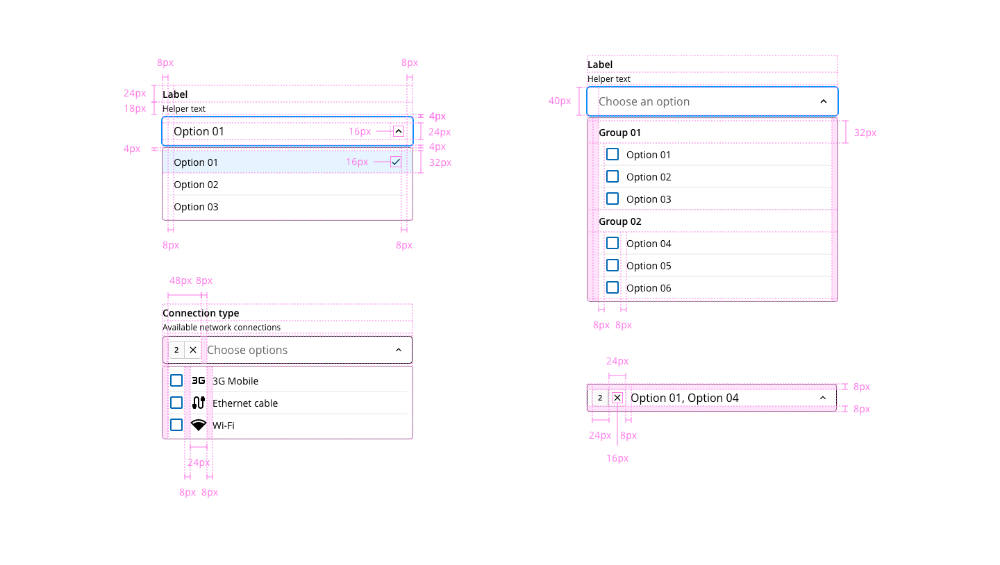

# Select

Select component allow users to make a single or multiple selection from a pre-defined list of options.
## Usage

- A dialog element should allow the user to select one option from a list
- If the list of options is short (4 or less), use checkboxes instead of the select component
- The select component should always display a label, different from any name in the option list
- Use a pre-selected good default where possible
- Use progressive disclosure between linked select components
- If more than one option is applicable, use the multi-select variant

## Variants



_Single and multiple variants of the select component_

| Variant       | Description                                             |
| :------------ | :------------------------------------------------------ |
| **Single**    | Allows the user to select one option from a list        |
| **Multiple**  | Allows the user to select multiple options from a list  |

## States

### Select input

States are defined for select component based on the interactions that the user can reproduce. The states are: **enabled**, **hover**, **focus**, **active**, **error** and **disabled**:



### Multiple selection

Allows the user to select more than one option from the list.



### Options list

To indicate which items are selected and which not, the select multiple variant integrates a checkbox pairing with each option from the dropdown.



## Anatomy



1. Label
2. Helper text
3. Selection indicator (multiple)
4. Option list container
5. Collapse indicator
6. List item
7. Divider
8. List item label
9. List item icon
10. List item checkbox (multiple)
11. Select value
12. List item selected indicator

## Filter



_Filterable single and multi variants_

* Both select variants can be filterable
* Use the filter when the number of items in the optionList is extremely long (± 15 elements)
* This list will be reduced to show only the matches as the user types
* The value will change when yhe user types a string that mayches an option from the list or pick one manually
* When the search does not match any result, a "no matches found" message will be displayed

## Required and optional



_Required with error and optional select examples_

* When labelled as optional, the select will display an option matching the placeholder to allow leaving it empty
* When no optional label appears, the select is required
* If leaved empty the required should display the error "this field can not be empty" when the select loses the focus


## Design Specifications



### General

#### Color

| Component token                   | Element                    | Core token         | Value      |             
| :-------------------------------- | :------------------------- | :----------------- | :--------- |
| `helperTextFontColor`          | Helper text                | `color-black`      | #000000    |
| `labelFontColor`                  | Label                      | `color-black`      | #000000    |
| `disabledColor`                   | All:disabled               | `color-black`      | #000000    |
| `errorColor`                      | Error message              | `color-red-700`    | #d0011b    |
| `optionBackgroundColor`           | Option list dialog         | `color-white`      | #ffffff    |
| `optionFontColor`                 | Option list item           | `color-black`      | #000000    |
| `scrollBarThumbColor`             | Scroll bar                 | `color-grey-700`   | #666666    |
| `scrollBarTrackColor`             | Scroll bar                 | `color-grey-500`   | #999999    |
| `optionIconColor`                 | Option list icon           | `color-black`      | #000000    |
| `hoverOptionBackgroundColor`      | Option list item:hover     | `color-grey-100`   | #f2f2f2    |
| `activeOptionBackgroundColor`     | Option list item:active    | `color-grey-200`   | #e6e6e6    |
| `selectedOptionBackgroundColor`   | Option list item:selected  | `color-grey-300`   | #cccccc    |
| `underlineColor`                  | Underline                  | `color-black`      | #000000    |
| `underlineFocusColor`             | underline:focus            | `color-black`      | #000000    |
| `valueFontColor`                  | Value                      | `color-black`      | #000000    |
| `valueIconColor`                  | Icon                       | `color-black`      | #000000    |
| `arrowColor`                      | Arrow                      | `color-black`      | #000000    |
| `focusColorOnDark`                | Focus indicator            | `color-blue-600`   | #0095ff    |


#### Size

The component `width` can adopt the following values:

width | value
-- | --
```small``` | 60px
```medium``` | 240px
```large``` | 480px
```fillParent``` | -

#### Margin

Select `margin` can use the values:

margin | value
-- | --
```xxsmall``` | 6px
```xsmall``` | 16px
```small``` | 24px
```medium``` | 36px
```large``` | 48px
```xlarge``` | 64px
```xxlarge``` | 100px

These values can be applied independently to each side of the component:
```top``` ```bottom``` ```left``` ```right```

### Select input

Select input specifications are the same as the [text-input](https://developer.dxc.com/design/components/text-input)

### Options list

#### Single select

| Property for single     |                           Value |
| ----------------------- | ------------------------------ |
| List item `padding-left/right`      |            16px |
| `height`                  |     36px |
| `font-size`               |                          16px |
| `font-weight`             |                       Regular |
| Icon size               |                    20 x 20px|
| Spacing between icon and label | 12px  |
| Focus outline `border-width` |  2px |


#### Multi-select

| Property for multiple   |                 Value |
| ----------------------- | -------------------- |
| List item `padding-left/right`      |            16px |
| `height`                  |     48px |
| `font-size`               |                          16px |
| `font-weight`             |                       Regular |
| Icon size               |                    20 x 20px|
| Spacing between checkbox and label | 8px  |
| Spacing between icon and label | 12px  |
| Focus outline `border-width` |  2px |


## Accessibility

### WCAG 2.2

* Understanding WCAG 2.2 - [SC 3.2.2: On Input](https://www.w3.org/WAI/WCAG22/Understanding/on-input.html)

### WAI-ARIA 1.2 

* WAI-ARIA practices 1.2 - [3.8 Combobox](https://www.w3.org/TR/wai-aria-practices-1.2/#combobox)
* WAI-ARIA practices 1.2 - [3.14 Listbox](https://www.w3.org/TR/wai-aria-practices-1.2/#Listbox)
* WAI-ARIA examples 1.2 - [Editable Combobox without Autocomplete Example](https://www.w3.org/TR/wai-aria-practices-1.2/examples/combobox/combobox-autocomplete-none.html)


## Links and references

* [React component](https://developer.dxc.com/tools/react/next/#/components/select)
* [Angular component](https://developer.dxc.com/tools/angular/next/#/components/select)
* [Adobe XD component](https://xd.adobe.com/view/af227d9a-92fa-4e32-b735-b1e914a9d447-fa71/)

____________________________________________________________

[Edit this page on Github](https://github.com/dxc-technology/halstack-style-guide/blob/master/guidelines/components/select/README.md)

