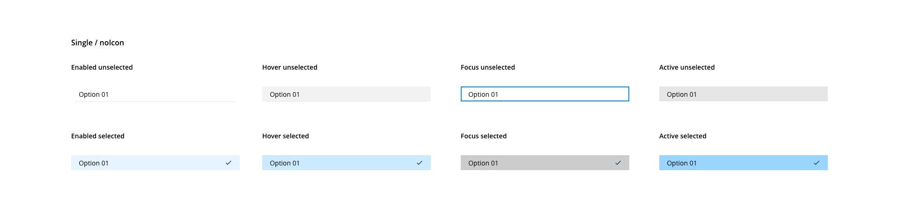
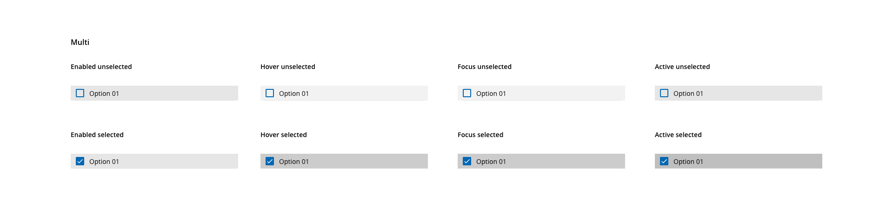

# Select

The select component allows users to make single or multiple selections from a pre-defined list of options.
## Usage

Considerations about the select usage:

- A dialog element should allow the user to select one option from a list
- If the list of options is short (4 or less), use checkboxes instead of the select component
- The select component should always display a label different from any name in the option list
- Use a pre-selected good default where possible
- Use progressive disclosure between linked select components
- If more than one option is applicable, use the multi-select variant

## Variants


_Single and multiple variants of the select component_

| Variant       | Description                                             |
| :------------ | :------------------------------------------------------ |
| **Single**    | Allows the user to select one option from a list        |
| **Multiple**  | Allows the user to select multiple options from a list  |

## States

### Select input

States are defined for select component based on the interactions that the user can reproduce. The states are: **enabled**, **hover**, **focus**, **active**, **error** and **disabled**:


### Multiple selection

Allows the user to select more than one option from the list.


### List options

To indicate which items are selected and which not, the select-multiple variant integrates a checkbox pairing with each option from the dropdown.

#### Single



_List option element states for single select_

#### Multiple



_List option element states for select multiple_

## Anatomy


1. Label
2. Helper text
3. Selection indicator (multiple)
4. List dialog
5. Action - Clear
6. Collapse indicator
7. List option
8. Divider
9. List option label
10. List option icon
11. List option checkbox (multiple)
12. Select value
13. List item selected indicator

## Filter


_Filterable single and multi variants_

* Both select variants can be filterable
* Use the filter when the number of items in the optionList is extremely long (± 15 elements)
* This list will be reduced to show only the matches as the user types
* The value will change when the user types a string that matches an option from the list or pick one manually
* When the search does not match any result, a "no matches found" message will be displayed

## Required and optional


_Required with error and optional select examples_

* When labeled as optional, the select will display an option matching the placeholder to allow leaving it empty
* When no optional label appears, the select is required
* If the select was left empty, the required should display the error "This field can not be empty" when the select loses the focus


## Design Specifications


### Color

| Component token                             | Element                        | Core token         | Value      |             
| :------------------------------------------ | :----------------------------- | :----------------- | :--------- |
| `labelFontColor`                            | Label                          | `color-black`      | #000000    |
| `helperTextFontColor`                       | Helper text                    | `color-black`      | #000000    |
| `errorMessageColor`                         | Error message                  | `color-red-700`    | #d0011b    |
| `valueFontColor`                            | Value                          | `color-black`      | #000000    |
| `placeholderFontColor`                      | Value                          | `color-grey-800-a` | #000000b3  |
| `disabledColor`                             | All:disabled                   | `color-grey-500`   | #999999    |
| `listDialogBackgroundColor`                 | List dialog                    | `color-white`      | #ffffff    |
| `listDialogBorderColor`                     | List dialog                    | `color-grey-400`   | #bfbfbf    |
| `listOptionFontColor`                       | List option                    | `color-black`      | #000000    |
| `listOptionIconColor`                       | List item icon                 | `color-black`      | #000000    |
| `listOptionDividerColor`                    | Divider                        | `color-grey-200`   | #e6e6e6    |
| `unselectedHoverListOptionBackgroundColor`  | List option:hover unselected   | `color-grey-100`   | #f2f2f2    |
| `unselectedActiveListOptionBackgroundColor` | List option:active unselected  | `color-grey-200`   | #e6e6e6    |
| `selectedListOptionBackgroundColor`         | List option selected           | `color-blue-100`   | #e6f4ff    |
| `selectedHoverListOptionBackgroundColor`    | List option:hover selected     | `color-blue-200`   | #cceaff    |
| `selectedActiveListOptionBackgroundColor`   | List option:active selected    | `color-blue-300`   | #99d5ff    |
| `selectedListOptionIconColor`               | List option selected indicator | `color-blue-900`   | #003c66    |
| `focusListOptionBorderColor`                | List option:hover selected     | `color-blue-600`   | #0095ff    |
| `systemMessageFontColor`                    | System message                 | `color-grey-700`   | #666666    |

#### Input

| Component token                             | Element                        | Core token           | Value           | 
| :------------------------------------------ | :----------------------------- | :------------------- | :-------------- |
| `enabledInputBorderColor`                   | Border:enabled                 | `color-black`        | #000000         |
| `hoverInputBorderColor`                     | Border:hover                   | `color-purple-500`   | #a46ede         |
| `focusInputBorderColor`                     | Border:focus                   | `color-blue-600`     | #0095ff         |
| `errorInputBorderColor`                     | Border:error                   | `color-red-700`      | #d0011b         |
| `hoverInputErrorBorderColor`                | Border:hover on error          | `color-red-600`      | #fe0123         |
| `disabledInputBorderColor`                  | Border:disabled                | `color-grey-500`     | #999999         |
| `disabledInputBackgroundColor`              | Background:disabled            | `color-grey-100`     | #f2f2f2         |
| `errorIconColor`                            | Error icon                     | `color-red-700`      | #d0011b         |
| `collapseIndicatorColor`                    | Collapse indicator             | `color-black`        | #000000         |


#### Selection indicator

| Component token                                    | Element                           | Core token           | Value           | 
| :------------------------------------------------- | :-------------------------------- | :------------------- | :-------------- |
| `selectionIndicatorFontColor`                      | Selection indicator value         | `color-black`        | #000000         |
| `selectionIndicatorBorderColor`                    | Selection indicator               | `color-grey-400`     | #bfbfbf         |
| `selectionIndicatorBackgroundColor`                | Selection indicator               | `color-grey-50`      | #fafafa         |
| `enabledSelectionIndicatorActionBackgroundColor`   | Selection indicator               | `color-transparent`  | transparent     |
| `hoverSelectionIndicatorActionBackgroundColor`     | Selection indicator:hover         | `color-grey-100`     | #f2f2f2         |
| `activeSelectionIndicatorActionBackgroundColor`    | Selection indicator:active        | `color-grey-300`     | #cccccc         |
| `enabledSelectionIndicatorActionIconColor`         | Selection indicator icon          | `color-black`        | #000000         |
| `hoverSelectionIndicatorActionIconColor`           | Selection indicator icon:hover    | `color-black`        | #000000         |
| `activeSelectionIndicatorActionIconColor`          | Selection indicator icon:active   | `color-black`        | #000000         | 

#### Clear action

| Component token                 | Element                     | Core token              | Value           | 
| :------------------------------ | :-------------------------- | :---------------------- | :-------------- |
| `actionBackgroundColor`         | Action                      | `color-transparent`     | transparent     |
| `hoverActionBackgroundColor`    | Action:hover                | `color-grey-100`        | #f2f2f2         |
| `activeActionBackgroundColor`   | Action:active               | `color-grey-300`        | #cccccc         |
| `actionIconColor`               | Action icon                 | `color-black`           | #000000         |
| `hoverActionIconColor`          | Action icon:hover           | `color-black`           | #000000         |
| `activeActionIconColor`         | Action icon:active          | `color-black`           | #000000         |


### Typography

| Component token            | Element              | Token                   | Value             |
| :------------------------- | :------------------- | :---------------------- | :---------------- |
| `fontFamily`               | All                  | `font-family-sans`      | Open Sans         |
| `labelFontSize`            | Label                | `font-scale-02`         | 0.875rem / 14px   |
| `labelFontWeight`          | Label                | `font-weight-semibold`  | 600               |
| `labelFontStyle`           | Label                | `font-style-normal`     | normal            |
| `labelLineHeight`          | Label                | `font-leading-loose-01` | 1.715em           |
| `optionalLabelFontWeight`  | Label optional       | `font-weight-regular`   | 400               |
| `valueFontSize`            | Value                | `font-scale-03`         | 1rem / 16px       |
| `valueFontWeight`          | Value                | `font-weight-regular`   | 400               |
| `valueFontStyle`           | Value                | `font-style-normal`     | normal            |
| `valueLineHeight`          | Value                | `font-leading-normal`   | 1.5em             |
| `helperTextFontSize`       | Helper text          | `font-scale-01`         | 0.75rem / 12px    |
| `helperTextFontWeight`     | Helper text          | `font-weight-regular`   | 400               |
| `helperTextFontStyle`      | Helper text          | `font-style-normal`     | normal            |
| `helperTextLineHeight`     | Helper text          | `font-leading-normal`   | 1.5em             |
| `listOptionFontSize`       | List option          | `font-scale-02`         | 0.875rem / 14px   |
| `listOptionFontWeight`     | List option          | `font-weight-regular`   | 400               |
| `listOptionFontStyle`      | List option          | `font-style-normal`     | normal            |
| `listGroupLabelFontWeight` | List group item      | `font-weight-semibold`  | 600               |

### Border

| Property             | Element                             | Token                  | Value               |
| :------------------- | :---------------------------------- | :--------------------- | :------------------ |
| `border`             | Input container                     | `border-width-1`       | 1px                 |
| `border`             | Input container                     | `border-style-solid`   | solid               |
| `border`             | Input container:focus               | `border-width-1`       | 1px                 |
| `border`             | Input container:focus               | `border-style-solid`   | solid               |
| `box-shadow`         | Input container:focus               | `-`                    | 0 0 0 2px           |
| `box-shadow`         | Input container:error               | `-`                    | 0 0 0 2px           |
| `box-shadow`         | List dialog                         | `shadow-default`       | 0 4px 6px -1px rgba(0,0,0,0.1)  |
| `border-radius`      | Input                               | `border-radius-medium` | 0.25rem / 4px      |
| `border-radius`      | Selection indicator / Clear action  | `border-radius-small`  | 0.125rem / 2px     |

### Spacing

The select component **input** share the [same spacing tokens of the text input](https://developer.dxc.com/design/guidelines/components/text-input).

| Property         | Element               | Token                  | Value               |
| :--------------- | :-------------------- | :--------------------- | :------------------ |
| `padding-left`   | List dialog           | `spacing-03`           | 0.5rem / 8px        |
| `padding-right`  | List dialog           | `spacing-03`           | 0.5rem / 8px        |
| `margin-top`     | List dialog content   | `spacing-02`           | 0.25rem / 4px       |
| `margin-bottom`  | List dialog content   | `spacing-02`           | 0.25rem / 4px       |
| `padding-top`    | List option           | `spacing-02`           | 0.25rem / 4px       |
| `padding-bottom` | List option           | `spacing-02`           | 0.25rem / 4px       |


#### Size

The component `width` can adopt the following values:

| Width                | Value |
| -------------------- | ----- |
| `small`              | 240px |
| `medium` (_default_) | 360px |
| `large`              | 480px |
| `fillParent`         | 100%  |


#### Margin

Select `margin` can use the values:

margin | value
-- | --
```xxsmall``` | 6px
```xsmall``` | 16px
```small``` | 24px
```medium``` | 36px
```large``` | 48px
```xlarge``` | 64px
```xxlarge``` | 100px

These values can be applied independently to each side of the component:
```top``` ```bottom``` ```left``` ```right```


## Accessibility

### WCAG 2.2

* Understanding WCAG 2.2 - [SC 3.2.2: On Input](https://www.w3.org/WAI/WCAG22/Understanding/on-input.html)

### WAI-ARIA 1.2 

* WAI-ARIA practices 1.2 - [3.8 Combobox](https://www.w3.org/TR/wai-aria-practices-1.2/#combobox)
* WAI-ARIA practices 1.2 - [3.14 Listbox](https://www.w3.org/TR/wai-aria-practices-1.2/#Listbox)
* WAI-ARIA examples 1.2 - [Editable Combobox without Autocomplete Example](https://www.w3.org/TR/wai-aria-practices-1.2/examples/combobox/combobox-autocomplete-none.html)


## Links and references

* [React component](https://developer.dxc.com/tools/react/next/#/components/select)
* [Angular component](https://developer.dxc.com/tools/angular/next/#/components/select)
* [Adobe XD component](https://xd.adobe.com/view/af227d9a-92fa-4e32-b735-b1e914a9d447-fa71/)

____________________________________________________________

[Edit this page on Github](https://github.com/dxc-technology/halstack-style-guide/blob/master/guidelines/components/select/README.md)

