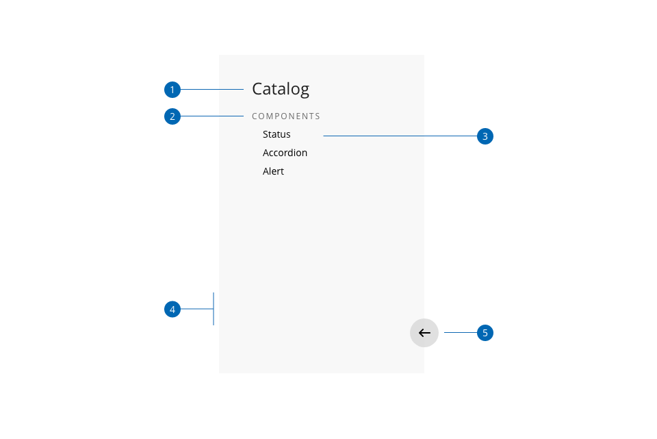
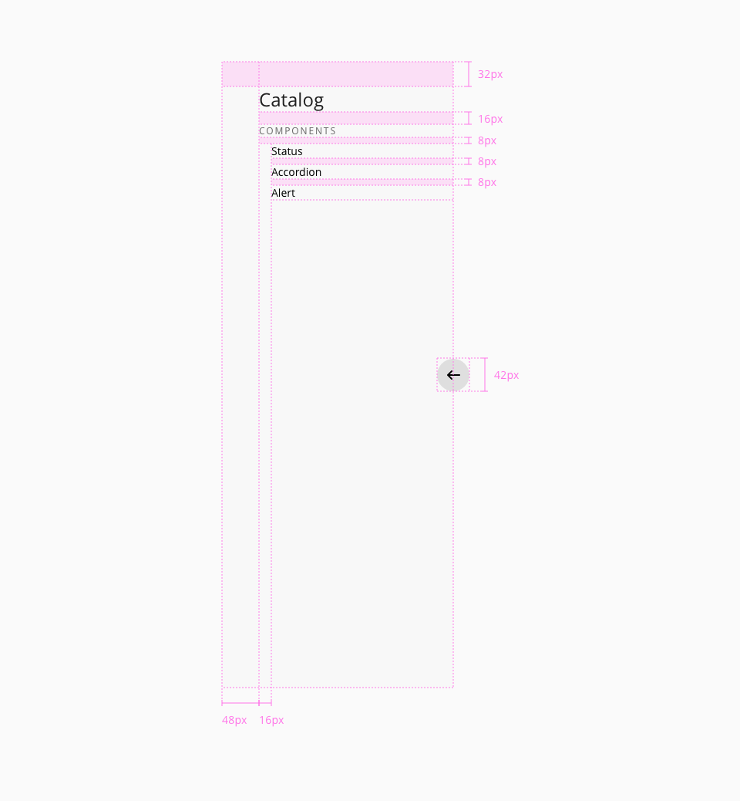
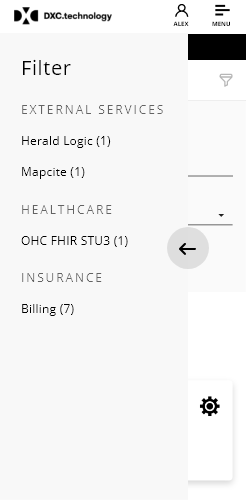

# Sidenav

The sidenav component is part of the layout of the application and it makes easier to divide the main screen into two different areas. The main area will have all the content and the sidenav as a secondary element as an index, including links to different resources on the web page.

## Usage

- Use the sidenav element to improve the discoverability of the application, making the navigation links accessible to the users.
- Keep in mind the type of the devices that you are developing for, and handle the behavior in a way that doesn't block or reduce the available space of the main area in the application
- Try to follow and order for the sidenav content and make use of hierarchy to differentiate between a title and a link

## Variants

_Example of the `overlay` and `push` sidenav variants_

Two different modes can be set in the element, according to the needs of the application and the relation between the main content and the sidenav.

| Variant     | Description                                                   |
| :---------- | :------------------------------------------------------------ |
| **overlay** | Content is covered by the sidenav container when displayed    |
| **push**    | Content is pushed right when displayed                        |

## Anatomy

1. Title
2. Subtitle
3. Link
4. Container
5. Arrow
## Design specifications

_Sidenav design specifications_

### Color

| Component token        | Element          | Core token         | Value     |
| :--------------------- | :--------------- | :----------------- | :-------- |
| `backgroundColor`      | Container        | `color-grey-100`   | #f2f2f2   |
| `arrowContainerColor`  | Arrow container  | `color-grey-200`   | #e6e6e6   |
| `arrowColor`           | Arrow            | `color-black`      | #000000   |
| `titleFontColor`       | Title            | `color-black`      | #000000   |
| `subtitleFontColor`    | Subtitle         | `color-grey-800`   | #4d4d4d   |
| `linkFontColor`        | Link             | `color-grey-800`   | #4d4d4d   |

### Typography

| Component token                | Element          | Core token              | Value                     |
| :----------------------------- | :--------------- | :---------------------- | :------------------------ |
| `titleFontFamily`              | Title            | `font-family-sans`      | 'Open Sans', sans-serif   |
| `titleFontSize`                | Title            | `font-scale-05`         | 1.5rem / 24px             |
| `titleFontWeight`              | Title            | `font-weight-regular`   | 400                       |
| `titleFontStyle`               | Title            | `font-style-normal`     | normal                    |
| `subtitleFontFamily`           | Subtitle         | `font-family-sans`      | 'Open Sans', sans-serif   |
| `subtitleFontSize`             | Subtitle         | `font-scale-03`         | 1rem / 16px               |
| `subtitleFontWeight`           | Subtitle         | `font-weight-regular`   | 400                       |
| `subtitleFontStyle`            | Subtitle         | `font-style-normal`     | normal                    |
| `subtitleFontLetterSpacing`    | Subtitle         | `font-tracking-wide-03` | 0.05em                    |
| `subtitleFontTextTransform`    | Subtitle         | `font-uppercase`        | uppercase                 |
| `linkFontFamily`               | Link             | `font-family-sans`      | 'Open Sans', sans-serif   |
| `titleFontSize`                | Link             | `font-scale-02`         | 0.875rem / 14px           |
| `linkFontWeight`               | Link             | `font-weight-regular`   | 400                       |
| `linkFontStyle`                | Link             | `font-style-normal`     | normal                    |
| `linkTextDecoration`           | Link             | `font-no-line`          | none                      |

### Spacing

| Component token                | Element          | Core token              | Value          |
| :----------------------------- | :--------------- | :---------------------- | :------------- |
| `linkMarginTop`                | Link             | `spacing-4`            | 0.25rem / 4px  |
| `linkMarginBottom`             | Link             | `spacing-4`            | 0.25rem / 4px  |
| `linkMarginLeft`               | Link             | `spacing-16`            | 1rem / 16x     |
| `linkMarginRight`              | Link             | `spacing-16`            | 1rem / 16x     |

| Property                | Element          | Core token              | Value          |
| :---------------------- | :--------------- | :---------------------- | :------------- |
| `margin-bottom`         | Title            | `spacing-16`            | 1rem / 16px    |
| `margin-bottom`         | Subtitle         | `spacing-4`            | 0.25rem / 4px  |

 ### Size

| Property for sidenav |                           Value |
| -------------------- | :------------------------------ |
| `width`                |                         300px |
| `height` _(default)_     | auto - adapted to the content |

#### Padding

Padding can be set through the following values: (xxsmall', 'xsmall', 'small', 'medium', 'large', 'xlarge', 'xxlarge') and independently for `top`, `right`, `bottom`, `left`.

| property             | Value(px) |
| -------------------- | :------   |
| `xxsmall`            | 6         |
| `xsmall`             | 16        |
| `small`              | 24        |
| `medium` _(default)_   | 36        |
| `large`              | 48        |
| `xlarge`             | 64        |
| `xxlarge`            | 100       |

### sidenav-arrow

| Property for sidenav |                           Value |
| -------------------- | :------------------------------ |
| Arrow display        |          true (default value) |
| Arrow distance       |                           50% |

## Responsive version for mobile and tablet

_Sidenav component example in mobile devices_

The responsive version of the component for mobile and tablet works a little bit different compared with the version for desktop. As the size of the screen in those devices is reduced, the default behavior in the first load of the page will be hidden in the sidenav component.
Taking this approach, as a first view of the page the user has all the content in the main area visible, and then he will need to interact with the component to make it visible and navigate to other resources.

Also, as an important point to mention, the only variant that works with responsive is the overlay, due to lack of space in the screen if the sidenav pushed the content of the main container.

Some properties regarding width vary, the details are indicated in the table below.

| Property for sidenav |                           Value |
| -------------------- | ------------------------------: |
| `width`                |                           60% |
| `height`     | auto - adapted to the content |
| `padding`              |                    `medium` / 36px _(default)_ |
| Arrow display        |     true (it cannot be false) |
| Arrow distance       |                           50% |

## Links and references

* [React component](https://developer.dxc.com/tools/react/next/#/components/sidenav)
* [Angular component](https://developer.dxc.com/tools/angular/next/#/components/sidenav)
* [Adobe XD component](https://xd.adobe.com/view/498590ff-e553-4c88-b2c9-73972b53d95a-1cd6/)

____________________________________________________________

[Edit this page on Github](https://github.com/dxc-technology/halstack-style-guide/blob/master/guidelines/components/sidenav/README.md)
