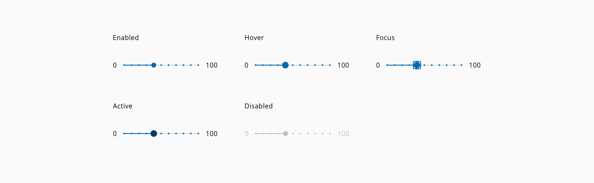
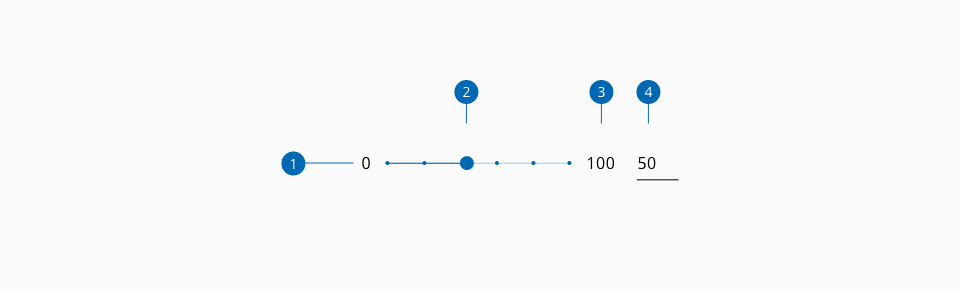
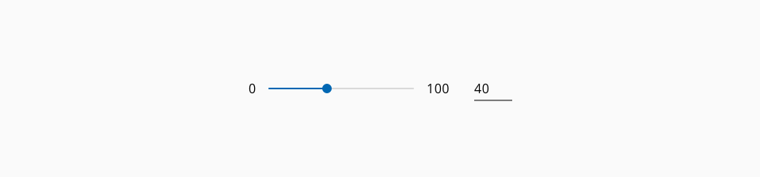
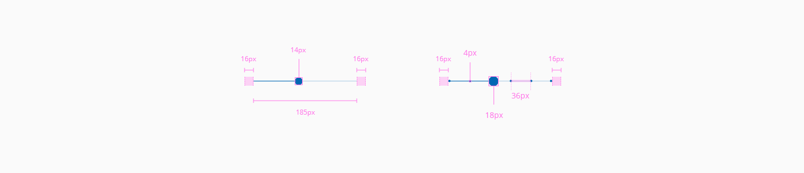

# Slider

Slider control allows users to select a specific value or a range of values from a set. Usually, slider presents a relatively large dataset and the way that the user interacts with it is helpful to explore the multiple options swiftly.

## Usage

- Visualize the output of the slider as feedback to the user of the current state.
- As more information can give it to the user, the easier the selection will be.
- If the value has to be specific, give some resource to the user to fill a precise input, i.e. an input next to the slider.

## Variants

The slider has two variants:

| Variant         | Description
| :-------------- | :-------------------------------------------------------------- |
| **Discrete**    | Slider can only get the value marked alongside the total line   |
| **Continous**   | Slider can take every value mapped                              |

_Slider variants_

## States

The slider component has the following states: **enabled**, **hover**, **focus**, **active** and **disabled**.

_Slider component different states example_

## Anatomy

1. Floor label _(Optional)_
2. Total line
3. Ceil label _(Optional)_
4. Value input _(Optional)_
5. Tick mark
6. Thumb
7. Track line

## Slider with input

To accomplish these considerations, some slider's variations were designed with the purpose of offering a great user experience within the application.

_Slider with input example_

## Design Specifications

_Slider Specifications_

### Color

#### On-Light

| Component token                   | Element             | Core token            | Value   |
| :-------------------------------- | :------------------ | :-------------------- | :------ |
| `fontColor`                       | Floor/Ceil label    | `color-black`         | #000000 |
| `thumbBackgroundColor`            | Thumb               | `color-blue-800`      | #0067b3 |
| `activeThumbBackgroundColor`      | Thumb:active        | `color-blue-900`      | #003c66 |
| `disabledThumbBackgroundColor`    | Thumb:disabled      | `color-grey-400`      | #bfbfbf |
| `tickMarkBackgroundColor`         | Tick Mark           | `color-blue-800`      | #0067b3 |
| `disabledTickMarkBackgroundColor` | Tick Mark:disabled  | `color-grey-400`      | #bfbfbf |
| `trackLineColor`                  | Track line          | `color-blue-800`      | #0067b3 |
| `disabledTrackLineColor`	        | Track line:disabled | `color-blue-100`      | #e6f4ff |
| `totalLineColor`	                | Total line          | `color-grey-200`      | #e6e6e6 |
| `disabledTotalLineColor`          | Total line:disabled | `color-grey-100`      | #f2f2f2 |
| `focusColor`                      | Focus outline       | `color-blue-800`      | #0067b3 |

#### On-Dark

| Component token                           | Element              | Core token              | Value         |
| :---------------------------------------- | :------------------- | :---------------------- | :------------ |
| `fontColorOnDark`                         | Floor/Ceil label     | `color-white`           | #ffffff       |
| `thumbBackgroundColorOnDark`              | Thumb                | `color-blue-600`        | #0095ff       |
| `activeThumbBackgroundColorOnDark`        | Thumb:active         | `color-blue-800`        | #0067b3       |
| `disabledThumbBackgroundColorOnDark`	    | Thumb:disabled       | `color-grey-500`        | #999999       |
| `tickMarkBackgroundColorOnDark`	        | Tick mark            | `color-blue-600`        | #0095ff       |
| `disabledTickMarkBackgroundColorOnDark`   | Tick mark:disabled   | `color-grey-500`        | #999999       |
| `trackLineColorOnDark`                    | Track line           | `color-blue-600`        | #0095ff       |
| `disabledTrackLineColorOnDark`            | Track line:disabled  | `color-grey-500`        | #999999       |
| `totalLineColorOnDark`	                | Total line           | `color-grey-400`        | #bfbfbf       |
| `disabledTotalLineColorOnDark`            | Total line:disabled  | `color-grey-700`        | #666666       |
| `focusColorOnDark`                        | Focus outline        | `color-blue-600`        | #0095ff       |

### Typography

| Component token                   | Element             | Core token             | Value                     |
| :-------------------------------- | :------------------ | :--------------------- | :------------------------ |
| `fontFamily`                      | Floor/Ceil label    | `font-family-sans`     | 'Open Sans', sans-serif   |
| `fontSize`                        | Floor/Ceil label    | `font-scale-03`        | 1rem / 16px               |
| `fontWeight`                      | Floor/Ceil label    | `font-regular`         | 400                       |
| `fontStyle`                       | Floor/Ceil label    | `font-normal`          | normal                    |

### Spacing

| Property                          | Element             | Core token      | Value                     |
| :-------------------------------- | :------------------ | :-------------- | :------------------------ |
| `margin-left`                     | Floor label         | `spacing-05`    | 1rem / 16px               |
| `margin-right`                    | Ceil label          | `spacing-05`    | 1rem / 16px               |
| `margin-left`                     | Input               | `spacing-07`    | 2rem / 32px               |

### Size

| Property                          | Element             | Core token      | Value                     |
| :-------------------------------- | :------------------ | :-------------- | :------------------------ |
| `height`                          | Total line          | -               | 2px                       |
| `height`                          | Track line          | -               | 2px                       |
| `height`                          | Thumb               | -               | 12px                      |
| `width`                           | Thumb               | -               | 12px                      |
| `height`                          | Thumb:hover*        | -               | 16px                      |
| `width`                           | Thumb:hover         | -               | 16px                      |
| `height`                          | Tick mark           | -               | 4px                       |
| `width`                           | Tick mark           | -               | 4px                       |

[*] The thumb element size is 16x16px in the following states: `:hover`, `:focus` and `:active`.

### Border

| Property                 | Element          | Core token                 | Value            |
| :----------------------- | :--------------- | :------------------------- | :--------------- |
| `border-width`           | Track line       | `border-width-0`           | 0                |
| `border-style`           | Track line       | `border-style-none`        | none             |
| `border-radius`          | Track line       | `border-radius-full`       | 9999px           |
| `border-width`           | Thumb            | `border-width-0`           | 0                |
| `border-style`           | Thumb            | `border-style-none`        | none             |
| `border-radius`          | Thumb            | `border-radius-full`       | 9999px           |
| `border-width`           | Focus border     | `border-width-2`           | 2px              |
| `border-style`           | Focus border     | `border-style-solid`       | solid            |
| `border-radius`          | Focus border     | `border-radius-medium`     | 0.25rem / 4px    |

## Accessibility

### WCAG

* Understanding WCAG 2.2 - [SC 1.3.1 Info and Relationships](https://www.w3.org/WAI/WCAG22/Understanding/info-and-relationships) 
* Understanding WCAG 2.2 - [SC 1.3.2 Meaningful Sequence](https://www.w3.org/WAI/WCAG22/Understanding/meaningful-sequence) 
* Understanding WCAG 2.2 - [SC 2.1.1 Keyboard](https://www.w3.org/WAI/WCAG22/Understanding/keyboard)
* Understanding WCAG 2.2 - [SC 2.4.3 Focus Order](https://www.w3.org/WAI/WCAG22/Understanding/focus-order) 
* Understanding WCAG 2.2 - [SC 2.4.6 Headings and Labels](https://www.w3.org/WAI/WCAG22/Understanding/headings-and-labels) 
* Understanding WCAG 2.2 - [SC 2.4.7 Focus Visible](https://www.w3.org/WAI/WCAG22/Understanding/focus-visible) 
* Understanding WCAG 2.2 - [SC 4.1.2 Name, Role, Value](https://www.w3.org/WAI/WCAG22/Understanding/name-role-value) 

### WAI-ARIA

* WAI-ARIA Authoring practices 1.2 - [3.19 Slider](https://www.w3.org/TR/wai-aria-practices-1.2/#slider)
* WAI-ARIA Authoring practices 1.2 - [Slider example](https://www.w3.org/TR/wai-aria-practices-1.2/examples/slider/slider-1.html)

## Links and references

- [React component](https://developer.dxc.com/tools/react/next/#/components/slider)
- [Angular component](https://developer.dxc.com/tools/angular/next/#/components/slider)

____________________________________________________________

[Edit this page on Github](https://github.com/dxc-technology/halstack-style-guide/blob/master/guidelines/components/slider/README.md)
