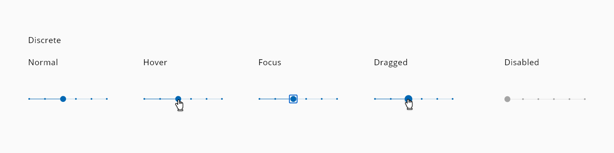
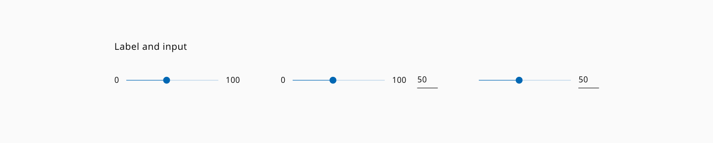

# Slider

Slider control allows users to select a specific value or a range of values from a set. Usually, slider presents a relatively large dataset and the way that the user interacts with it is helpful to explore the multiple options swiftly.

## Usage

- Visualize the output of the slider as feedback to the user of the current state.
- As more information can give it to the user, the easier the selection will be.
- If the value has to be specific, give some resource to the user to fill a precise input, i.e. an input next to the slider.

## Variants

The slider has two variants:

| Variant         | Description
| :-------------- | :-------------------------------------------------------------- |
| **Discrete**    | Slider can only get the value marked alongside the total line   |
| **Continous**   | Slider can take every value mapped                              |

_Slider variants_

## States

Seven different states are defined in the life cycle of the component: **enabled**, **hover**, **focus**, **active** and **disabled**.

_Slider component different states example_

## Anatomy

_Slider Anatomy_

1. Minimum value label (optional)
2. Default Knob
3. Maximum value label (optional)
4. Value input (optional)

## Slider with input

To accomplish these considerations, some slider's variations were designed with the purpose of offering a great user experience within the application.

_Slider variation for special cases_

## Design Specifications

_Slider specifications_

### Color

#### On-Light

| Component token                   | Element             | Core token      | Value     |
|  --                               |  --                 |  --             |  --       |
| `fontColor`                       | Floor/Ceil label    | `Hal-Black`     | `#000000` |
| `thumbBackgroundColor`            | Thumb               | `Hal-Blue-S-35` | `#0067b3` |
| `activeThumbBackgroundColor`      | Thumb:active        | `Hal-Blue-D-20` | `#003c66` |
| `disabledThumbBackgroundColor`    | Thumb:disabled      | `Hal-Blue-L-95` | `#e6f4ff` |
| `tickMarkBackgroundColor`         | Tick Mark           | `Hal-Blue-S-35` | `#0067b3` |
| `disabledTickMarkBackgroundColor` | Tick Mark:disabled  | `Hal-Blue-L-95` | `#e6f4ff` |
| `trackLineColor`                  | Track line          | `Hal-Blue-S-35` | `#0067b3` |
| `disabledTrackLineColor`	        | Track line:disabled | `Hal-Blue-L-95` | `#e6f4ff` |

#### On-Dark

| Component token                           |   Element             |   Core token      |   Value       |
|  --                                       |  --                   |  --               |  --           |
| `fontColorOnDark`                         |   Floor/Ceil label    |   `Hal-White`     |   `#ffffff`   |
| `thumbBackgroundColorOnDark`              |   Thumb               |   `Hal-Blue-L-50` |   `#0095ff`   |
| `activeThumbBackgroundColorOnDark`        |   Thumb:active        |   `Hal-Blue-S-35` |   `#0067b3`   |
| `disabledThumbBackgroundColorOnDark`	    |   Thumb:disabled      |   `Hal-Blue-D-20` |   `#003c66`   |
| `tickMarkBackgroundColorOnDark`	          |   Tick Mark           |   `Hal-Blue-L-50` |   `#0095ff`   |
| `disabledTickMarkBackgroundColorOnDark`   |   Tick Mark:disabled  |   `Hal-Blue-D-20` |   `#003c66`   |
| `trackLineOnDark`                         |   Track line          |   `Hal-Blue-L-50` |   `#0095ff`   |
| `disabledTrackLineColorOnDark`            |   Track line:disabled |   `Hal-Blue-D-20` |   `#003c66`   |
| `totalLineOnDark`	                        |   Total line          |   `Hal-Grey-L-75` |   `#bfbfbf`   |
| `disabledTotalLineColorOnDark`            |   Total line:disabled |   `Hal-Grey-S-40` |   `#666666`   |
| `focusColorOnDark`                        |   Focus outline       |   `Hal-Blue-L-50` |   `#0095ff`   |

| Property                |         Value |
| ----------------------- | ------------: |
| Margin                  |        `15px` |
| Slider line thickness   |         `1px` |
| Default knob            |   `14 x 14px` |
| Selected knob           |   `18 x 18px` |
| Min width               |       `185px` |
| Small steppers          |     `4 x 4px` |
| Space between steppers  |        `36px` |
| Separation with lock up |        `10px` |
| Lockup size             |   `40 x 40px` |
| Focused ripple          |   `42 x 42px` |
| Pressed ripple          |   `62 x 62px` |
| Font size (with text)   |        `16px` |
| Font weight             |     `Regular` |
| Knob shape              | `y:3, blur:3` |

## Links and references

- [React component](https://developer.dxc.com/tools/react/3/#/components/slider)
- [Angular component](https://developer.dxc.com/tools/angular/3/#/components/slider)

____________________________________________________________

[Edit this page on Github](https://github.com/dxc-technology/halstack-style-guide/blob/master/guidelines/components/slider/README.md)
