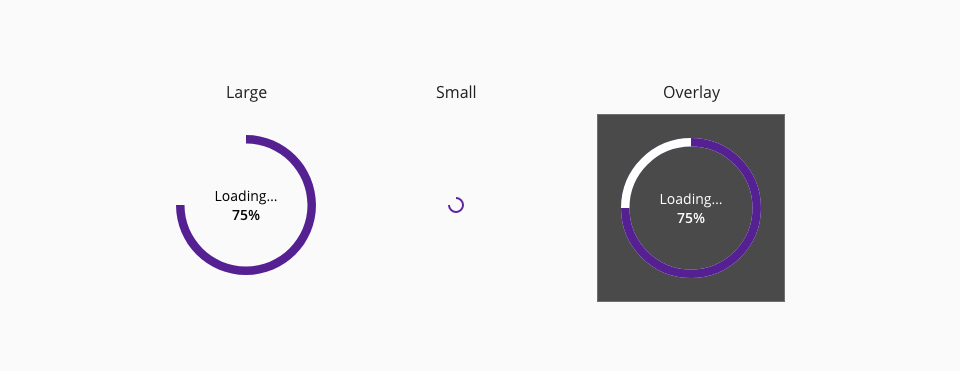
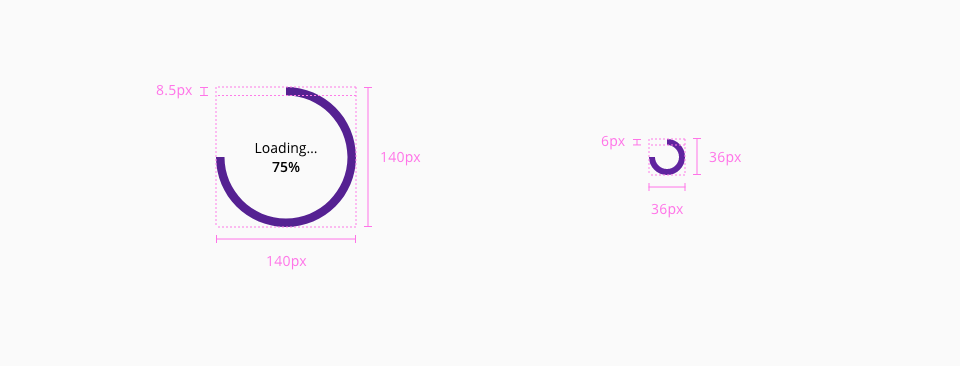

# Spinner

Loading spinner is a waiting indicator in the user interface to communicate users an ongoing proccess. 

## Usage

* There should only be a single spinner on a page at one time.
* Only use the spinner component in a process that takes more than one second.
* The text of the action it is not mandatory but recommendable.
* If only a portion of a page is displaying new content or being updated, use a `medium` or `small` spinner place the spinner in that part of the page.

## Variants

There are three different variants for the spinner component due to the size or the position: **large**, **small** and **overlay**.

_Spinner component variants_

## Design Specifications

_Spinner design specifications_

### Color

| Component token           | Element                   | Token                   | Value     |
| :------------------------ | :------------------------ | :---------------------- | :-------- |
| `trackCircleColor`        | Spinner circle (track)    | `color-purple-700`      | #5f249f   |
| `trackCircleColorOnDark`  | Spinner circle (track)    | `color-purple-500`      | #a46ede   |
| `totalCircleColor`        | Spinner circle (total)    | `color-white`           | #ffffff   |
| `fontColor`               | Label                     | `color-black`           | #000000   |
| `fontColorOnDark`         | Label                     | `color-white`           | #ffffff   |
| `fontColor`               | Percentage                | `color-black`           | #000000   |
| `overlayColor`            | Overlay                   | `color-grey-800-a`      | #000000b3 |

### Size

| Property        | Element                      | Token            | Value     |
| --------------- | ---------------------------- | ---------------- | --------- |
| `width`         | Spinner container (large)    | -                | 140px     |
| `height`        | Spinner container (large)    | -                | 140px     |
| `width`         | Spinner container (small)    | -                | 16px      |
| `height`        | Spinner container (small)    | -                | 16px      |
| `max-width`     | Overlay                      | -                | 100vw     |
| `max-height`    | Overlay                      | -                | 100vh     |

### Typography

| Property        | Element          | Token            | Value     |
| --------------- | ---------------- | ---------------- | --------- |
| `font-size`     | Loading label    | `font-scale-02`  | 14px      |
| `font-weight`   | Loading label    | `font-regular`   | 400       |
| `font-size`     | Percentage       | `font-scale-02`  | 14px      |
| `font-weight`   | Percentage       | `font-bold`      | 600       |

### Border

| Property        | Element                      | Token            | Value        |
| --------------- | ---------------------------- | ---------------- | ------------ |
| `stroke`        | Spinner circle (large)       | -                | 8.5px solid  |
| `stroke`        | Spinner circle (small)       | -                | 2px solid    |

## Determinate or indeterminate   
 

_Determinate vs indeterminate spinner_

* Determinate indicators display how long a process will take. They should be used in longer processes.
* Indeterminate indicators express an unspecified amount of wait time. They should be used when:
        * The processing time is unknown.
        * The wait time is expected to be short enough that it’s not necessary to display.

## Links and references

* [Angular CDK component](https://developer.dxc.com/tools/angular/next/#/components/spinner)
* [React CDK component](https://developer.dxc.com/tools/react/next/#/components/spinner)
* [Adobe XD component](https://xd.adobe.com/view/bc8ee829-5380-4561-8957-07d06bbb51df-e9dd/)

____________________________________________________________

[Edit this page on Github](https://github.com/dxc-technology/halstack-style-guide/blob/master/guidelines/components/spinner/README.md)

