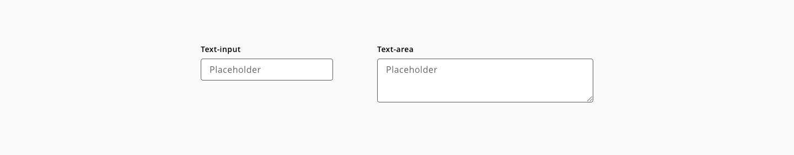
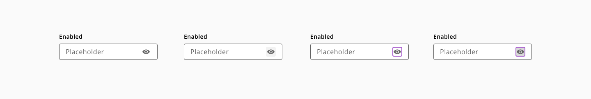
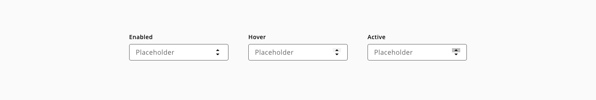

# Text-input

Text inputs are input fields typically used in forms that allow the user to enter text data in a structured format.

## Usage

Use text inputs in forms to help people enter, select, and search for text. Common text input types include: Usernames, descriptions, URLs, phone numbers, credit cards, emails, addresses or plain text searches

### Do's

* Do use fixed width inputs for content that has a specific, known length (e.g. post code, phone number).
* Do use sentence for any input text case with standard, local grammar and punctuation rules.
* Do use helpful and clear text for labels, error messages and helper texts


### Dont's

* Do not use text-input for text longer than a single line (e.g. name, phone number). Use the text-area instead.
* Do not disable copy and paste.
* Do not display pop up error message after validating
* Avoid masking label, keep it always visible.

## Variants

* Text-input
* Text-area



_Text-input vatiants_

## States

Text-input states: **enabled**, **hover**, **focus**, **error** and **disabled**.


_Example of the text-input component states_


## Anatomy


1. Label text
2. Helper text (Optional)
3. Placeholder text
4. Error message
5. Input action (Optional)
6. Error indicator
7. Input container

## Content

### Actions

#### Clearing content

Clear actions allow user to remove the content of the text-input.


_Example of a text-input with a clear content action button_

#### Show or hide content

Text-inputs used for password typing should allow the user to show and hide the content. 



_Example of a text-input with a show/hide password button_

### Prefixes and suffixes

Prefixes and suffixes help the user to understando the purpose of the text input.


_Icon or text prefixes and suffixes usage_

### Number

Input elements of type number are used to let the user enter a number including built-in validation to reject non-numerical entries.



_Input element of type number example_

## Design Specifications


_Specifications for text-input component_

### Width

| Width                | Value |
| -------------------- | ----- |
| `small`              | 60px  |
| `medium` (_default_) | 240px |
| `large`              | 480px |
| `fitContent`         | -     |
| `fillParent`         | -     |


### Margin

| Margin      | Value |
| ----------- | ----- |
| `xxsmall`   | 6px   |
| `xsmall`    | 16px  |
| `small`     | 24px  |
| `medium`    | 36px  |
| `large`     | 48px  |
| `xlarge`    | 64px  |
| `xxlarge`   | 100px |

And also apply different values to each side of the component:
```top``` ```bottom``` ```left``` ```right```

## Color

| Property        | Element          | Token             | Value           |
| --------------- | ---------------- | ----------------- | --------------- |
| `color`         | error message    | `Hal-Red-S-41`    | #d0011b         |
| `color`         | label            | `Hal-Black`       | #000000         |
| `color`         | placeholder      | `Hal-Grey-S-40`   | #666666         |
| `color`         | outline:enabled  | `Hal-Black`       | #000000         |
| `color`         | outline:hover    | `Hal-Purple-L-60` | #ab63cf         |
| `color`         | outline:focus    | `Hal-Purple-L-60` | #ab63cf         |
| `color`         | outline:error    | `Hal-Red-S-41`    | #d0011b         |
| `color`         | outline:disabled | `Hal-Red-L-60`    | #999999         |


### Typography

| Property        | Element        | Token             | Value           |
| --------------- | -------------- | ----------------- | --------------- |
| `font-size`     | error message  | `type-scale-01`   | 12px            |
| `font-size`     | label          | `type-scale-02`   | 14px            |
| `font-size`     | placeholder    | `type-scale-03`   | 16px            |
| `font-family`   | error message  | `type-sans`       | Open Sans       |
| `font-family`   | label          | `type-sans`       | Open Sans       |
| `font-family`   | placeholder    | `type-sans`       | Open Sans       |
| `font-weight`   | error message  | `type-regular`    | 400             |
| `font-weight`   | label          | `type-bold`       | 600             |
| `font-weight`   | placeholder    | `type-regular`    | 400             |


### Spacing


| Property        | Element         | Token             | Value           |
| --------------- | --------------- | ----------------- | --------------- |
| `margin-top`    | error message   | `spacing-03`      | 8px             |
| `margin-left`   | error icon      | `spacing-02`      | 4px             |
| `margin-left`   | action icon     | `spacing-02`      | 4px             |
| `margin-right`  | prefix          | `spacing-03`      | 8px             |
| `margin-left`   | suffix          | `spacing-03`      | 8px             |
| `padding-left`  | input container | `spacing-05`      | 16px            |
| `padding-right` | input container | `spacing-05`      | 16px            |
| `margin-top`    | input container | `spacing-03`      | 8px             |

### Border

| Property        | Element               | Token             | Value           |
| --------------- | --------------------- | ----------------- | --------------- |
| `border`        | input container       | `-`               | 1px solid       |
| `border`        | input container:focus | `-`               | 2px solid       |


### Helper text

Helper text can be used as additional instructions to the user when filling in the form. It should be always visible even on focus state.


_Text-input helper text example_

**Usage**

Do:

* Keep helper text as short and specific as possible.
* Only use helper text when truly necessary to avoid overloading the user.
* Should give an example or an explanation of the field

Don’t:

* Helper text should not run longer than the input area.

**Specs**

| Property        | Element        | Token             | Value           |
| --------------- | -------------- | ----------------- | --------------- |
| `margin-top`    | helper-text    | `spacing-02`      | 4px             |
| `font-size`     | helper-text    | `type-scale-01`   | 12px            |
| `font-family`   | helper-text    | `type-sans`       | Open Sans       |
| `color`         | helper-text    | `Hal-Black`       | hsl(0, 0%, 0%)  |

## Accessibility

### WCAG 2.2

* Understanding WCAG 2.2 - [1.3.1: Information and Relationships](https://www.w3.org/WAI/WCAG22/Understanding/info-and-relationships)
* Understanding WCAG 2.2 - [3.3.1: Error Identification](https://www.w3.org/WAI/WCAG22/Understanding/error-identification)
* Understanding WCAG 2.2 - [3.3.2: Labels and Instructions](https://www.w3.org/WAI/WCAG22/Understanding/labels-or-instructions) 
* Understanding WCAG 2.2 - [3.3.3: Error Suggestion](https://www.w3.org/WAI/WCAG22/Understanding/error-suggestion) 
* Understanding WCAG 2.2 - [4.1.2: Name, Role, Value](https://www.w3.org/WAI/WCAG22/Understanding/name-role-value) 


## Links and references

* [Angular CDK component]()
* [React CDK component]()
* [Adobe XD component]()

_________________________

[Edit this page on GitHub]()

