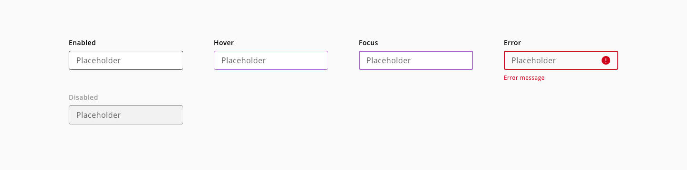
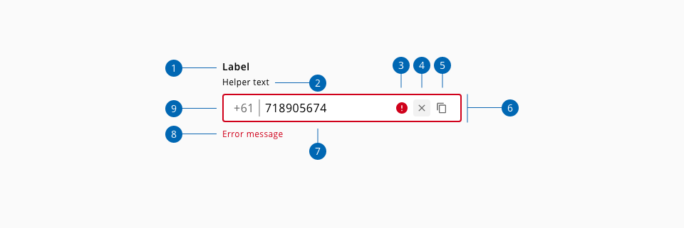
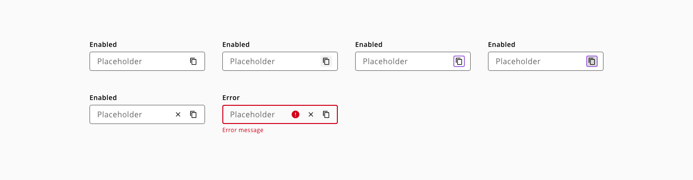
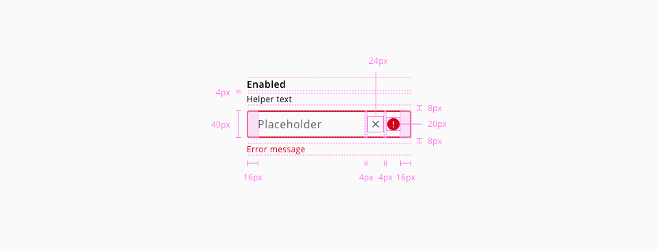
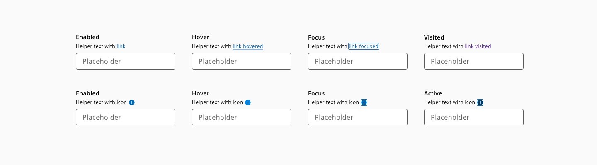

# Text-input

Text inputs are input fields typically used in forms that allow the user to enter text data in a structured format.

## Usage

Use text inputs in forms to help people enter, select, and search for text. Common text input types include: Usernames, descriptions, URLs, phone numbers, credit cards, emails, addresses or plain text searches

### Do's

* Do use fixed width inputs for content that has a specific, known length (e.g. post code, phone number).
* Do use sentence for any input text case with standard, local grammar and punctuation rules.
* Do use helpful and clear text for labels, error messages and helper texts


### Dont's

* Do not use text-input for text longer than a single line (e.g. name, phone number). Use the text-area instead.
* Do not disable copy and paste.
* Do not display pop up error message after validating
* Avoid masking label, keep it always visible.

## Variants


## States

Text-input states: **enabled**, **hover**, **focus**, **error** and **disabled**.



_Example of the text-input component states_


## Anatomy



1. Label text
2. Helper text (Optional)
3. Placeholder text
4. Error message
5. Input action (Optional)
6. Error indicator
7. Input container

## Content

### Actions

#### Clearing content

Clear actions allow user to remove the content of the text-input.


_Example of a text-input with a clear content action button_

#### Custom actions

Text-inputs can have an additional custom action. 



_Example of a text-input with an additional action_

### Prefixes and suffixes

Prefixes and suffixes help the user to understando the purpose of the text input.


_Icon or text prefixes and suffixes usage_


## Design Specifications



_Specifications for text-input component_

### Width

| Width                | Value |
| -------------------- | ----- |
| `small`              | 60px  |
| `medium` (_default_) | 240px |
| `large`              | 480px |
| `fitContent`         | -     |
| `fillParent`         | -     |


### Margin

| Margin      | Value |
| ----------- | ----- |
| `xxsmall`   | 6px   |
| `xsmall`    | 16px  |
| `small`     | 24px  |
| `medium`    | 36px  |
| `large`     | 48px  |
| `xlarge`    | 64px  |
| `xxlarge`   | 100px |

And also apply different values to each side of the component:
```top``` ```bottom``` ```left``` ```right```

## Color

### On-light

#### Base

| Component token          | Element          | Token             | Value             |
| ------------------------ | ---------------- | ----------------- | ----------------- |
| `labelFontColor`         | Label            | `Hal-Black`       | `#000000`         |
| `helperTextFontColor`    | Helper-text      | `Hal-Black`       | `#000000`         |
| `placeholderColor`       | Placeholder      | `Hal-Grey-S-40`   | `#666666`         |
| `outlineEnabledColor`    | Outline:enabled  | `Hal-Black`       | `#000000`         |

#### Interactive

| Property                 | Element          | Token             | Value             |
| ------------------------ | ---------------- | ----------------- | ----------------- |
| `outlineHoverColor`      | Outline:hover    | `Hal-Purple-L-60` | `#ab63cf`         |
| `outlineFocusColor`      | Outline:focus    | `Hal-Purple-L-60` | `#ab63cf`         |
| `outlineErrorColor`      | Outline:error    | `Hal-Red-S-41`    | `#d0011b`         |
| `outlineDisabledColor`   | Outline:disabled | `-`               | `-`               |
| `errorMessageColor`      | Error message    | `Hal-Red-S-41`    | `#d0011b`         |
| `errorIconColor`         | Error icon       | `Hal-Red-S-41`    | `#d0011b`         |


#### Suffix/Prefix

| Property                 | Element          | Token             | Value             |
| ------------------------ | ---------------- | ----------------- | ----------------- |
| `leadingIconColor`       | Leading icon     | `Hal-Black`       | `#000000`         |
| `trailingIconColor`      | Trailing icon    | `Hal-Black`       | `#000000`         |
| `suffixLabelColor`       | Suffix label     | `Hal-Black`       | `#000000`         |
| `prefixLabelColor`       | Prefix label     | `Hal-Black`       | `#000000`         |

### On-dark

#### Base

| Property                 | Element          | Token             | Value           |
| ------------------------ | ---------------- | ----------------- | --------------- |
| `labelFontColor`         | Label            | `Hal-White`       | `#ffffff`       |
| `helperTextFontColor`    | Helper-text      | `Hal-White`       | `#ffffff`       |
| `placeholderColor`       | Placeholder      | `Hal-White`       | `#ffffff`       |
| `outlineEnabledColor`    | Outline:enabled  | `Hal-White`       | `#ffffff`       |

#### Interactive

| Property                 | Element          | Token             | Value           |
| ------------------------ | ---------------- | ----------------- | --------------- |
| `outlineHoverColor`      | Outline:hover    | `Hal-Purple-L-60` | `#ab63cf`       |
| `outlineFocusColor`      | Outline:focus    | `Hal-Purple-L-60` | `#ab63cf`       |
| `outlineErrorColor`      | Outline:error    | `Hal-Red-L-60`    | `#f7344f`       |
| `outlineDisabledColor`   | Outline:disabled | `-`               | `-`             |
| `errorMessageColor`      | Error message    | `Hal-Red-L-60`    | `#f7344f`       |
| `errorIconColor`         | Error icon       | `Hal-Red-L-60`    | `#f7344f`       |


#### Suffix/Prefix

| Property                 | Element          | Token             | Value           |
| ------------------------ | ---------------- | ----------------- | --------------- |
| `leadingIconColor`       | Leading icon     | `Hal-White`       | `#ffffff`       |
| `trailingIconColor`      | Trailing icon    | `Hal-White`       | `#ffffff`       |
| `suffixLabelColor`       | Suffix label     | `Hal-White`       | `#ffffff`       |
| `prefixLabelColor`       | Prefix label     | `Hal-White`       | `#ffffff`       |


### Typography

| Property        | Element        | Token                   | Value           |
| --------------- | -------------- | ----------------------- | --------------- |
| `font-family`   | Label          | `type-sans`             | Open Sans       |
| `font-size`     | Label          | `type-scale-02`         | 0.875rem / 14px |
| `font-weight`   | Label          | `type-bold`             | 600             |
| `line-height`   | Label          | `type-leading-loose-01` | 1.75em          |
| `font-family`   | Placeholder    | `type-sans`             | Open Sans       |
| `font-size`     | Placeholder    | `type-scale-03`         | 1rem / 16px     |
| `font-weight`   | Placeholder    | `type-regular`          | 400             |
| `font-family`   | Error message  | `type-sans`             | Open Sans       |
| `font-size`     | Error message  | `type-scale-01`         | 0.75rem / 12px  |
| `font-weight`   | Error message  | `type-regular`          | 400             |
| `line-height`   | Error message  | `type-leading-normal`   | 1.5em           |


### Spacing


| Property        | Element         | Token             | Value           |
| --------------- | --------------- | ----------------- | --------------- |
| `margin-left`   | Error icon      | `spacing-02`      | 0.25rem / 4px   |
| `margin-left`   | Action icon     | `spacing-02`      | 0.25rem / 4px   |
| `margin-right`  | Prefix          | `spacing-03`      | 0.5rem / 8px    |
| `padding-left`  | Prefix divider  | `spacing-03`      | 0.5rem / 8px    |
| `margin-left`   | Suffix          | `spacing-03`      | 0.5rem / 8px    |
| `padding-right` | Suffix divider  | `spacing-03`      | 0.5rem / 8px    |
| `padding-left`  | Input container | `spacing-05`      | 1rem / 16px     |
| `padding-right` | Input container | `spacing-05`      | 1rem / 16px     |
| `margin-top`    | Input container | `spacing-03`      | 0.5rem / 8px    |
| `margin-bottom` | Input container | `spacing-03`      | 0.5rem / 8px    |

### Border

| Property        | Element               | Token             | Value           |
| --------------- | --------------------- | ----------------- | --------------- |
| `border`        | Input container       | `-`               | 1px solid       |
| `box-shadow`    | Input container:focus | `-`               | 1px solid       |


### Helper text

Helper text can be used as additional instructions to the user when filling in the form. It should be always visible even on focus state.



_Text-input helper text example_

**Usage**

Do:

* Keep helper text as short and specific as possible.
* Only use helper text when truly necessary to avoid overloading the user.
* Should give an example or an explanation of the field

Don’t:

* Helper text should not run longer than the input area.

**Specs**

| Property        | Element        | Token                   | Value           |
| --------------- | -------------- | ----------------------- | --------------- |
| `margin-top`    | helper-text    | `spacing-02`            | 4px             |
| `font-size`     | helper-text    | `type-scale-01`         | 12px            |
| `font-family`   | helper-text    | `type-sans`             | Open Sans       |
| `line-height`   | Helper text    | `type-leading-normal`   | 1.5em           |
| `color`         | helper-text    | `Hal-Black`             | hsl(0, 0%, 0%)  |

## Accessibility

### WCAG 2.2

* Understanding WCAG 2.2 - [1.3.1: Information and Relationships](https://www.w3.org/WAI/WCAG22/Understanding/info-and-relationships)
* Understanding WCAG 2.2 - [3.3.1: Error Identification](https://www.w3.org/WAI/WCAG22/Understanding/error-identification)
* Understanding WCAG 2.2 - [3.3.2: Labels and Instructions](https://www.w3.org/WAI/WCAG22/Understanding/labels-or-instructions) 
* Understanding WCAG 2.2 - [3.3.3: Error Suggestion](https://www.w3.org/WAI/WCAG22/Understanding/error-suggestion) 
* Understanding WCAG 2.2 - [4.1.2: Name, Role, Value](https://www.w3.org/WAI/WCAG22/Understanding/name-role-value) 


## Links and references

* [Angular CDK component]()
* [React CDK component]()

____________________________________________________________

[Edit this page on Github](https://github.com/dxc-technology/halstack-style-guide/blob/master/guidelines/components/text-input/README.md)

