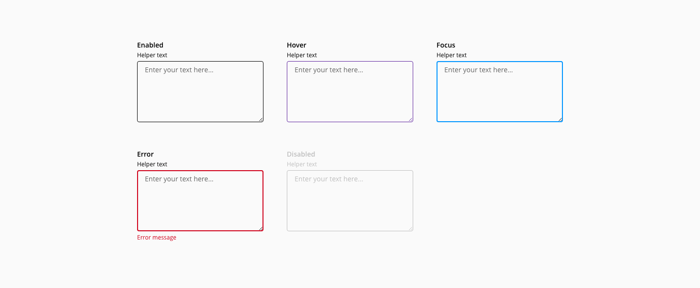
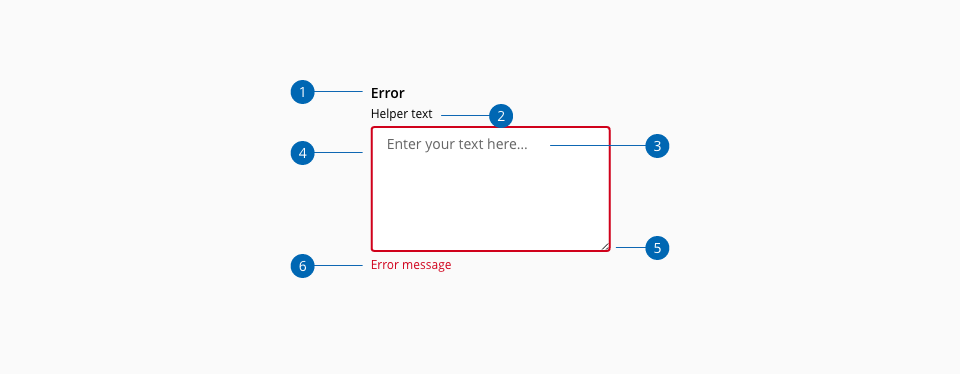
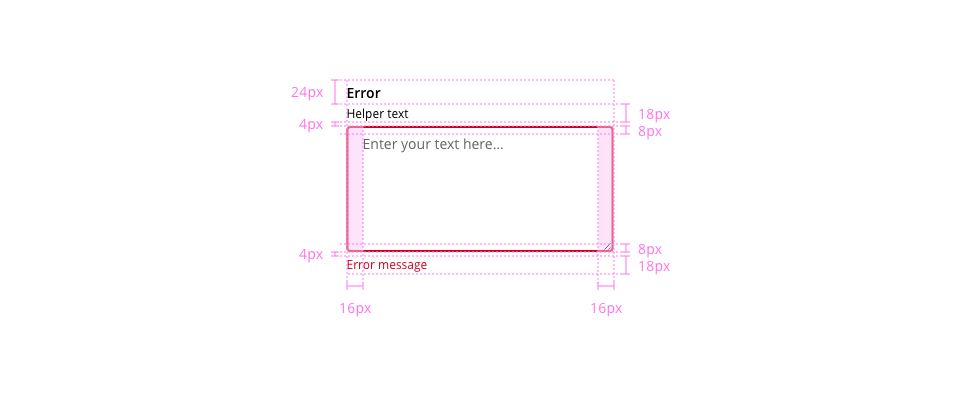

# Textarea

A textarea allows the users enter a multi-line, free-form text.

## Usage

* Use the texarea when you need users to enter a text longer than a single line
* Avoid using the text area when complex questions can break up in simpler ones 
## States

States: **Enabled**, **hover**, **focus**, **error** and **disabled**.

_Textarea component states example_
## Anatomy

1. Label
2. Helper text _(Optional)_
3. Placeholder/Value
4. Container
5. Resizer
6. Error message

## Design specifications

_Component design specifications_

<!--
### Color
### Typography
### Border
### Spacing

-->

## Accesibility

<!--
Add WCAG success criterion and WAI-ARIA design pattern and example when available

### WCAG 

* Understanding WCAG 2.2 - [SC x.x name of the succes criterion](url)

### WAI-ARIA

* WAI-ARIA Authoring practices 1.2 - [x.x title of the section](url)
* WAI-ARIA Authoring practices 1.2 - ["Name" design pattern](url)
-->

## Links and references

* [Angular CDK component](https://developer.dxc.com/tools/react/next/#/components/textarea)
* [React CDK component](https://developer.dxc.com/tools/angular/next/#/components/textarea)

____________________________________________________________

* [Edit this page on GitHub](url)

