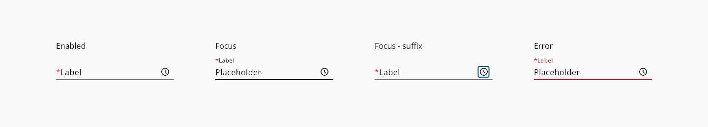
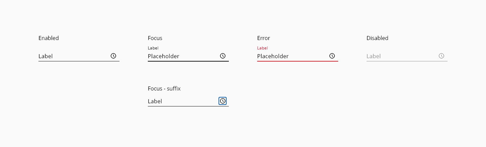

# Time

A time input is a user interface element where the user can type or select a time in a predefined format.

## Usage

#### Do:
Keep helper text as short and specific as possible.
Only use helper text when truly necessary to avoid overloading the user.
Should give an example or an explanation of the field.

#### Don’t:
Helper text should not run longer than the input area.

### Required
Required time fields are displayed in the same way the component text-input does.



_Examples of time picker required input_


## Variants

<span style="display:block; background-color:red; color:white"><b>- to be discussed</b></span>

## States

### Time-input

States: **enabled**, **hover**, **focus**, **focus-suffix**, **error**, and **disabled**.



_Examples of time picker input states_

### Time pop-up

States: **enabled**, **hover**, **focus**, **focus-suffix**, **error**, and **disabled**.

<span style="display:block; background-color:lightgreen;">

</span>

_Examples of the time pop-up states_


## Anatomy


_Anatomy of Time picker_

1. Component State
2. Focus Area
3. Icon
4. Underline
5. Assistive Text showing Error Messages
6. Placeholder Text
7. Helper Text

## Design specifications

### Time-input


_Structure and spacing for time picker inputs_

#### Height

| Property                              | Value     |
| ------------------------------------- | --------- |
| `height` (default)                    |      32px |
| `height` (selected)                   |      48px |
| `height` (selected + auxiliar text)   |      73px |

#### Width

| Property            |  Value           | 
| ------------------- |  -------------   |   
| `medium`_(default)_ |  240px           | 
| `large`             |  480px           |  
| `fillParent`        |  -               | 

#### Margin

Different values can be applied to each side of the component:
```top``` ```bottom``` ```left``` ```right```

margin | Value
-- | --
`xxsmall` | 6px
`xsmall` | 16px
`small` | 24px
`medium` | 36px
`large` | 48px
`xlarge` | 64px
`xxlarge` | 100px

#### Typography

| Property                      | Element          |  Value      |
| ----------------------------- | ---------------- | ----------- |
| `font-size`                   |  label enabled   |   16px      |
| `font-size`                   |  label           |   12px      |
| `font-size`                   |  placeholder     |   16px      |
| `font-size`                   |  assistive text  |   12px      |
| `font-weight`                 |  all             |   400       |

#### Other specs

| Property                            | Value     |
| ----------------------------------- | --------- |
| `border-width` enabled              |   1px     |
| `border-width` focus                |   2px     |
| Icon size                           |   20x20px |
| Distance between text and underline |   7px     |

### Time pop-up

<span style="display:block; background-color:red; color:white"><b>- to be discussed</b></span>

_Structure and spacing for time picker time pop-up_

#### Color

<span style="display:block; background-color:red; color:white"><b>- to be discussed</b></span>

| Tokens                              | Value       |
| ---------------------------------   | ----------- |
| `pickerSelectedDateBackgroundColor` |     #5f249f |
| `pickerSelectedDateColor`           |     #FFFFFF |
| `pickerBackgroundColor`             |     #FFFFFF |
| `pickerFontColor`                   |     #000000 |
| `pickerActualDate`                  |     #D9D9D9 |
| `pickerHoverDateBackgroundColor`    |     #D0BDDB |
| `pickerHoverDateFontColor`          |     #000000 |
| `scrollBarThumbColor`               |     #666666 |
| `scrollBarTrackColor`               |     #D9D9D9 |
| `focusColor`                        |     #005FCC |


#### Typography

<span style="display:block; background-color:red; color:white"><b>- to be discussed</b></span>

| Property                      | Element          |  Value      |
| ----------------------------- | ---------------- | ----------- |
| `font-size`                   |  year selector   |   16px      |
| `font-size`                   |  current month   |   13px      |
| `font-size`                   |  day             |   13px      |
| `font-weight`                 |  year selector   |   600       |
| `font-weight`                 |  current month   |   400       |
| `font-weight`                 |  day             |   400       |

#### Padding

<span style="display:block; background-color:red; color:white"><b>- to be discussed</b></span>

| Property                      | Element               |  Value      |
| ----------------------------- | ----------------      | ----------- |
| `padding`                     |  calendar container   |   16px      |
| `padding-left/right`          |  month container      |   8px       |
| `padding-left/right`          |  year selector        |   16px      |
| `padding-top/bottom`          |  separator            |   8px       |

#### Sizing

<span style="display:block; background-color:red; color:white"><b>- to be discussed</b></span>

| Property                      | Element                |  Value      |
| ----------------------------- | ----------------       | ----------- |
| `height/width`                |  selected date circle  |   28/28px   |
| `height/width`                |  year selection caret  |   24/24px   |
| `height/width`                |  calendar top controls |   24/24px   |

## Helper text

Helper text can be used as additional instructions to the user when filling in the form. It should be visible even on focus state and it can be replaced by an error message until the error is fixed in order to prevent adding more lines of text.


_Examples of time picker input states with Helper text_

## Accesibility

<span style="display:block; background-color:red; color:white"><b>- to be discussed</b></span>

### WCAG 2.2
Understanding WCAG 2.2 - SC 2.4.7: Focus Visible
Understanding WCAG 2.2 - SC 1.4.13: Content on Hover or Focus

#### WAI-ARIA 1.2
WAI-ARIA authoring practices 1.2 - 3.9 Dialog modal
WAI-ARIA authoring practices - Time picker design pattern

## Links and references

* [Angular CDK component](url)
* [React CDK component](url)

____________________________________________________________

* [Edit this page on GitHub](url)