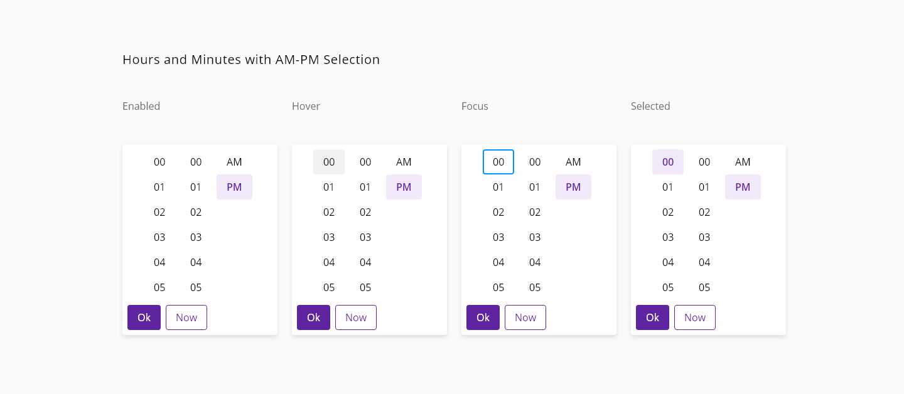
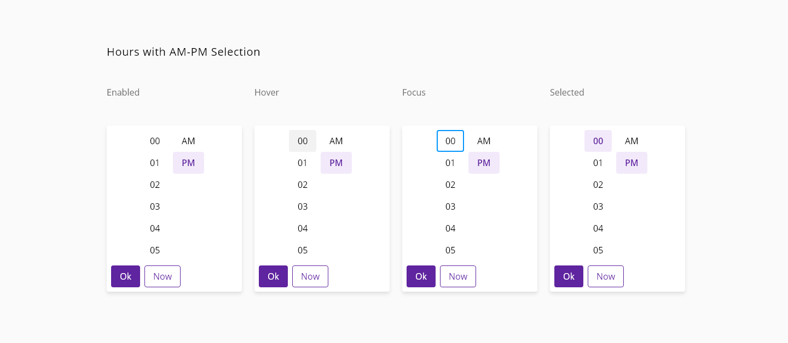
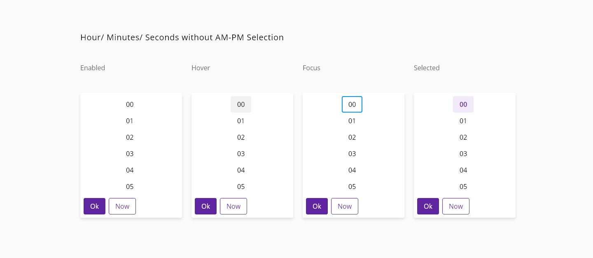

# Timepicker

A time input is a user interface element where the user can type or select a time in a predefined format.

## Usage

- The time picker may be configured to display either 12-hour (HH:MM:SS AM/PM) or 24-hour (HH:MM) format.
- User may key in the desired time or select from the displayed pre-configured 12-hour or 24-hour format time value options displayed in the dropdown.


_Examples of time selection_

## States

### Time-input

States: **enabled**, **hover**, **focus**, **focus-suffix**, **error**, and **disabled**.


_Examples of time picker required input_

### Time pop-up

States: **enabled**, **hover**, **focus** and **selected**.


_Examples of the time pop-up states_


## Anatomy


_Anatomy of Time picker_

1. Label (Optional)
2. Placeholder
3. Error message
4. Secondary Icon
5. Primary Icon
6. Input Outline

## Design specifications

### Time-input


_Structure and spacing for time picker inputs_

#### Height

Property | Value    
-- | --
`height` (default) | `40px`
`height` (selected) | `64px`
`height` (selected + auxiliar text) | `82px`

#### Width

Property |  Value
-- |  --
`medium`_(default)_ | `240px`
`large` | `480px`
`fillParent` | -              

#### Margin

Different values can be applied to each side of the component:
```top``` ```bottom``` ```left``` ```right```

margin | Value
-- | --
`xxsmall` | `6px`
`xsmall` | `16px`
`small` | `24px`
`medium` | `36px`
`large` | `48px`
`xlarge` | `64px`
`xxlarge` | `100px`

#### Typography

Property|Element|Value     
--|--|--
`font-size` | label enabled | `16px`
`font-size` | label | `12px`
`font-size` | placeholder | `16px`
`font-size` | assistive text | `12px`
`font-weight` | all | `400`

#### Other specs

Property|Value    
--|--
`border-width` enabled | `1px`
`border-width` focus | `2px`
Icon size | `24x24px`
Distance between text and underline | `7px`

### Time pop-up


_Structure and spacing for time picker time pop-up_








#### Color

Tokens | Value      
--|--
`pickerSelectedTimeBackgroundColor` | `#5f249f`
`pickerSelectedTimeColor` | `#FFFFFF`
`pickerBackgroundColor` | `#FFFFFF`
`pickerFontColor` | `#000000`
`pickerActualDate` | `#D9D9D9`
`pickerHoverTimeBackgroundColor` | `#D0BDDB`
`pickerHoverTimeFontColor` | `#000000`
`scrollBarThumbColor` | `#666666`
`scrollBarTrackColor` | `#D9D9D9`
`focusColor` | `#005FCC`


#### Typography

Property | Element | Value     
--|--|--
`font-size`   | hr/ min/ sec selector | `16px`
`font-weight` | hr/ min/ sec selector | `400`

#### Padding

Property | Element | Value
--|--|--
`padding` | time container | `8px`
`padding-left/ right` | hr/ min/ sec selector   | `16px`
`padding-top/ bottom` | hr/ min/ sec selector   | `8px`

#### Sizing

Property | Element | Value
--|--|--
`height/ width` | selected time  | `40/50px`
`height/ width` | am/pm selector  | `40/57px`

## Helper text

Helper text can be used as additional instructions to the user when filling in the form. It should be visible even on focus state and it can be replaced by an error message until the error is fixed in order to prevent adding more lines of text.

## Accesibility

- to be discussed

### WCAG 2.2
Understanding WCAG 2.2 - SC 2.4.7: Focus Visible
Understanding WCAG 2.2 - SC 1.4.13: Content on Hover or Focus

#### WAI-ARIA 1.2
WAI-ARIA authoring practices 1.2 - 3.9 Dialog modal
WAI-ARIA authoring practices - Time picker design pattern

## Links and references

* [Angular CDK component](url)
* [React CDK component](url)

____________________________________________________________

* [Edit this page on GitHub](url)
