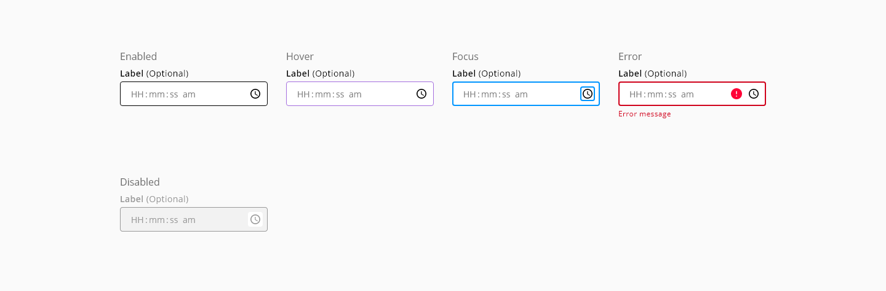
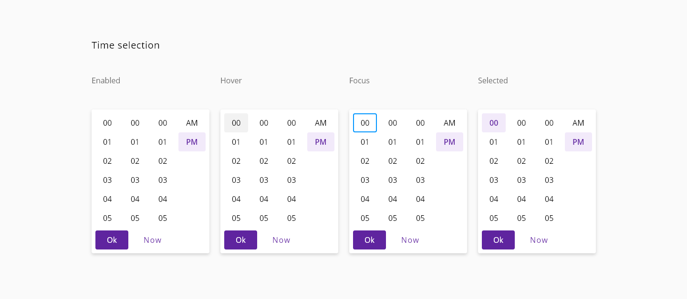
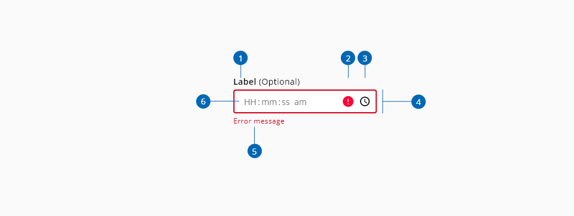
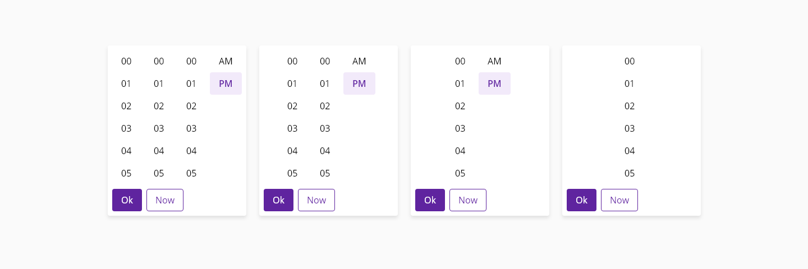
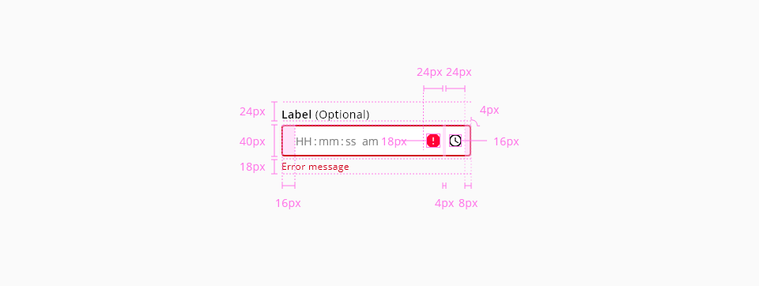
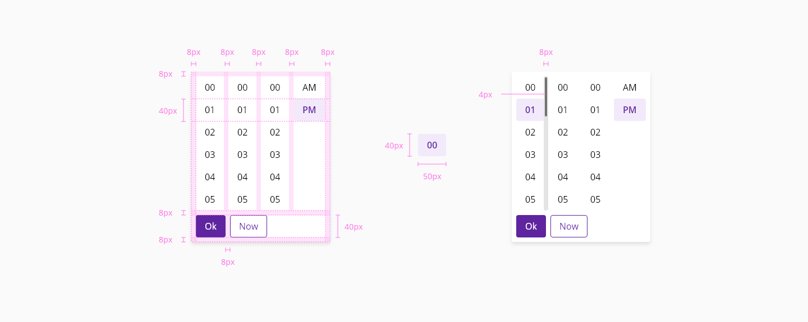

# Timepicker

A time input is a user interface element where the user can type or select a time in a predefined format.

## Usage

- The time picker may be configured to display either 12-hour (HH:MM:SS AM/PM) or 24-hour (HH:MM) format.
- User may key in the desired time or select from the displayed pre-configured 12-hour or 24-hour format time value options displayed in the dropdown.


## States

### Time-input

States: **enabled**, **hover**, **focus**, **focus-suffix**, **error**, and **disabled**.



_Examples of time picker required input_


### Time pop-up

States: **enabled**, **hover**, **focus** and **selected**.



_Examples of the time pop-up states_


## Anatomy



_Anatomy of Time picker_

1. Label
2. Optional field label (Optional)
3. Secondary Icon
4. Primary Icon
5. Input Outline
6. Error message
7. Placeholder


### Variants of the time pop-up



* Hours/ Minutes / Seconds
* Hours / Minutes or Minutes / Seconds
* Select only one: Hours, minutes or seconds
* Display in a 12 hour / 24 hours this configuration affects all

## Design specifications

### Time-input



_Structure and spacing for time picker inputs_

#### Color

| Component token          | Element            | Token                   | Value             |
| :----------------------- | :----------------- | :---------------------- | :---------------- |
| `labelFontColor`         | Label              | `color-black`           | #000000           |
| `valueFontColor`         | Value              | `color-black`           | #000000           |
| `helperTextFontColor`    | Helper-text        | `color-black`           | #000000           |
| `placeholderFontColor`   | Placeholder        | `color-grey-600`        | #808080           |
| `enabledBorderColor`     | Border:enabled     | `color-black`           | #000000           |
| `ActionIconColor`        | Time button icon   | `color-black`           | #000000           |
| `ActionBackgroundColor`  | Time button        | `color-transparent`     | transparent       |

#### Interactive

| Component token                 | Element                     | Token                   | Value           |
| :------------------------------ | :-------------------------- | :---------------------- | :-------------- |
| `hoverBorderColor`              | Border:hover                | `color-purple-500`      | #a46ede         |
| `focusBorderColor`              | Border:focus                | `color-blue-600`        | #0095ff         |
| `errorBorderColor`              | Border:error                | `color-red-700`         | #d0011b         |
| `hoverErrorBorderColor`         | Border:hover on error       | `color-red-600`         | #fe0123         |
| `disabledBorderColor`           | Border:disabled             | `color-grey-500`        | #999999         |
| `errorMessageColor`             | Error message               | `color-red-700`         | #d0011b         |
| `errorIconColor`                | Error icon                  | `color-red-700`         | #d0011b         |
| `disabledContainerFillColor`    | Input container:disabled    | `color-grey-100`        | #f2f2f2         |
| `disabledLabelFontColor`        | Label:disabled              | `color-grey-500`        | #999999         |
| `disabledValueFontColor`        | Value:disabled              | `color-grey-500`        | #999999         |
| `disabledHelperTextFontColor`   | Helper text:disabled        | `color-grey-500`        | #999999         |
| `disabledPlaceholderFontColor`  | Placeholder:disabled        | `color-grey-500`        | #999999         |
| `hoverActionBackgroundColor`    | Time button:hover           | `color-grey-100`        | #f2f2f2         |
| `focusActionBackgroundColor`    | Time button:focus           | `color-grey-100`        | #f2f2f2         |
| `activeActionBackgroundColor`   | Time button:active          | `color-grey-300`        | #cccccc         |
| `disabledActionBackgroundColor` | Time button:disabled        | `color-transparent`     | transparent     |
| `hoverActionIconColor`          | Time button icon:hover      | `color-grey-500`        | #999999         |
| `focusActionIconColor`          | Time button icon:focus      | `color-grey-500`        | #999999         |
| `disabledActionIconColor`       | Time button icon:disabled   | `color-grey-500`        | #999999         |

          
#### Typography

| Property        | Element        | Token                      | Value           |
| :-------------- | :------------- | :------------------------- | :-------------- |
| `font-family`   | Label          | `font-family-sans`         | Open Sans       |
| `font-size`     | Label          | `font-scale-02`            | 0.875rem / 14px |
| `font-weight`   | Label          | `font-weight-bold`         | 600             |
| `line-height`   | Label          | `font-leading-loose-01`    | 1.75em          |
| `font-family`   | Value          | `font-family-sans`         | Open Sans       |
| `font-size`     | Value          | `font--scale-03`           | 1rem / 16px     |
| `font-weight`   | Value          | `font-weight-regular`      | 400             |
| `font-family`   | Error message  | `font-family-sans`         | Open Sans       |
| `font-size`     | Error message  | `font--scale-01`           | 0.75rem / 12px  |
| `font-weight`   | Error message  | `font-weight-regular`      | 400             |
| `line-height`   | Error message  | `font-leading-normal`      | 1.5em           |

#### Spacing


| Property        | Element         | Token             | Value           |
| :-------------- | :-------------- | :---------------- | :-------------- |
| `margin-left`   | Error icon      | `spacing-02`      | 0.25rem / 4px   |
| `margin-left`   | Time button     | `spacing-02`      | 0.25rem / 4px   |
| `padding-left`  | Input           | `spacing-03`      | 0.5rem / 8px    |
| `padding-left`  | Input container | `spacing-03`      | 0.5rem / 8px    |
| `padding-right` | Input container | `spacing-03`      | 0.5rem / 8px    |
| `margin-top`    | Input container | `spacing-02`      | 0.25rem / 4px   |
| `margin-bottom` | Input container | `spacing-02`      | 0.25rem / 4px   |

#### Border

| Property                 | Element          | Core token                 | Value            |
| :----------------------- | :--------------- | :------------------------- | :--------------- |
| `border-width`           | Input:enabled    | `border-width-1`           | 1px              |
| `border-style`           | Input:enabled    | `border-style-solid`       | solid            |
| `border-width`           | Input:focus      | `border-width-2`           | 2px              |
| `border-style`           | Input:focus      | `border-style-solid`       | solid            |


#### Width

| Width                | Value |
| :------------------- | :---- |
| `small`              | 240px |
| `medium` (_default_) | 360px |
| `large`              | 480px |
| `fillParent`         | 100%  |

#### Margin

Different values can be applied to each side of the component:
```top``` ```bottom``` ```left``` ```right```

| margin        | Value     |
| :------------ | :-------- |
| `xxsmall`     | 6px       |
| `xsmall`      | 16px      |
| `small`       | 24px      |
| `medium`      | 36px      |
| `large`       | 48px      |
| `xlarge`      | 64px      |
| `xxlarge`     | 100px     |


### Time pop-up



_Structure and spacing for time picker time pop-up_


#### Color

| Component token                       | Element                     | Token                   | Value         |
| :------------------------------       | :-------------------------- | :---------------------- | :------------ |
| `timeBackgroundColor`                 | Time container              | `color-transparent`     |  transparent  |
| `timeFontColor`                       | Time label                  | `color-black`           |  #000000      |
| `hoverTimeBackgroundColor`            | Time container:hover        | `color-grey-100`        |  #f2f2f2      |
| `hoverTimeFontColor`                  | Time label:hover            | `color-black`           |  #000000      |
| `selectedTimeBackgroundColor`         | Time container:selected     | `color-purple-100 `     |  #f2eafa      |
| `selectedTimeFontColor`               | Time label:selected         | `color-purple-700 `     |  #5f249f      |
| `focusColor`                          | Time container:focus        | `color-blue-600`        |  #0095ff      |


#### Typography

| Property      |   Element                 |   Token                   | Value         |
| :------------ |   :---------------------- |  :------------------      | :------------ |
| `font-size`   |   Time label              |  `spacing-05`             | 1 rem/ 16px   |
| `font-weight` |   Time label              |  `font-weight-regular`    | 400           |
| `font-weight` |   Time label:selected     |  `font-weight-semibold`   | 600           |


#### Spacing

| Property              |   Element                 |   Token               | Value         |
| :-------------------- |   :---------------------- |  :------------------  | :------------ |
| `padding-left/ right` | Time label                | `spacing-05`          | 1rem / 16px   |
| `padding-top/ bottom` | Time label                | `spacing-03`          | 0.5rem / 8px   |
| `padding`             | Time dialog container     | `spacing-03`          | 0.5rem / 8px   |
| `padding-right`       | Time column               | `spacing-03`          | 0.5rem / 8px   |

#### Sizing

| Property          | Element           | Token         | Value     |
| :---------------- | :---------------- | :------------ | :-------- |
| `height/ width`   | Time container    | -             | 40 / 50px |
| `height/ width`   | Format selector   | -             | 40 / 57px |

## Accesibility

### WCAG 2.2

* Understanding WCAG 2.2 - [SC 2.1.1: Keyboard](https://www.w3.org/WAI/WCAG22/Understanding/keyboard)
* Understanding WCAG 2.2 - [SC 2.1.2: No keyboard trap](https://www.w3.org/WAI/WCAG22/Understanding/no-keyboard-trap)
* Understanding WCAG 2.2 - [SC 2.4.6: Headings and labels](https://www.w3.org/WAI/WCAG22/Understanding/headings-and-labels)
* Understanding WCAG 2.2 - [SC 2.4.7: Focus Visible](https://www.w3.org/WAI/WCAG22/Understanding/focus-visible)

#### WAI-ARIA 1.2

* WAI-ARIA authoring practices 1.2 - [3.9 Dialog modal](https://www.w3.org/TR/wai-aria-practices-1.2/#dialog_modal)


## Links and references

* [Angular CDK component](url)
* [React CDK component](url)

____________________________________________________________

* [Edit this page on GitHub](url)
