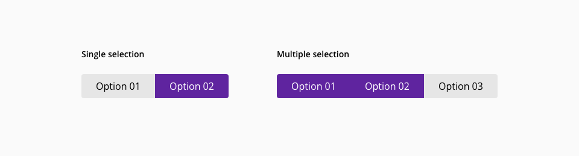
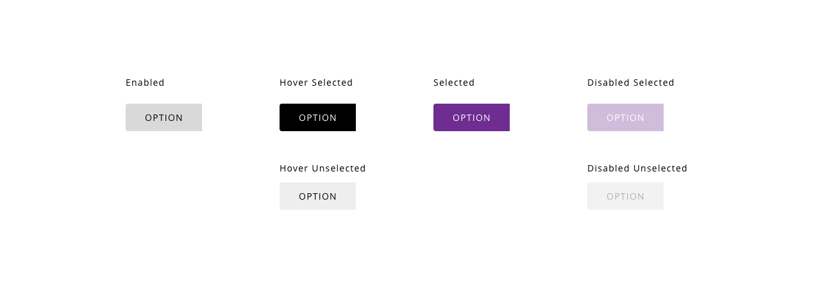
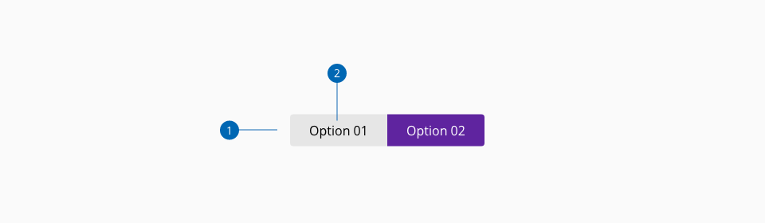

# Toggle group

Toggle buttons can be used to put together related options that share a common attribute modification.
It allows the user to switch from one selected option to another in the same control, having one option selected at a time. Also, there can be another variation that allows selecting multiple options from the current toggle group.


## Usage

Toggles should be used in place of radio buttons whenever the options are:

* Minimal in number, i.e. 3 or 4 maximum choices where only one selction is required
* Opposites of each other

## Variants



_Toggle component single and multiple variants_

The selection of the toggle group can be mutually exclusive (single variant) or multiple (multiple variant).

## States

Different states are defined in the life cycle of the component:
**Unselected enabled**, **unselected hover**, **unselected focus**, **unselected active**, **unselected disabled**, **selected enabled**, **selected hover**, **selected focus**, **selected active** and **selected disabled**



_Toggle button states example_


## Anatomy



1. Container
2. Label/Icon


## Icon Usage

Inside the toggle button, it is possible to use icons to represent recognizable actions. The specifications for icon usage differs a little bit in relation to text usage. The size of the icons should be 24 by 24 pixels, it must be centered respecting to the box that contains it vertically and horizontally. 


## Design Specifications


_Toggle design specifications_
### Color

| Component token                     | Element                     | Token                    | Value       |
| :---------------------------------- | :-------------------------- | :----------------------- | :---------- |
| `unselectedBackgroundColor`         | Container fill:enabled	    | `color-grey-200`         | #e6e6e6     |
| `unselectedHoverBackgroundColor`    | Container fill:hover	    | `color-grey-300`         | #cccccc     |
| `unselectedActiveBackgroundColor`   | Container fill:active	    | `color-purple-700`       | #5f249f     |
| `unselectedDisabledBackgroundColor` | Container fill:disabled	    | `color-grey-100`         | #f2f2f2     |
| `unselectedFontColor`               | Label	                    | `color-black`            | #000000     |
| `unselectedDisabledFontColor`       | Label:disabled	            | `color-grey-500`         | #999999     |
| `selectedBackgroundColor`           | Container fill:enabled	    | `color-purple-700`       | #5f249f     |
| `selectedHoverBackgroundColor`      | Container fill:hover	    | `color-purple-800`       | #4b1c7d     |
| `selectedActiveBackgroundColor`     | Container fill:active	    | `color-purple-900`       | #321353     |
| `selectedDisabledBackgroundColor`   | Container fill:disabled	    | `color-purple-100`       | #f2eafa     |
| `selectedFontColor`                 | Label	                    | `color-white`            | #ffffff     |
| `selectedDisabledFontColor`         | Label:disabled	            | `color-purple-300`       | #cbacec     |
| `focusColor`                        | Border:focus	            | `color-blue-600`         | #0095ff     |

### Typography

| Component token                     | Element              | Token                           | Value                       |
| :---------------------------------- | :------------------- | :------------------------------ | :-------------------------- |
| `fontFamily`                        | Label	             | `font-family`                   | 'Open Sans', sans-serif     |
| `fontSize`                          | Label	             | `font-scale-03`                 | 1rem / 16px                 |
| `fontStyle`                         | Label	             | `font-style-normal`             | normal                      |
| `fontWeight`                        | Label	             | `font-weight-regular`           | 400                         |


### Spacing

| Component token                     | Element              | Token                           | Value                       |
| :---------------------------------- | :------------------- | :------------------------------ | :-------------------------- |
| `iconPaddingRight`                  | Icon	             | `spacing-03`                    | 0.5rem / 8px                |
| `iconPaddingLeft`                   | Icon	             | `spacing-03`                    | 0.5rem / 8px                |
| `labelPaddingLeft`                  | Label	             | `spacing-06`                    | 1.5rem / 24px               |
| `labelPaddingRight`                 | Label	             | `spacing-06`                    | 1.5rem / 24px               |


### Border

| Property                 | Element          | Core token                 | Value            |
| :----------------------- | :--------------- | :------------------------- | :--------------- |
| `border-width`           | Container        | `border-width-0`           | 0                |
| `border-style`           | Container        | `border-style-none`        | none             |
| `border-radius`          | Container        | `border-radius-medium`     | 0.25rem / 4px    |
| `border-width`           | Focus border     | `border-width-2`           | 2                |
| `border-style`           | Focus border     | `border-style-solid`       | solid            |
| `border-radius`          | Focus border     | `border-radius-medium`     | 0.25rem / 4px    |

### Margin

margin | value
-- | --
```xxsmall``` | 6px
```xsmall``` | 16px
```small``` | 24px
```medium``` | 36px
```large``` | 48px
```xlarge``` | 64px
```xxlarge``` | 100px

And also apply different values to each side of the component:
```top``` ```bottom``` ```left``` ```right```

## Links and references

* [React CDK component](https://developer.dxc.com/tools/react/next/#/components/toggleGroup)
* [Angular CDK component](https://developer.dxc.com/tools/angular/next/#/components/toggleGroup)

____________________________________________________________

[Edit this page on Github](https://github.com/dxc-technology/halstack-style-guide/blob/master/guidelines/components/toggle/README.md)
