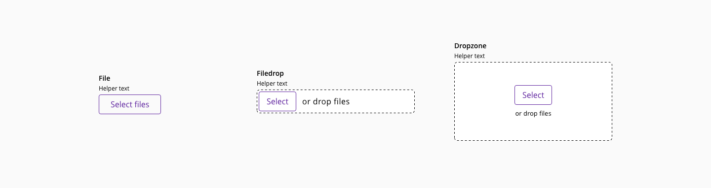
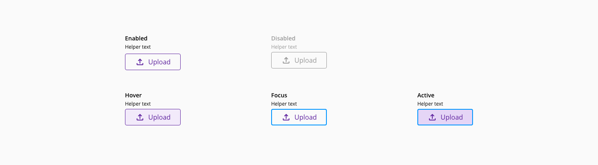
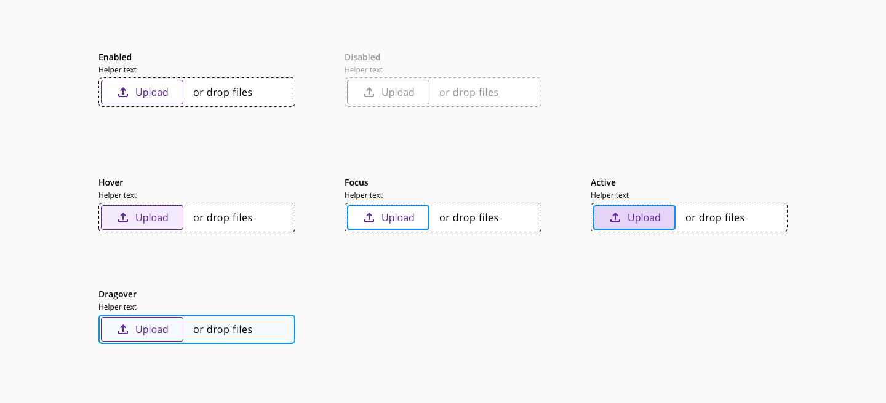
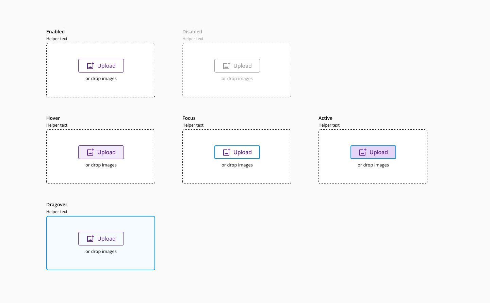
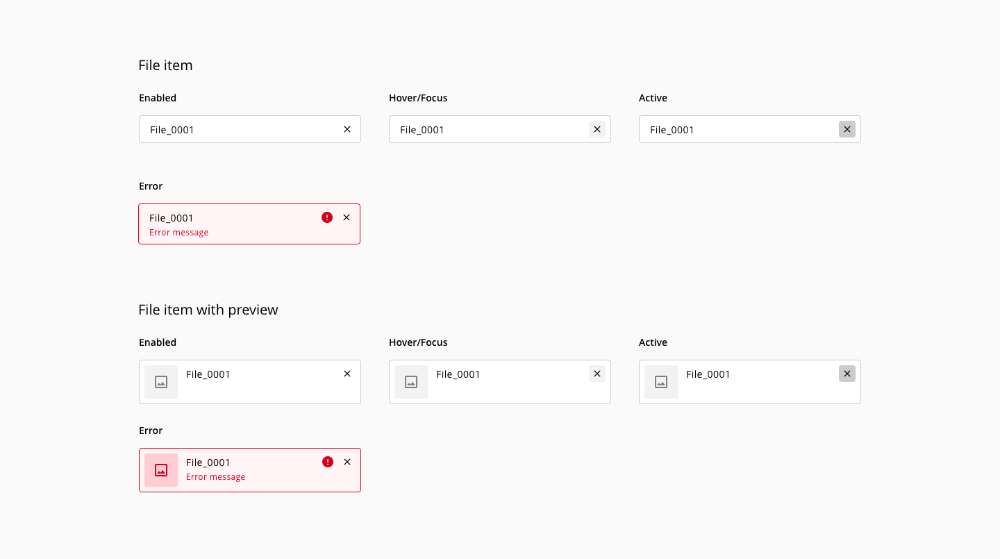
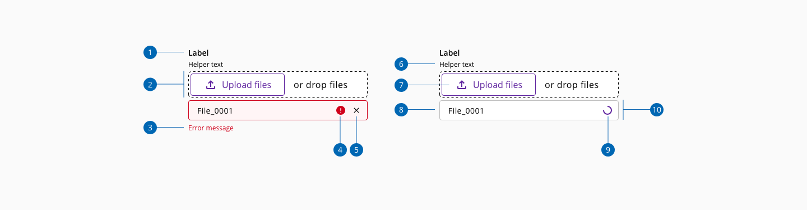
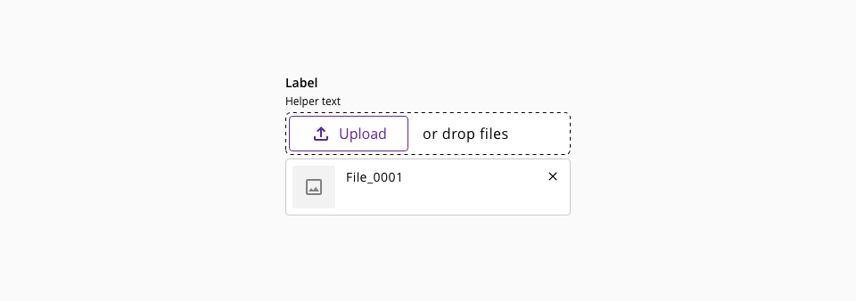
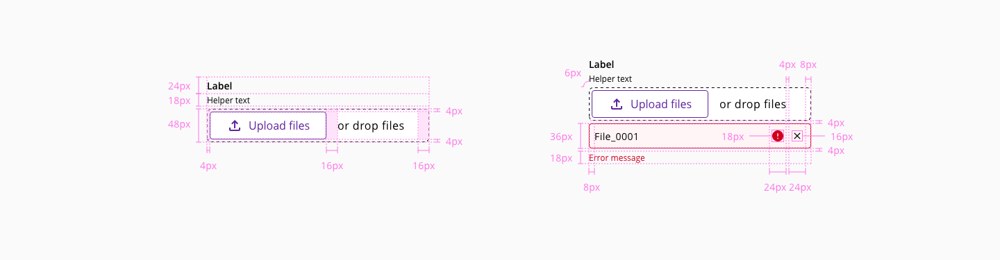

# Upload

The upload component is used to choose files from any location in the local machine and update those files to the server where the application is hosted. It is a common procedure in applications where files are required like documents, images or other information in digital formats.

## Usage

### Do's

* Provide a meaninful label and helper text in order to help the user understand the files expected
* When displaying errors, provide feedback about the type of error using the error message
* When the upload process fails, provide useful information instead of showing an error message using technical or undetermined information (i.e '0x94 ERROR_PATH_BUSY')

### Don'ts

* Use the upload component to upload multiple files inside a modal dialog
* Use a variant with drag and drop functionality when designing for mobile devices

## Variants

_Upload component variants_

|  Name        | Use case                                                                             |
| :----------- | :----------------------------------------------------------------------------------- |
| **File**     | Use the file variant when designing for multidevice                                  |
| **Filedrop** | Use in large or complex forms when designing only for desktop                        |
| **Dropzone** | Choose the dropzone when the main purpose of the content is to upload files/images   |

## States

The component upload is made-up of an input (type: file) and a file-item(s).

### File

The element has the following states: **Enabled**, **hover**, **focus**, **active** and **disabled**.

_File variant upload states_

### Filedrop

The element has the following states: **Enabled**, **hover**, **focus**, **active**, **dragover** and **disabled**.

_Filedrop variant upload states_

### Dropzone

The element has the following states: **Enabled**, **hover**, **focus**, **active**, **dragover** and **disabled**.

_Dropzone variant upload states_
### File items

The element has the following states: **Enabled**, **hover/focus**, **active**, **loading** and **error**.

_File item states_

## Anatomy

1. Label
2. Drag and drop area
3. Error message
4. Error indicator
5. Action - Remove file
6. Helper text
7. Upload button
8. File preview
9. File name
10. Loading indicator
11. File item container

## File item with preview

When the files to upload are mainly images, the preview can provide more feedback to the user rather than the name of the file, preventing errors loading content.

_File item with preview example_

## Loading content

When handling with large file sizes the file item should provide feedback to the user about the loading state. While the file is being loaded, the action to remove the file can not be performed.

_Loading content state_

## Design Specifications

_Upload design specifications_

### Color

#### Base

| Component token               | Element                     | Core token                  | Value         |
| :---------------------------- | :-------------------------- | :-------------------------- | :------------ |
| `dropBorderColor`             | Drag and drop area          | `color-black`               |   #000000     |
| `fileItemBorderColor`         | File item                   | `color-grey-300`            |   #cccccc     |
| `fileItemIconColor`           | File item                   | `color-black`               |   #000000     |
| `labelFontColor`              | Label                       | `color-black`               |   #000000     |
| `helperTextFontColor`         | Helper text                 | `color-black`               |   #000000     |
| `dropLabelFontColor`          | Drop label                  | `color-black`               |   #000000     |

#### Interactive

| Component token                         | Element                     | Core token                  | Value         |
| :-------------------------------------- | :-------------------------- | :-------------------------- | :------------ |
| `disabledLabelFontColor`                | Label:disabled              | `color-grey-500`            |   #999999     |
| `disabledHelperTextFontColor`           | Helper text:disabled        | `color-grey-500`            |   #999999     |
| `disabledDropLabelFontColor`            | Drop label:disabled         | `color-grey-500`            |   #999999     |
| `focusDropBorderColor`                  | Dnd border:focus            | `color-blue-600`            |   #0095ff     |
| `disabledDropBorderColor`               | Dnd border:disabled         | `color-grey-500`            |   #999999     |
| `focusDropBackgroundColor`              | Dnd fill:focus              | `color-blue-50`             |   #f5fbff     |
| `hoverFileItemIconBackgroundColor`      | File item icon:hover        | `color-grey-100`            |   #f2f2f2     |
| `activeFileItemIconBackgroundColor`     | File item icon:active       | `color-grey-300`            |   #cccccc     |
| `errorFileItemBorderColor`              | File item:error             | `color-red-700`             |   #d0011b     |
| `errorFileItemBackgroundColor`          | File item:error             | `color-red-200`             |   #ffccd3     |
| `errorMessageFontColor`                 | File item:error             | `color-red-700`             |   #d0011b     |

### Typography

| Property        | Element        | Token                   | Value           |
| :-------------- | :------------- | :---------------------- | :-------------- |
| `font-family`   | Label          | `font-family-sans`      | Open Sans       |
| `font-size`     | Label          | `font-scale-02`         | 0.875rem / 14px |
| `font-weight`   | Label          | `font-bold`             | 600             |
| `line-height`   | Label          | `font-leading-loose-01` | 1.75em          |
| `font-family`   | Helper text    | `font-family-sans`      | Open Sans       |
| `font-size`     | Helper text    | `font-scale-01`         | 12px            |
| `font-weight`   | Helper text    | `font-regular`          | 400             |
| `line-height`   | Helper text    | `font-leading-normal`   | 1.5em           |
| `font-family`   | Drop label     | `font-family-sans`      | Open Sans       |
| `font-size`     | Drop label     | `font-scale-03`         | 1rem / 16px     |
| `font-weight`   | Drop label     | `font-regular`          | 400             |
| `font-family`   | Error message  | `font-family-sans`      | Open Sans       |
| `font-size`     | Error message  | `font-scale-01`         | 0.75rem / 12px  |
| `font-weight`   | Error message  | `font-regular`          | 400             |
| `line-height`   | Error message  | `font-leading-normal`   | 1.5em           |

### Border

| Property        | Element               | Token             | Value           |
| :-------------- | :-------------------- | :---------------- | :-------------- |
| `border`        | Drag and drop area    | `-`               | dashed 2px      |
| `border-radius` | Drag and drop area    | `-`               | 4px             |
| `border`        | File item             | `-`               | solid 1px       |
| `border-radius` | File item             | `-`               | 4px             |

## Links and references

* [React CDK component](https://developer.dxc.com/tools/react/next/#/components/upload)
* [Angular CDK component](https://developer.dxc.com/tools/angular/next/#/components/upload)
* [Adobe XD component](https://xd.adobe.com/view/39b1bdc4-900e-431e-8724-2076a4840509-6ce2/)

____________________________________________________________

[Edit this page on Github](https://github.com/dxc-technology/halstack-style-guide/blob/master/guidelines/components/upload/README.md)
