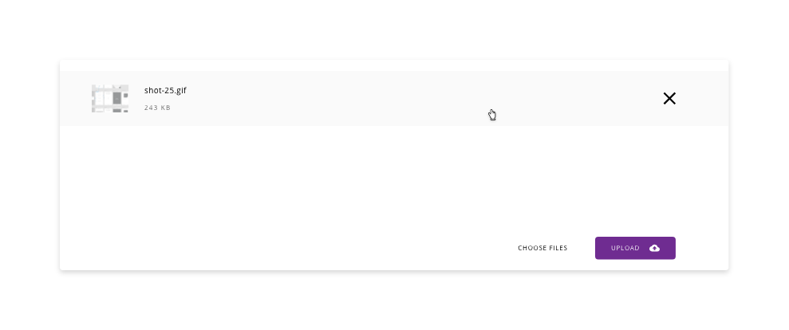

# Upload

The upload component is used to choose files from any location in the local machine and update those files to the server where the application is hosted. It is a common procedure in applications where files are required like documents, images or other information in digital formats.

* [Usage](#usage)
* [Appearance](#appearance)
* [Modes](#modes)
* [States](#states)
* [Design specifications](#design-specifications)
* [Links and references](#links-and-references)

## Usage

- Use the specific mode based on the application requirements
- Add some explanation text in the case that it is needed to clarify the information to the user
- By default, the drag and drop appearance is handled by the browser, in case it wants to be customized is the responsibility of the developer
- If the upload process fails, please show an error message avoiding technical or undetermined information (i.e '0x94 ERROR_PATH_BUSY') that won't be understood by the user of the application

## Appearance

A limited area in the user interface is reserved for this purpose, letting the user select the files in two ways, either choosing the file through the file system of the operating system or dragging the file and dropping in the respective area.
Once the file is displayed there, some characteristics are rendered:
- A thumbnail of the file (in the case that it is available)
- The name of the file
- The size or other information of the file
- An icon representing the actual status of the file (in progress, done, error) 

When all the files are loaded and the user wants to upload the files to the server, the only action to be performed is the click on the upload button. If the action goes right, an alert message with a success status will be displayed, in other cases, an error will pop up indicating the reason.

## Modes

There are two different modes for the upload component, one of them is used to upload a single file thus the representation of the component is much simple and takes less space in the screen compared with the multi file upload version, which is used to select several files in a row. 

Modes for the component: __single__ and __multiple__.

## States

*Default state*

*Drag and drop state*

*Uploading state*

*File complete state*

*Hover state with extra options*

*Upload completion state*

## Design Specifications

Since this component has many specifications to be detailed here, the best way to share the information with the interested people is throw the adobe cloud link in the Links and references section.

### Design tokens

Cannot be possible to configure or customize any parameter of the component to apply a theming.

### Responsive design

*This is pending*

## Links and references

- Upload: https://xd.adobe.com/view/23e2cca4-5021-490a-a548-e99a9b4a2006-76b1/screen/0a80be63-f9b6-4436-a3f1-ced47070f70d/variables/
- Single upload: https://xd.adobe.com/view/23e2cca4-5021-490a-a548-e99a9b4a2006-76b1/screen/f67eb530-b374-4d13-a1d8-ba4c1fba2e74/variables/

____________________________________________________________

[Edit this page on Github](https://github.com/dxc-technology/halstack-style-guide/blob/master/guidelines/components/upload/README.md)
