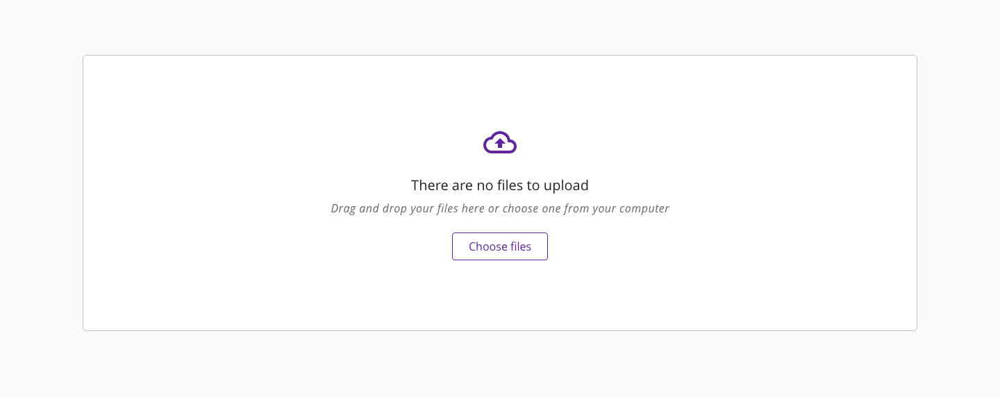
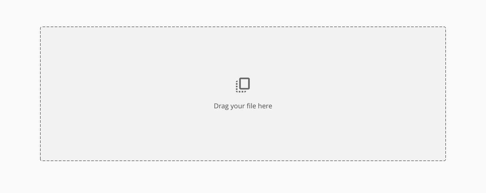
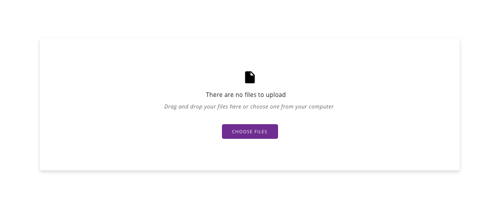
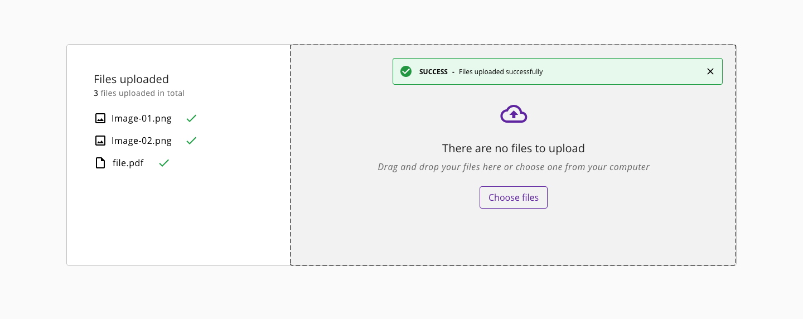
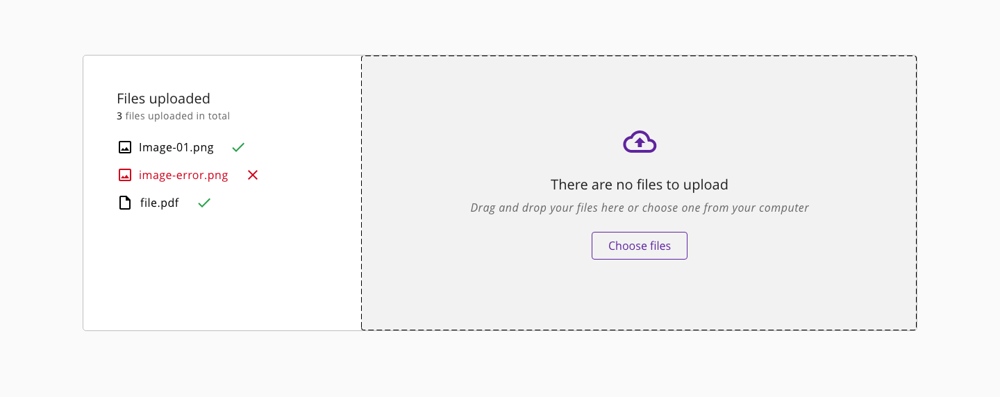

# Upload

The upload component is used to choose files from any location in the local machine and update those files to the server where the application is hosted. It is a common procedure in applications where files are required like documents, images or other information in digital formats.

## Usage

- Use the specific mode based on the application requirements
- Add some explanation text in the case that it is needed to clarify the information to the user
- By default, the drag and drop appearance is handled by the browser, in case it wants to be customized is the responsibility of the developer
- If the upload process fails, please show an error message avoiding technical or undetermined information (i.e '0x94 ERROR_PATH_BUSY') that won't be understood by the user of the application

## States

### Default

_Upload with the default preview of the component_

### Drag and drop

_Upload with drag and drop action of a file_

### Hover state

_Example of an item hovered_

### Success and error

Provide feedback to the users regarding the issues their files may face, or indicate that the files upload was succesfull. An alert type `success` or `error` should be placed on the top right corner of the upload container.

_Component success feedback_

_Component error feedback_

## Links and references

- [React CDK component](https://developer.dxc.com/tools/react/next/#/components/upload)
- [Angular CDK component](https://developer.dxc.com/tools/angular/next/#/components/upload)

____________________________________________________________

[Edit this page on Github](https://github.com/dxc-technology/halstack-style-guide/blob/master/guidelines/components/upload/README.md)
