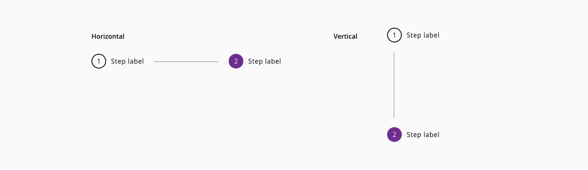

# Wizard

Wizard represents a stepped workflow as a form of linear and mandatory progression through a defined process with several bullet points where the user need to interact with the content of each step during the workflow.

## Modes

The basic modes defined for this component are based on the display of the information.

Modes: **horizontal** and **vertical**.

_Examples of horizontal and vertizal wizard flows_

## States

States: **enabled**, **focus**, **selected** and **disabled**.

_Example of the wizard stepper states_

## Design Specifications

_Wizard stepper specifications_

_Wizard modes spacing specifications_

### Color

| Tokens                    | Value       |
| -----------------------   | ----------- |
| `selectedBackgroundColor` |     #6F2C91 |
| `selectedFont`            |     #FFFFFF |
| `borderColor`             |     #000000 |
| `fontColor`               |     inherit |
| `lineColor`               |     #D9D9D9 |
| `disabledBackground`      |     #D9D9D9 |
| `disabledFont`            |     #666666 |

### Margin

Different values can be applied to each side of the component:
`top` `bottom` `left` `right`

| Margin    | Value |
| --------- | ----- |
| `xxsmall` | 6px   |
| `xsmall`  | 16px  |
| `small`   | 24px  |
| `medium`  | 36px  |
| `large`   | 48px  |
| `xlarge`  | 64px  |
| `xxlarge` | 100px |

### Typography

| Property                      | Element          |  Value      |
| ----------------------------- | ---------------- | ----------- |
| `font-size`                   |  label           |   16px      |
| `font-size`                   |  helper text     |   12px      |
| `font-weight`                 |  all             |   400       |

### Iconography

| Property          | Element         | Value     |
| ---------------   | ----------      | ----------|
| `height`/ `width` | Custom icon     | 20/20px   |
| `height`/ `width` | Validation icon | 18/18px   |

## Validation

There could be some scenarios in which the content of a step wants to be validated while the user is filling the fields with information or doing relevant actions in every step of the wizard.
For that case, a validation mark can be represented in every step once the user navigate to the next step in the linear progression. This will represent the status of the validation respecting the content, with a success mark or an error mark visible on the step mark.

_Example of wizard step validation_

## Content

Different variations of the content can be performed in the stepper:

* Only numbers
* Only icons
* Numbers/icons with stepper label

_Examples of wizard content_

## Helper text

Helper text can be added to the wizard component stepper:

_Example of wizard helper text_

### User Interface Design Considerations

- The horizontal/vertical line should not extend to the left of the first circle or to the right of the last circle
- Do not overwhelmed the component with too many steps, it won't be a good idea for the user workflow neither for the display of the information

## Links and references

- https://xd.adobe.com/view/23e2cca4-5021-490a-a548-e99a9b4a2006-76b1/screen/8408c439-e1b6-4273-b0b7-b16a2def1cef/variables/

