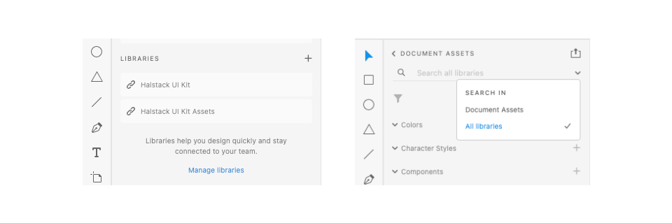
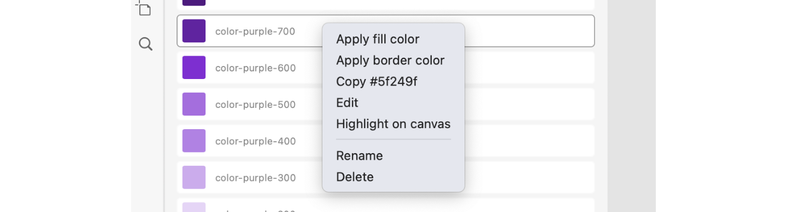
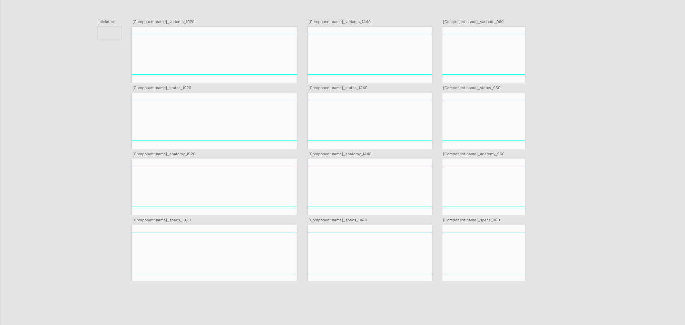
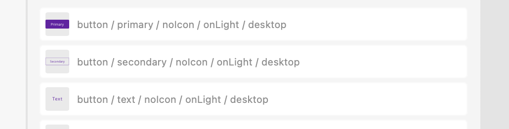

# Design

## Halstack UI Kit

The Halstack UI Kit is available in two formats:

* [Public XD library](https://shared-assets.adobe.com/link/732533f4-d925-487e-4761-9a760574cfac)
* [UI Kit versioned file](https://github.com/dxc-technology/halstack-style-guide/raw/master/Halstack%20UI-Kit/UI%20Kit-Halstack_v3.6.0.xd)

At the moment we only have built our library in Adobe XD, if you are interested in contributing by creating the library in another design tool we are delighted, please go to the "Other contributions" section for more information.

### Reusing styles across XD documents

There are two options in order to reuse the styles:

* Using the public library
* Publishing a local library from the UI-kit versioned file

Unless you are working on the library itself is recommneded to use the public library in order to reuse the design assets in other files. **You will receive the updates automatically in your working files**. 

_Access to the assets from the libraries panel_

If you want to know more about how to work with XD libraries you can check the article: [Adobe XD Get Started: Components and libraries](https://www.adobe.com/products/xd/learn/get-started-xd-components-libraries.html) whit a useful video to understand how to browse and use library assets (video 05).

#### Color

Every element on the design files should use the design system color palette. In order to follow an ETC (easy to change) methodology, having all our file assets correctly linked will favor the updates needed.

The color assets should be applied to the element's:

* `background-color`
* `border-color`

To can access to the contextual menu of the asset to apply both of them on the element

_Color asset contextual menu example_

#### Nesting components

When creating component that reuse as child elements another components, be sure that you are bringing them from the library assets (e.g. the select component uses the optionList as a child element)

_`optionList` reused inside the select component_

In the case presented above the `select` will be the outer component and the `optionList` will be the nested one. For more infomation about the terminology and how to work with nested components you can check [nested components](https://helpx.adobe.com/xd/help/work-with-nested-components.html) article.

### New and deprecated components

In order to identify wich components in the UI-Kit are new and wich ones are deprecated, we have a color legend that comes with the component when is searched across the document assets search bar:

| Color  | Component status      | Description                                                                                                             |
| :----- | :-------------------- | :---------------------------------------------------------------------------------------------------------------------- |
| 🔴     | Waiting to be removed  | The component will be removed soon. If you have any instance of this component in your files, replace for the new ones |
| 🟠     | Deprecated             | The component has been deprecated                                                                                      | 
| 🟡     | Variant changed        | There are changes on this component variant                                                                            |
| 🟣     | New variant            | New component variant in the UI-Kit. Changes are not available yet in CDK's                                            |
| 🟢     | CDK Available          | New component variant available in CDK                                                                                 |

### Working with previous versions

If you development team is working with a **previous version of the latest released Halstack CDK**, you can find all the UI Kit files in the [previous releases folder](https://github.com/dxc-technology/halstack-style-guide/tree/master/previous-releases) (Note that if you need to upgrade the version of the components you are using you will need to delete all the instances and relink the again with the proper version/public library)

Use the following table to match the version between the UI Kit and the CDK versions.

| UI Kit                  | React           | Angular         |
| :---------------------- | :-------------- | :-------------- |
| 2.0.0                   | 2.0.0           | 2.1.0           |
| 3.0.0                   | 3.0.0           | 3.0.0           |
| 3.3.0                   | 3.2.0           | -               |

Since the CDK releases React: 3.2.0 / Angular: 3.0.4  we are not releasing the guidelines or the UI Kit components until they have been correctly implemented and tested, we will improve the matching table in the next releases.

## Design assets

Between the design assets we store the .xd files for every component documentation images, principles and another useful files as branding assets. All our design assets are located [here](https://github.com/dxc-technology/halstack-style-guide/tree/master/contributing/assets).

Assets folder contains:

* `/logos`: DXC logo variants and Halstack logo
* `/components`: component raw XD files where from images are generated
* `/principles`: principles pages raw XD files where from images are generated

## Adding new components

The process of adding new components to the Halstack design system consists of the following steps:

1. Create a `[component name]_images.xd` file and submit to review
2. Export the artboards as png to an images folder following the [images contribution guidelines](https://developer.dxc.com/design/guidelines/contributing/image)
3. Write the component documentation page accordingly to the [content guidelines](https://developer.dxc.com/design/guidelines/contributing/content)

In this page we are going to focus in the first step of the process in order to helping halstack contributors to create reusable and compelling components for the design system UI Kit.

### Starting file

You can use a [template](https://github.com/dxc-technology/halstack-style-guide/blob/master/contributing/assets/templates/template_component_images.xd) to start building your component XD file or use an empty file.

_Component template file example_

Be sure that you have access to the Halstack Adobe libraries (UI Kit and Assets) and always stick to the color and typography styles of the public library so a change of one of those will affect your component styles also. Adobe XD doesn't apply the color styles to the borders directly, avoid using the color picker and copy and paste the HEX code instead.

### Naming convention

Our naming convention include multiple properties separated by a slash with one space gap before and after the slash in order to improve legibility. We use [camelCase convention](https://en.wikipedia.org/wiki/Camel_case) when connecting separate words in the same slot (e.g. on light --> onLight)

Our naming convention is built in the following way:

**[name] / [variant] / [state] / [mode] / [device] / [size]**

| Slot name  | Description                                                                                             |
| :--------- | :------------------------------------------------------------------------------------------------------ |
| Name       | Component name                                                                                          |
| Variant    | The component variants define the style variations that a component can have                            |
| State      | Apart from the states defined inside the component, we can have a collapsed/expanded states, overlay... |
| Icon       | Whenever the component can have (icon) or not (noIcon)                                                  |
| Mode       | If the component is on a light background (onLight) or a dark one (onDark)                              |
| Device     | Defines if the component is meant for desktop or mobile devices                                         |
| Size       | If the component have different sizes (e.g. large, medium and small) should be defined in this slot     |

#### Component examples:

_Example of the button naming convention_

Another examples:

* badge / default / onLight / desktop  / small
* optionList / compact / noIcon / onLight / desktop 

### States

_Button component states panel_

We use Adobe XD instances to add all the states to the main component. Here you have more iformation about [how to work with component states in XD](https://www.adobe.com/products/xd/learn/prototype/component-states/component-states-common-use-cases.html).

**The default state is the :enabled**, appart from that the following states can be added depending of the behaviour of the component to specify special states:

| State                   | Pseudo-classes                               |
| :---------------------- | :------------------------------------------- | 
| Hover                   | `:hover`                                     |
| Focus                   | `:focus`, `:focus-visible`, `:focus-within)` |
| Active                  | `:active`                                    |
| Error                   | `:invalid`, `:user-invalid`                  |
| Selected/Unselected     | -                                            |
| Checked/Unchecked       | `:checked`                                   |
| Visited                 | `:visited`                                   |
| Loading                 | -                                            |
| Disabled                | `:disabled`                                  |
| Read-only               | `:read-only`                                 |

Most of the states have a direct relationship with the CSS pseudo-classes, if you want to know more about them, you can check the [MDN Web Docs Pseudo-classes page](https://developer.mozilla.org/en-US/docs/Web/CSS/Pseudo-classes).

### Variants

Since Adobe XD doesn't support variants, we create them as separate components, so if you take a button for example where we have 3 variants (primary, secondary and text) we have a component for each of them:

* button / primary
* button / secondary
* button / text

There are specific cases where the differences between component variants aren't big and it is not worthy to use different components, in this case we modify the instances (e.g. icon usage in every button variant) 

## Adding component features

When the component already exists but there is a missing feature or changes in a current one the proccess varies depending if it's a new variant of the component or the changes affect an existing one.

### New variant

If you identify a new variant of the component that is not covered by our guidelines you can submit the variant file and the documentation changes in a Pull request to the upstream repository so we can review it and add the variant to the UI-Kit library.

1. Bring the existing component to a new XD file named `component-xyz_variant.xd`
2. Ungroup the component (<kbd>⇧ Shift</kbd><kbd>⌘ Command</kbd><kbd>G</kbd>)
3. Make the component local (<kbd>⌘ Command</kbd><kbd>K</kbd>) and name the variant following the naming convention and adding "🟣 /" as a prefix
4. Work on the new variant
5. Create a new branch in your fork named `component-xyz-variant`
6. Save the file in `contributing/assets/components/variants` folder

### Changing an existing variant

Sometimes the changes affect a variant of the component that already exist, in order to incorporate those changes in our component library we need the to have the new component variant and deprecate the previous to make everyone aware wich component should use.

1. Bring the existing component from the library to a new XD file named `component-xyz_update.xd`
2. Ungroup the component (<kbd>⇧ Shift</kbd><kbd>⌘ Command</kbd><kbd>G</kbd>)
3. Make the component local (<kbd>⌘ Command</kbd><kbd>K</kbd>) and keep the previous naming adding "🟡 /" as a prefix
4. Work on the variant changes
5. Create a new branch in your fork named `component-xyz-update`
6. Save the file in `contributing/assets/components/updates` folder

### Documentation

Changes on a component need to be properly documented, before making a PR from your for to the upstream repository ensure you are changing the component README.md file, updating the needed images in order to help other designers and developers understand the changes made in the component.

The [content](https://developer.dxc.com/design/guidelines/contributing/content) and [image](https://developer.dxc.com/design/guidelines/contributing/images) contribution guidelines will help you in the process of updating documentation of a component.

## Other contributions

We are a small team and maintaining more than one library is time-consuming, although we know that a UI Kit in other design software rather than Adobe XD would be an interesting asset to have. So... if you are interested in bringing those to the halstack ecosystem, our priorities are:

1. [Figma](https://www.figma.com/)

* OS independent, Figma is a web-based tool so windows and mac users can work seamlessly on the design files 
* Variants feature can handle not also variants but component states and other custom properties
* Branching features to improve collaboration and design iteration 
* The Figma API can bring all the core token information to Amazon's Style Dictionary and export them to JS, CSS, SCSS.

2. [Framer](https://www.framer.com/)

* Version control integrated with GitHub
* Apart form variants, Framer has variables in order to change dinamycally properties without creating a new variant 
* Offers a better control of transitions and animations.
* Can import React components, we want to test how close we can iterate with our production components using this tool.

