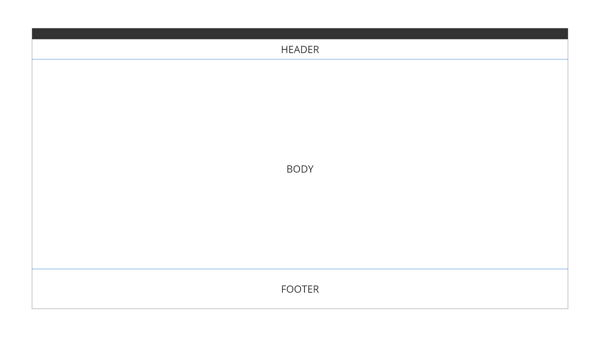
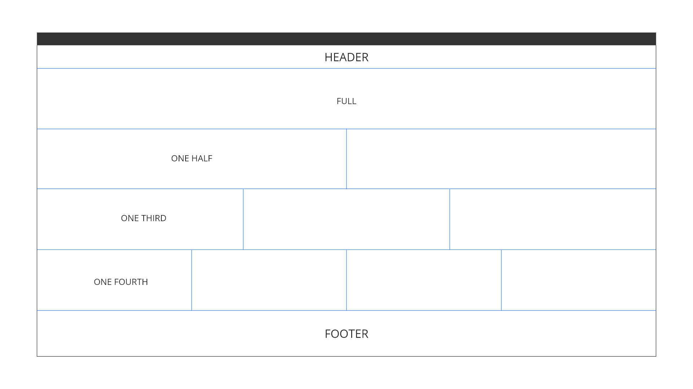
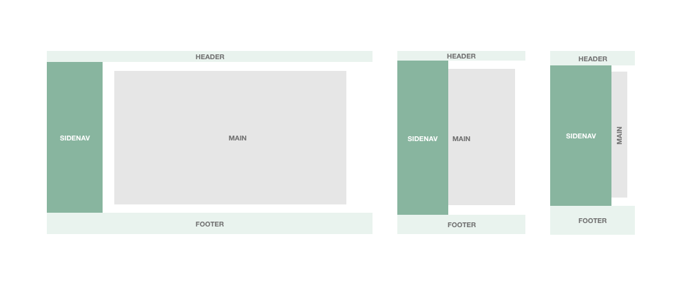

# Layout

Layouts form the foundation on which visual components are built. Our layouts focus on facilitating clarity and consistency across applications. To facilitate this, our starting point consists of three main areas: the Header, the Main Content, and the Footer. From here, we build a variety of layouts to accommodate different needs and use cases.   

## Application Layout

The three main areas can be subdivided into multiple sections depending on the use case. 

Main content can further be subdivided into full-width, one-half, one-third, and one-fourth layouts.

* Maximum width is set for the main area of 1320 pixels, giving enough whitespace to the UI and the elements to breath, and keeping the content center on the screen to call the attention of the user.
* Margins from the left and right sides are also other aspects that the component itself is controlling, adapting it depending on the device and the needs of the applications.Additionally, a margin area is defined following the spacing with other components of the layout with these values:- Margin for desktop: 64 pixels (top), 80 pixels (bottom), 15.6% (left/right)- Margin for tablet: 48 pixels (top), 64 pixels (bottom), 9.6 (left/right)- Margin for mobile: 36 pixels (top), 48 pixels (bottom), 6.4% (left/right)
* The specifications of the header and footer will remain the same in the rest of the layouts, with the following values:- Header: 64 pixels (height), 100% (width)- Footer: 128 pixels (height), 100% (width)

### Application Layout with side navigation

In technical applications and documentation sites, where you need to show an overview of all the items available, a side navigation bar can be included as part of the application layout.

This sidenav component works like an index of a book, displaying several actionable items that trigger an action, refreshing the information of the main content area, or navigating to another resource in the page hierarchy.

As opposed to the previous layouts, in this case, the sidenav needs to adopt a different behavior in responsive mode, due to the lack of spacing for touchable devices. So in case of keeping it visible as it can be configured in the desktop version, the component can be triggered to show and hide the content inside of it, improving the user experience and letting the main content enough space on the screen.

Specifications for the layout:- Sidenav: 300 pixels (width), 100% (height)- Main content margins for desktop: 64 pixels (top), 80 pixels (bottom), 8.6% (right), 5.4% (left)- Main content margins for tablet: 48 pixels (top), 64 pixels (bottom), 9.6 (left/right)- Main content margins for mobile: 36 pixels (top), 48 pixels (bottom), 6.4% (left/right)

If the sidenav is used in push mode, once the component is hidden by the left side of the screen, the main content will take all the available space, increasing the size of the left margin to match with the value of the right margin.

The content will be rendered in the middle of the screen and the look will be similar to the one reproduced using the standard layout.

### Application Layout with secondary aside navigation

A component that can be included as part of the application layout in certain occasions, is the secondary aside navigation bar. It shows different types of descriptive icons or actions that will represent some current selections of the status of the interface. Both elements can be interchangeable in terms of position due to the requirements of the applications and the importance of the actions associated with each element.

For that class of layout, the height of the content won't increase based on the content itself, on the other side, the area will have a scroll area to maintain the distribution and not lose focus of the current hierarchy of the interface.

In terms of responsive design, the aside element will stay at the same position and accessible at any time of the interaction process.

Same specifications apply for all the components mentioned before, adding the measures of the aside element:- Aside: 88 pixels (width), 100% (height)This layout is thought to be adaptive to the viewport, meaning that in case the content overflow the available space, the container will display a scrollbar to access all the information inside it.

## Content Layout

### Two column layout

A special layout that is designed for certain scenarios where the content and the dual-view are key.

Every side of the interface can be customized with custom content with a relation between. It can be an image related to the content on his right/left, a login page with detail information on the near side, or a table with actions that will make some effect on the information of the other part of the UI, like filtering, searching or highlight. Even it can be used as a splash screen during the loading of the application.

Thinking about the distribution on mobile and tablet, the left part always is on top and the right side will be positioned at the bottom. So take it present at the time of design and place the information on each side.

There should be a relationship aspect between the two columns, to preserve size and scaling. So we can establish a rule going from 1/4 to 3/4 where, 1/4 is the minimum value that a column can take and 3/4 is the maximum value to be expanded by one single column.

Accordingly, the other column should take the rest of available space based on the ratio selected for each of them, making the 100% of the screen width.

### Symmetrical layout

A flexible layout to distribute the content through three flexible columns in the main area of the screen.

As a layout component, it doesn't provide any control of the content inside of each section, but it is intended mainly for back office applications, where the user needs to have a higher amount of information compared with a standard user interface application.

Even the relevant part of the screen is the middle column as it has a larger space and it will be updated with relevant information about the service, both columns on the sides can be used to display additional information to complement the main part of the screen, actionable items related with the business or even news and updates from some topics of importance.

Specifications for paired layout:- Main margin for desktop: 64 pixels (top), 80 pixels (bottom), 15.6% (left/right)- Side columns: 270 pixels (width), 64 pixels (margin top), 80 pixels (margin bottom)

____________________________________________________________

[Edit this page on Github](https://github.com/dxc-technology/halstack-style-guide/blob/master/guidelines/principles/layout/README.md)
