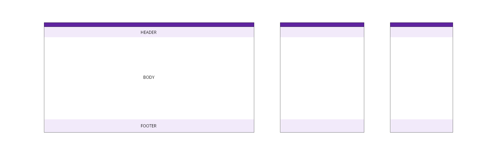
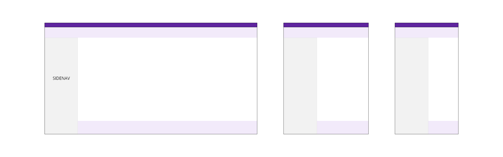
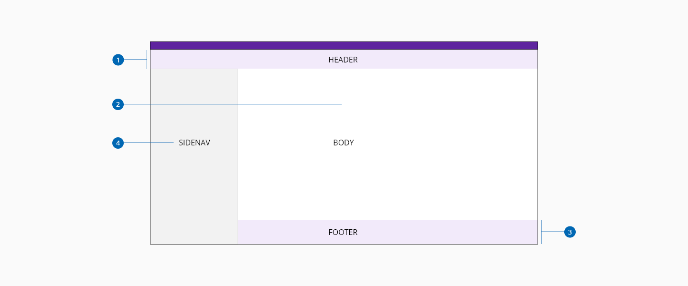

# Layout

Layouts form the foundation on which application components are built. Our layouts focus on facilitating a consistent visual flow across applications. 

## Application Layout

The application layout consists of three main elements: the header, the main content, and the footer.

### Application Layout with side navigation

A side navigation can be added as a fourth element to display additional links or information apart from the links that can be displayed as part of the header or footer

### Application Layout Anatomy

1. Header
2. Main content
3. Footer
4. Side Navigation

## Specifications

## Links

Refer to the following links for more detailed information about each of the layout elements:

*[Header Component](url)
*[Footer Component](url)
*[Sidenav Component](url)

____________________________________________________________

[Edit this page on Github](https://github.com/dxc-technology/halstack-style-guide/blob/master/guidelines/principles/layout/README.md)
